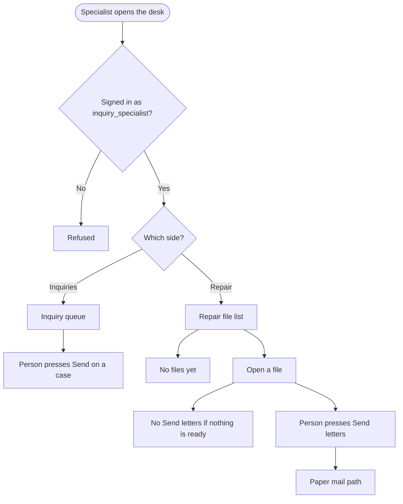
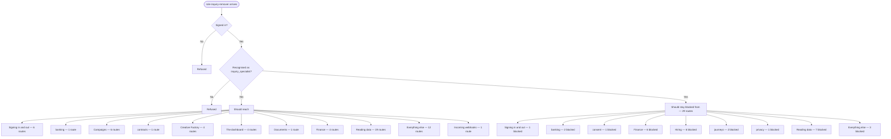

# role-inquiry-remover — intended

> ⚠️ **WRITTEN AFTER THE FACT, NOT BEFORE IT.** CLAUDE.md §4 calls this file the
> hand-authored source of truth, checked against the code — and says agents do
> not write it, because an agent writing it would be authoring the very thing
> its own work is supposed to be checked against. This one is an explicit,
> one-time exception: the owner directed it be created from current behavior
> because none existed at all (`docs/journeys/README.md` recorded that gap
> from 2026-07-31 to 2026-08-02). It was generated on 2026-08-02 from the same
> extracted route data as [`role-inquiry-remover-actual.md`](./role-inquiry-remover-actual.md) —
> not from a product spec, a ticket, or anyone's independent judgment of what
> *should* happen. A match against `-actual.md` right now proves only that
> this file was copied from it, not that either one is correct. Replace this
> page's judgment calls with a human's the next time this journey changes on
> purpose — that is the point of having two files at all.

What a staff member with role `inquiry_specialist` (shown as **Specialist**) should be able to do.

> **Who this is, in the code:** the screen is the Specialist desk (`public/app/inquiry-remover.html`); the role key is still `inquiry_specialist`. They run inquiry removal and credit repair on one page with a toggle. No second sidebar row.

## Specialist desk (observable)

The person signs in as Specialist and lands on this page.

1. The side-menu row says **Specialist**. There is no extra row for repair.
2. A toggle at the top says **Inquiries** and **Repair**. Inquiries is on first.
3. Top-left number answers **Need me** — how many files need a person today.
4. **Inquiries** side: the existing inquiry queue. Send on an inquiry case still requires a click. Phone inquiry work stays on hold.
5. **Repair** side: a list of repair files (stage, round, letters ready). Empty copy: "No repair files yet." Loading shows grey bars. A failed load says the list could not load.
6. Click a repair row: items and letters. **Send letters** appears only when a letter body is ready. Nothing mails until that click.
7. Stuck files (stalled cards / bureau answers that need a look) show only if this role may see them. Specialist, owner, and admin may. Confirming a bureau answer is a click.

Ground truth: `GET /api/read/repair-cases` returns the list. `GET /api/read/repair-cases?client_id=` returns letters. `POST /api/repair/send` with `mail: true` is the only mail click. `GET/POST /api/repair/exceptions` is Specialist + owner + admin.

## In one picture (routes)

## Should be able to reach

- **Signing in and out** (6 routes) — should be reachable.
- **banking** (1 route) — should be reachable.
- **Campaigns** (6 routes) — should be reachable.
- **contracts** (1 route) — should be reachable.
- **Creative Factory** (4 routes) — should be reachable.
- **The dashboard** (4 routes) — should be reachable.
- **Documents** (1 route) — should be reachable.
- **Finance** (4 routes) — should be reachable.
- **Reading data** (19 routes) — should be reachable.
- **Everything else** (12 routes) — should be reachable.
- **Incoming webhooks** (1 route) — should be reachable.

## Should stay blocked from

- **Signing in and out** (1 route) — should stay blocked.
- **banking** (2 routes) — should stay blocked.
- **consent** (1 route) — should stay blocked.
- **Finance** (6 routes) — should stay blocked.
- **Hiring** (6 routes) — should stay blocked.
- **journeys** (2 routes) — should stay blocked.
- **privacy** (1 route) — should stay blocked.
- **Reading data** (7 routes) — should stay blocked.
- **Everything else** (3 routes) — should stay blocked.

## Comparing this against reality

Run `npm run journeys` and read [`role-inquiry-remover-actual.md`](./role-inquiry-remover-actual.md). There is no automated
diff between the two files — CLAUDE.md §4 describes intended vs. actual as a human
comparison, and this repository has never built a machine check for it. Read both,
side by side, and treat any difference between them as a finding to report, not
something to silently fix in either file.