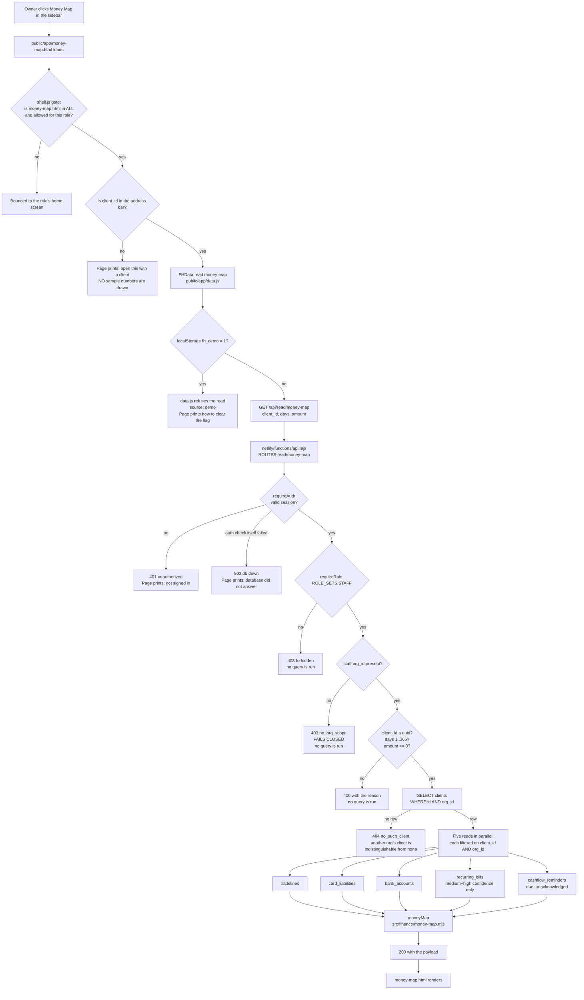
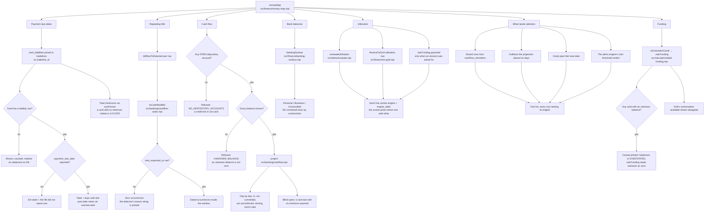
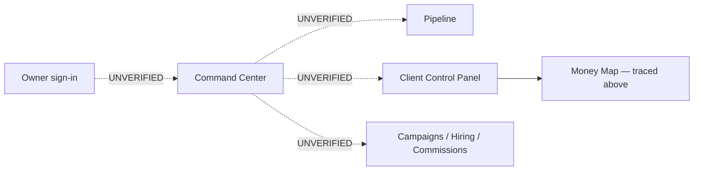

# role-owner — ACTUAL

Generated from code, not from a spec and not from memory. Every box below was
traced to a file and a function; anything that could not be traced is marked
`UNVERIFIED` and is drawn as such rather than assumed.

**Scope of this file, stated plainly.** This documents ONE flow inside the owner
journey: opening the **Money Map** for a client. It is the only flow this
workflow built or read end to end. The rest of the owner journey — sign-in,
pipeline, campaigns, hiring, commissions — is **not documented here**, because
tracing it was not part of this unit and drawing it from assumption would be
worse than leaving it out.

**There is no `role-owner-intended.md`.** `docs/journeys/` did not exist before
this file. That means there is no hand-authored statement of what *should*
happen to check this against, so no gap between intended and actual can be
reported — the intended side is simply absent. Per CLAUDE.md §4 the intended
file is hand-authored and agents do not write it, so this workflow did not
create one.

---

## Money Map — opening a client's money picture

### What the assembler does, and which module owns each answer

### Refusals, in one place

Every one of these is a real branch in the code, not a defensive comment.

| where | condition | what the person sees |
|---|---|---|
| `public/app/shell.js` | screen not in `ALL`, or not allowed for the role | bounced to the role's home |
| `public/app/money-map.html` | no `client_id` in the URL | a sentence asking for one. **No sample numbers.** |
| `public/app/data.js` | `localStorage.fh_demo === "1"` | "you are in demo mode", with the command to clear it |
| `api/read/money-map.mjs` | method is not GET | 405 + `allow: GET` |
| `src/http/middleware/requireAuth.mjs` | no or bad session | 401 |
| `src/http/middleware/requireAuth.mjs` | the auth check itself failed | 503 `db: down` |
| `src/http/read-api.mjs` `requireRole` | role outside `ROLE_SETS.STAFF` | 403, no query run |
| `api/read/money-map.mjs` | session has no `org_id` | 403 `no_org_scope`, no query run |
| `api/read/money-map.mjs` | `client_id` not a uuid / bad `days` / bad `amount` | 400, no query run |
| `api/read/money-map.mjs` | client not in the session's org | 404 `no_such_client` |
| `src/finance/money-map.mjs` | no open depository account | cash-flow section says why; other sections still render |
| `src/banking/cashflow.mjs` `project()` | any supplied balance unknown | cash-flow section says why; other sections still render |
| `src/banking/cashflow-seam.mjs` | a bill has no confident next date | bill listed, not placed on the calendar, reason printed |

### Not traced by this workflow — UNVERIFIED

These paths exist as screens and links in `public/app/`, but this workflow did
not read the code behind them, so they are drawn as unverified rather than
described. Do not treat the dotted edges as documentation.

### Nothing on this flow transmits

The Money Map is read-only. It runs `SELECT` statements and nothing else — no
`INSERT`, no `UPDATE`, no outbound `fetch`. Reading a reminder does not mark it
delivered; there is no `surfaced_at` stamp anywhere in this path.
