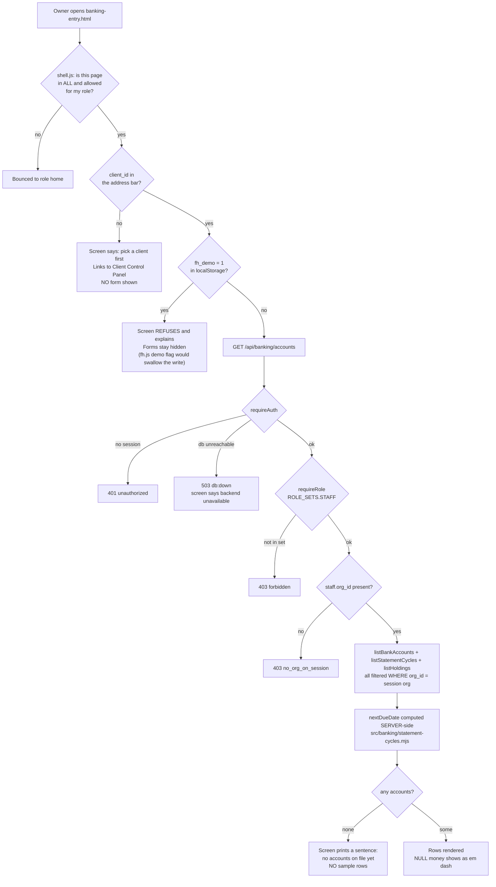
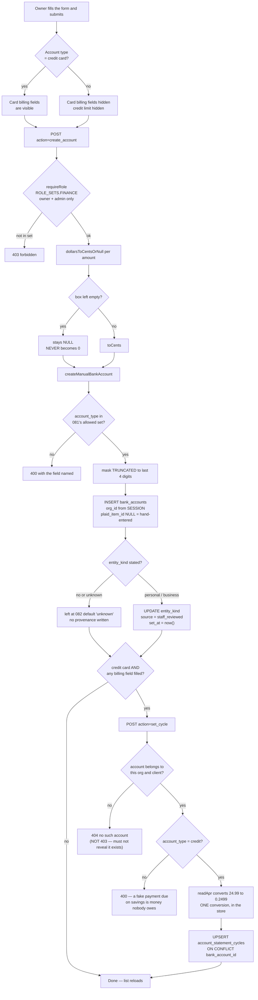
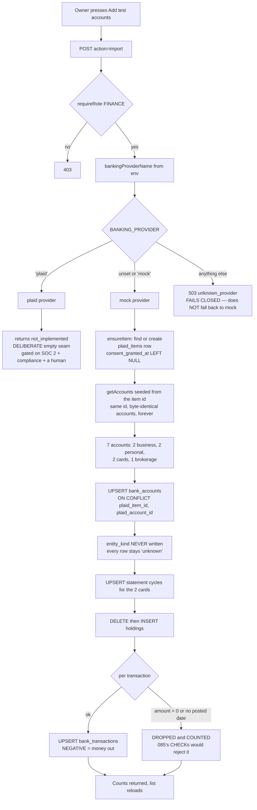

# Role: Owner — what the code actually does

**Generated from code, not from a spec.** Every box below was traced by reading the
files named beside it. Anything that could not be traced is marked `UNVERIFIED`.

> **This file covers ONE flow: adding bank accounts and credit cards by hand.**
> The rest of the owner's journey is not traced yet. An absent box means nobody has
> read that code and written it down — it does NOT mean the step does not exist.
>
> There is no `role-owner-intended.md` to compare against. `docs/journeys/` did not
> exist before this commit, so there is nothing to report a gap against. The intended
> file is the owner's to author.

---

## Adding a bank account or credit card

**Traced in:** `public/app/banking-entry.html`, `public/app/shell.js:16-25`,
`api/banking/accounts.mjs`, `src/banking/accounts.mjs`,
`src/http/middleware/requireAuth.mjs`.

---

## Saving one account by hand

**Traced in:** `api/banking/accounts.mjs:135-215`, `src/banking/accounts.mjs`,
`src/tradelines/index.mjs:51` (`readApr`), `db/migrations/096_account_statement_cycles.sql`.

---

## Filling the screen with test accounts

**Traced in:** `src/banking/import.mjs`, `src/banking/provider.mjs`,
`src/banking/mock.mjs`, `db/migrations/085_bank_transactions.sql`.

---

## Gaps found while tracing

These are facts about the code, not opinions about it.

1. **`bank_transactions` has no foreign key to `bank_accounts`.** The column comment
   says the table "does not exist in this repo", but `081_bank_accounts.sql` created
   it. Combined with `client_id ON DELETE SET NULL`, a deleted client leaves
   transactions with no route back to the person and no route to the account. Assigned
   to W4.

2. **`api/read/banking-surface.mjs` is not org-scoped.** It filters on `client_id`
   only. The new endpoint added here IS org-scoped; the older one next to it is not.

3. **Going live is an env change for the SEAM, not for Plaid itself.** Setting
   `BANKING_PROVIDER=plaid` switches which module answers in zero lines of code.
   `plaid.mjs`'s `linkAccount()` and `getAccounts()` still return `not_implemented` by
   design, gated on a SOC 2 review, a compliance-approved consent flow and a human
   decision. The seam is free to switch; the thing it switches to is unbuilt on purpose.

4. `UNVERIFIED` — how the owner reaches a client's `client_id` in the first place. The
   screen links to the Client Control Panel, but the path from that screen to a
   copyable id was not traced.
