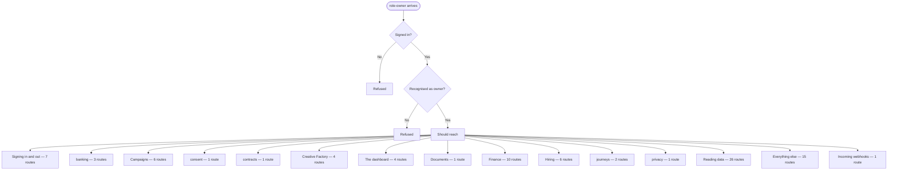

# role-owner — intended

> ⚠️ **WRITTEN AFTER THE FACT, NOT BEFORE IT.** CLAUDE.md §4 calls this file the
> hand-authored source of truth, checked against the code — and says agents do
> not write it, because an agent writing it would be authoring the very thing
> its own work is supposed to be checked against. This one is an explicit,
> one-time exception: the owner directed it be created from current behavior
> because none existed at all (`docs/journeys/README.md` recorded that gap
> from 2026-07-31 to 2026-08-02). It was generated on 2026-08-02 from the same
> extracted route data as [`role-owner-actual.md`](./role-owner-actual.md) —
> not from a product spec, a ticket, or anyone's independent judgment of what
> *should* happen. A match against `-actual.md` right now proves only that
> this file was copied from it, not that either one is correct. Replace this
> page's judgment calls with a human's the next time this journey changes on
> purpose — that is the point of having two files at all.

What a staff member with role `owner` should be able to do.

> **Who this is, in the code:** db/schema/001_init.sql — staff.role comment lists 'owner'

## In one picture

## Should be able to reach

- **Signing in and out** (7 routes) — should be reachable.
- **banking** (3 routes) — should be reachable.
- **Campaigns** (6 routes) — should be reachable.
- **consent** (1 route) — should be reachable.
- **contracts** (1 route) — should be reachable.
- **Creative Factory** (4 routes) — should be reachable.
- **The dashboard** (4 routes) — should be reachable.
- **Documents** (1 route) — should be reachable.
- **Finance** (10 routes) — should be reachable.
- **Hiring** (6 routes) — should be reachable.
- **journeys** (2 routes) — should be reachable.
- **privacy** (1 route) — should be reachable.
- **Reading data** (26 routes) — should be reachable.
- **Everything else** (15 routes) — should be reachable.
- **Incoming webhooks** (1 route) — should be reachable.

## Should stay blocked from

_Nothing — every route admitted this journey when this was written._

## Comparing this against reality

Run `npm run journeys` and read [`role-owner-actual.md`](./role-owner-actual.md). There is no automated
diff between the two files — CLAUDE.md §4 describes intended vs. actual as a human
comparison, and this repository has never built a machine check for it. Read both,
side by side, and treat any difference between them as a finding to report, not
something to silently fix in either file.