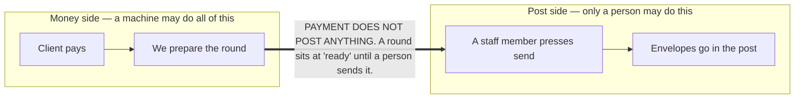
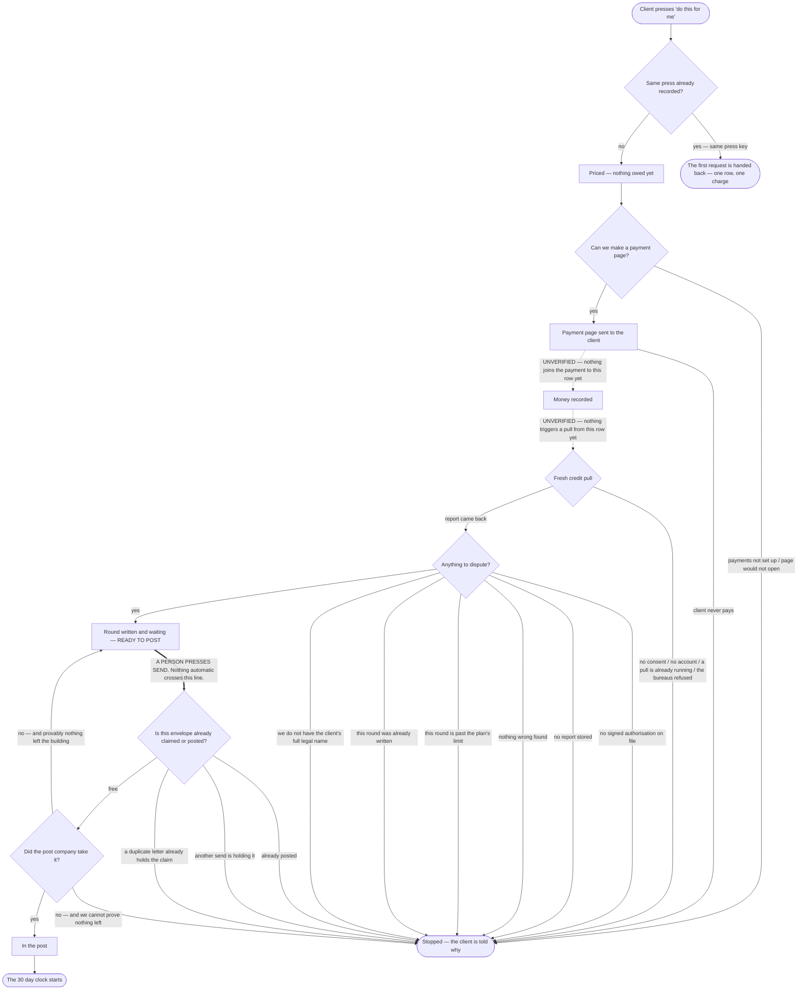

# The paid round — press to posted, end to end

**What the code does today.** Hand-written, traced from the code on 2026-09-05. Not generated:
`npm run journeys` builds nine pages from the routing table and this is not a routing change.

Every step below names the file and line it was read from. **Three steps in the middle of this flow
have no code joining them yet** — the tables and the pricing exist, the analyser and the send loop
exist, and the wiring between them is the endpoint lane's work. Those steps are drawn with a dashed
line and marked `UNVERIFIED`, and §7 lists every one with the reason. Drawing them solid would tell
a non-coder the money path works today. It does not.

Language note (owner-set): no repair wording appears in anything a client reads here. This is a
funding optimisation round.

---

## THE ONE LINE THAT MATTERS

**Paying prepares the round. A person still posts it.** This is written into the code twice, as the
first thing a reader sees in each file:

* `src/metro2/delivery/send.mjs:3` — "Human still presses send; callers must not invoke this from
  payment.received."
* `api/repair/send.mjs:3` — "Never auto-mails."

Do not route around it.

---

## 1. The whole flow

---

## 2. The press, and why a double press is one charge

`requestPaidService()`, `src/waypoints/store.mjs:151-207`.

A press writes one row in `paid_service_requests` with status `quoted`
(`db/migrations/331_paid_service_requests.sql:161`).

**The double-press guard is the press key, and only the press key.** The insert carries
`ON CONFLICT (org_id, idempotency_key) DO NOTHING` (`store.mjs:186`), backed by a partial unique
index in the database (`db/migrations/331:303-305`). The loser of a race is handed the winner's row
with `created: false` (`store.mjs:205`) — the same answer a second press gets. Two people cannot
both pass a check and both insert, because the database decides, not the application.

**What that guard does NOT cover, stated plainly.** Nothing stops a second *open* request for the
same client under a *different* press key. There is an index for finding open requests
(`db/migrations/331:292-294`) but no constraint refusing one. So "a request is already in flight"
is something the screen must ask for and honour — it is not enforced by the database. That is why
the read contract carries `paidServices[].inFlight` as a fact rather than relying on a greyed-out
button.

---

## 3. The price

`priceDisputeRound()`, `src/waypoints/pricing.mjs:56-69`. Owner-set, integer cents, no floats:

| Line | Cents | When |
|---|---|---|
| Round — all three bureaus | 10,000 (`pricing.mjs:22`) | always |
| Creditor letter | 1,000 (`pricing.mjs:23`) | only when one is needed |
| Regulator and attorney general filings | 2,000 (`pricing.mjs:24`) | only when they are needed |

The receipt is stored as **line items, not a total** (`db/migrations/331:176-181`), so a receipt can
be itemised six months later and a future price change cannot silently restate what somebody already
paid. The database checks the lines add up to the total (`db/migrations/331:239-243`), and a total of
zero is refused outright (`:178-179`).

**A missing price is not a free one.** `price_total_cents` NULL means "not priced yet"
(`db/migrations/331:316-317`), and `requestPaidService` refuses a priced request that totals zero or
less (`store.mjs:176-178`).

**A paid round does not use up a round from the plan.** The two counters are deliberately kept
apart: `nextSelfServeRoundNo()` counts only paid requests and never reads the plan's limit
(`store.mjs:222-238`), and a test asserts the table has no column joining them
(`src/waypoints/store.pg.test.mjs:326-337`).

---

## 4. The payment page

Nothing in this repository can charge a card that is already on file. Every purchase mints a
**hosted payment page** the client visits themselves.

`createCheckoutSession()`, `src/payments/commas-api.mjs:260-380`. Four ways it refuses, each its own
labelled edge above:

| Refusal | Line |
|---|---|
| Payments are not configured at all | `checkoutConfig()`, `src/payments/commas-api.mjs:198`; the caller turns that into a 503 at `src/payment-links/index.mjs:246-250` |
| The payment company answered with something unreadable | `:351` |
| The payment company answered with an error | `:357` |
| It answered fine but gave us no page to send anyone to | `:364` |
| We could not reach the payment company at all | `:378` |

A refused page means **no row moves to `awaiting_payment`**. The client is told, and nothing is
prepared.

---

## 5. The staging boundary — the hard line in the middle

`paid_service_requests.status` runs `quoted → awaiting_payment → paid → staged → fulfilled`, with
`failed`, `cancelled` and `refunded` as endings (`db/migrations/331:161-173`).

**`staged` means: the work is prepared and it is waiting on a human.** That is the state the whole
flow bends around, and the database will not let a row claim it dishonestly:

* a row at `paid` or beyond must carry a payment time (`db/migrations/331:258-261`);
* a row claiming to be finished must say what it produced (`:272-274`);
* a finished, failed, cancelled or refunded row must have an end time, and an open one must not
  (`:264-267`).

Between `staged` and the post there is exactly one door: a member of staff pressing send. It is
`POST /api/repair/send`, and it is staff-only — `requireAuth` then `requireRole(ROLE_SETS.STAFF)`
(`api/repair/send.mjs:24-27`) — and it will not post anything unless the request explicitly says
`mail: true` (`:34`).

---

## 6. The send, and the guard against a second envelope

`claimLetterForMailing()`, `src/repair/send.mjs:155-219`. Before any letter is handed to the post
company, the send **claims** it with a single conditional update (`:161-174`). Four refusals, each
one a labelled edge in the diagram:

| Refusal | What it means to a person | Line |
|---|---|---|
| `already_mailed` | This envelope has already gone. Nothing releases this and nothing ever will. | `:210` |
| `send_claim_held` | Another send is holding it right now, or one was and never came back. A person can clear it. | `:217` |
| `already_mailed_duplicate_letter` | A different letter row for the same case, bureau, round and destination already holds the claim. | `:180` |
| `claim_failed` | The database would not answer, so we do not know if it is safe. It is not sent. | `:186` |

A letter is only given back when the failure **provably** happened before anything left the building
— `releaseLetterClaim()` at `src/repair/send.mjs:224-240` carries `mailed_at IS NULL` in its WHERE
clause, so a release can never un-post a letter that really went. When the post company refuses in a
way we cannot prove was pre-transmission, the letter keeps its claim and a person has to release it.

Only when at least one letter actually went does `repair.letters.sent` fire
(`src/repair/send.mjs:593-597`), which is what moves the client's file to "in the post" and starts
the bureau's 30 day clock.

---

## 7. Every step marked UNVERIFIED, and why

| Step | Why it could not be traced |
|---|---|
| Payment page → money recorded on the request row | A search of `src/` and `api/` finds `paid_service_requests` referenced only in `src/waypoints/store.mjs` and its test. The payment webhook path exists and emits `payment.received` (`src/adapters/commas.mjs:523`), and `requestPaidService` accepts a `checkoutUrl` (`store.mjs:161`) — but **nothing mints the page for a paid service request and nothing marks one paid.** |
| Money recorded → fresh credit pull | The only thing in the repository that triggers a pull from a payment is `diagnostic.paid` → workflow C-00 (`src/handlers/diagnostic-soft-pull.mjs:21-31`). Nothing connects a paid service request to it. The owner's plan requires every paid round to re-pull first; that wiring is not written. |
| Fresh pull → the analyser | Same absence. C-00 ends by returning its result (`src/workflows/c-00-crs-soft-pull-request.mjs:125-134`); nothing reads that and calls the analyser for a paid round. |

The pull's own refusals **are** traced and are drawn above, from
`src/workflows/c-00-crs-soft-pull-request.mjs`: no client (`:60`), no account to attribute the pull
to (`:79`), consent refused (`:102`), a pull already outstanding (`:111-115`), and the pull itself
failing (`:132`).

The analyser's refusals are all traced, from `src/repair/analyze.mjs`: no signed authorisation
(`:311`), this round already written (`:313-330`), past the plan's round limit (`:330-338`), no
stored report (`:341`), nothing wrong found (`:360`), client record missing (`:363`), no full legal
name on file (`:364`). Per bureau it also skips a bureau with no rule-backed claims (`:378`) and one
already written (`:384`).

---

## 8. One conflict this page found and did not fix

**The plan's round limit still refuses a paid round.** Owner-set: a paid round must not consume a
round from the plan, and the table honours that — there is no column joining the two counters
(`db/migrations/331` table comment; `src/waypoints/store.mjs:222-231`).

But the analyser does not know that. `analyzeAndGenerate` reads `repair_programs.rounds_cap` and
returns `round_cap_exceeded` for any round past it (`src/repair/analyze.mjs:330-338`). A trial client
whose plan covers two rounds, who then buys a third round with their own money, would be refused
there today.

That is a finding, reported and not reconciled (CLAUDE.md §4). It belongs to whoever builds the
endpoint that calls the analyser for a paid round.

---

## 9. Rounds 4 and 5 may never be shown as filed

Carried over from `docs/journeys/client-progress-flow.md` because it applies to anything a client
buys as well: **nothing in this repository records whether a federal regulator complaint or a state
attorney general complaint was actually submitted** (`src/metro2/letters/catalog.mjs:57-65`). The
documents are produced and handed to the client to sign and file personally. A paid round may
produce them. Neither this flow nor any screen may say either one was filed.

---

## 10. Compliance

`COMPLIANCE REVIEW REQUIRED` — fee timing and dispute logic. This page describes what a client is
asked to pay for a dispute round and when, and the human gate between payment and posting. It
changes no code; the two modules it draws from carry the same label already
(`src/waypoints/pricing.mjs:1`, `db/migrations/331:3`).
