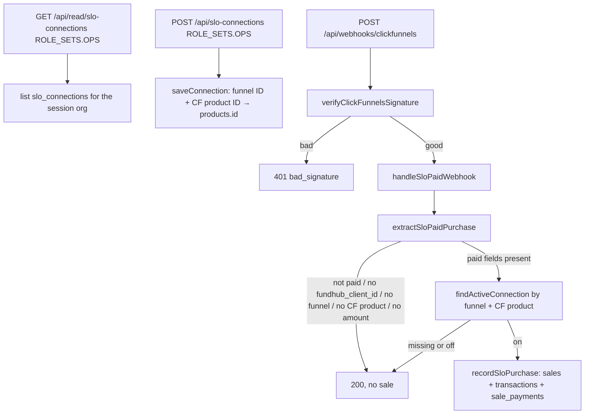

# SLO connections — actual (first slice)

Generated from the code in this worktree. Not from the spec.

## What the code does

## Traced paths

- `public/app/products-commissions.html` — SLO connections tab, hidden until
  `/api/auth/session` says owner or admin.
- `api/read/slo-connections.mjs` — `ROLE_SETS.OPS` (owner, admin).
- `api/slo-connections.mjs` — same gate. Writes `slo_connections`.
- `src/slo/purchase.mjs` — paid types: `order.completed`,
  `one-time-order.completed`, `one_time_order.completed`, `new_purchase`.
  Client key is only `fundhub_client_id`. Amount is `amount_cents` or a CF 2.0
  integer cent total. Classic integer dollars without a cents field are refused.
- `src/adapters/clickfunnels.mjs` — after a good signature, calls
  `handleSloPaidWebhook` before the email / survey / booking path.

## Not in this code

Soft pull, UnderwriteIQ, black reports, paper, recurring, white-label, the CRM
writes, a new checkout, ClickFunnels apply.
