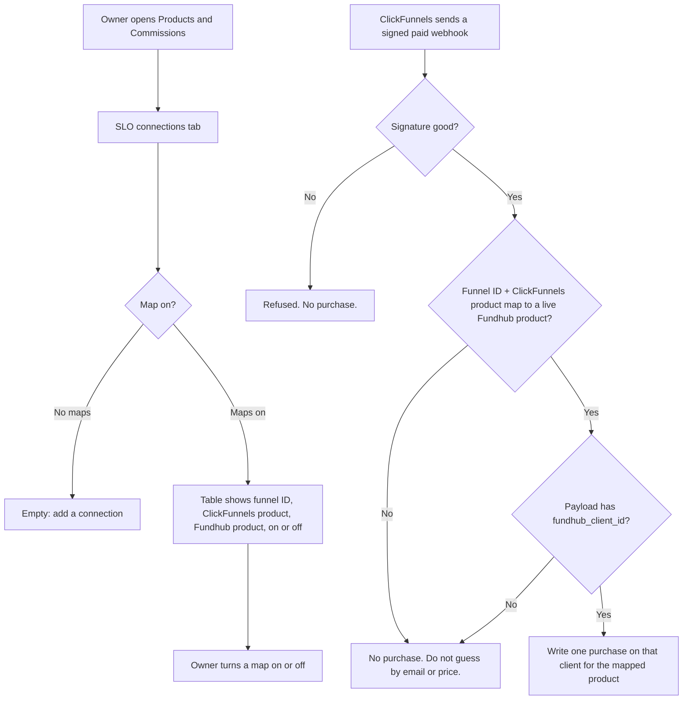

# SLO connections — intended (first slice)

**COMPLIANCE REVIEW REQUIRED** — this path records a paid purchase.

Owner-only. ClickFunnels keeps the page and the checkout. Fundhub does not
build a new checkout. Do not walk ClickFunnels apply.

## First question

Which SLO connections are live, and what does each one unlock?

## What should happen

## Ground truth

1. The owner (or admin) can save a connection: name, ClickFunnels funnel ID,
   ClickFunnels product ID, Fundhub product, on or off.
2. A sales manager can open Products and Commissions but cannot save or list
   SLO connections.
3. A signed ClickFunnels paid webhook writes a sales row on the client named
   in `fundhub_client_id`.
4. The same webhook does not pick the client by email.
5. The same webhook does not pick the offer by price or product name.
6. An off map writes no purchase.
7. A replay of the same order writes one purchase, not two.
8. No card is charged here. No credit pull. No paper mail. No GHL.

## Not in this slice

Soft pull, UnderwriteIQ, black reports, paper, recurring, white-label, GHL.
