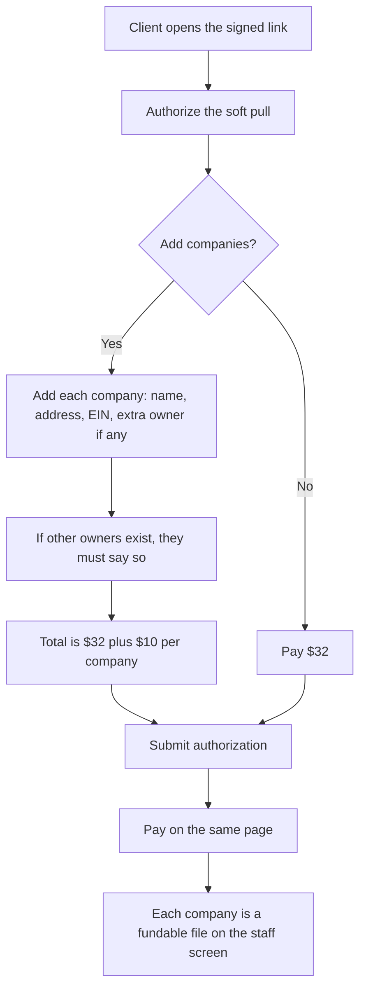

# Soft-pull multi-business — intended draft

Draft for Chris. Not an official `*-intended.md` until he approves it.

**COMPLIANCE REVIEW REQUIRED** — consent, fee timing, payment rails.

## Who this is for

The client fills the form. A closer or funding advisor later reads the file.

## One job

Capture each company the client wants funded (name, address, EIN, extra owner if any) on the same authorize-then-pay page, save those companies on the client, and show each one as its own fundable file.

## First question on the form

Approve the soft pull and add the companies to fund.

## What should happen

## Ground truth — what a person can see

1. The client stays on one page. They authorize first. Then they pay.
2. The businesses card tells them: if a company has other owners, say so. Extra owners make funding slower and harder. We usually prefer one-owner companies.
3. Each added company asks for name, street, city, state, ZIP, EIN, and an optional extra owner name.
4. EIN is required when a company is added. Nine digits. `12-3456789` is allowed.
5. Extra owner name is optional. Empty is fine.
6. The plus button adds another full company block. There is no advertised cap. A hidden safety stop exists so the form cannot be abused.
7. Copy tells them to add each company they want funded. It does not say “up to 20”.
8. Price stays **$32 + $10 per company**. Two companies = **$52**.
9. After submit, the same page shows Pay for that total.
10. Each saved company is stored on the client. Staff see name, state, address, EIN, and a visible extra-owner warning when an extra owner was named.
11. Different states stay visible. They matter for banks and cards.

## What this is not

- No new database table.
- No TransUnion, Aged Corps, or Twilio change.
- No customer-facing claim about a credit score going up or down.

## Screens

- Client form: `/app/soft-pull-approve.html`
- Staff drawer: Pipeline contact drawer
- Staff full file: Client Control Panel → Businesses
