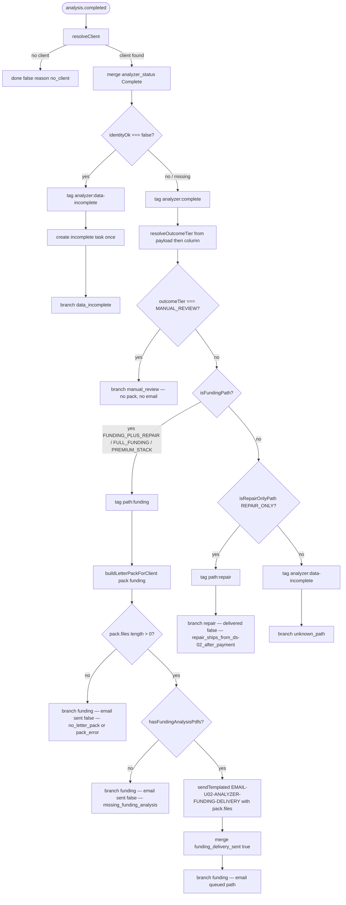

# U-02 — Analyzer Complete Delivery — actual

What `src/workflows/u-02-analyzer-complete-delivery.mjs` does today on `analysis.completed`.
Traced from that file (plus `resolveOutcomeTier` / `isFundingPath` / `isRepairOnlyPath` in
`src/config/product-path.mjs` and `hasFundingAnalysisPdfs` in `src/underwrite/letter-pack-filter.mjs`).
Not from a spec. Not from memory.

> **Why this file exists separately:** the eight role `-actual.md` pages are regenerated by
> `npm run journeys` from route gates only. They never mentioned U-02. Hand-editing them would
> fail the stale-journey suite. This page is the workflow actual for B3’s no-mail gates.

## In one picture

## Branches traced in code

| Branch | Email? | Pack? | Notes from code |
|---|---|---|---|
| `no_client` | no | no | Returns before status merge |
| `data_incomplete` | no | no | `identityOk === false` only; tags + funding_advisor task |
| `manual_review` | no | no | Early return — does not build a pack |
| `funding` + empty / error pack | no | attempted | No `sendTemplated` when `files` empty |
| `funding` + missing four analysis PDFs | no | yes, refused | Gate: credit_analysis, roadmap, funding_snapshot, lender_match by type or filename |
| `funding` + four analysis PDFs present | yes (`EMAIL-U02-ANALYZER-FUNDING-DELIVERY`) | yes | Then sets `funding_delivery_sent` |
| `repair` (`REPAIR_ONLY`) | no | no | Tags `path:repair` only — no free repair pack; fulfilment is DS-02 after payment |
| `unknown_path` | no | no | Includes non-funding tiers that are not `REPAIR_ONLY` e.g. `FRAUD_HOLD` / null / typo |

## UNVERIFIED

- Whether `sendTemplated` later transmits off the queue — U-02 only calls `sendTemplated`; dispatcher scheduling is outside this file.
- `EMAIL-U02-ANALYZER-REPAIR-DELIVERY` is exported from U-02 but **not called** anywhere in `handle` — do not draw a repair-email send path here.
- Exact PDF bytes inside `buildLetterPackForClient` — this page only records U-02’s gates after the pack returns.

## How to check this yourself

Open `src/workflows/u-02-analyzer-complete-delivery.mjs` and walk `handle` top to bottom.
Four-doc gate: `hasFundingAnalysisPdfs` in `src/underwrite/letter-pack-filter.mjs`.
Tier helpers: `src/config/product-path.mjs`.
