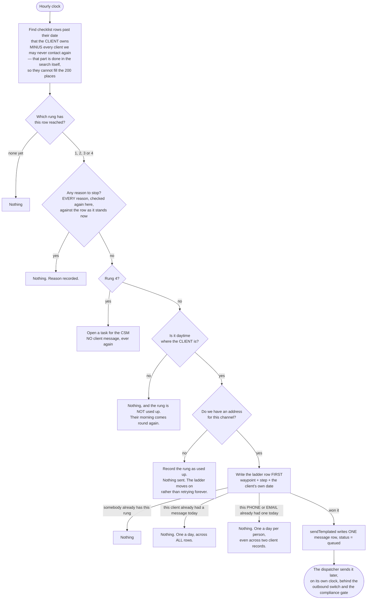
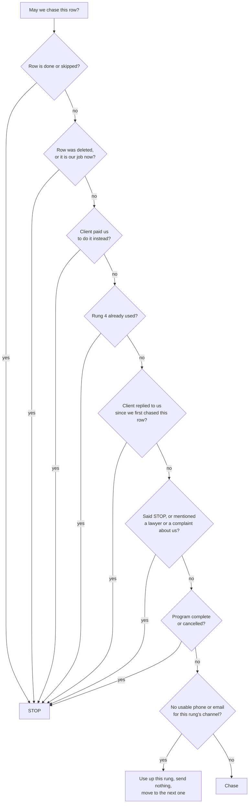
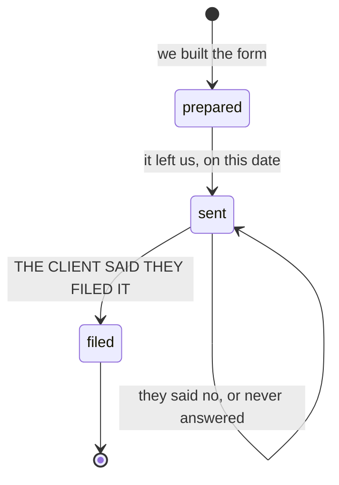

# waypoint nudge — actual

**COMPLIANCE REVIEW REQUIRED** (CLAUDE.md §7) — credit-repair messaging.

What the code **does** when a checklist step the client owns goes past its date.
Traced from `src/nudge/run.mjs`, `src/nudge/exits.mjs`, `src/nudge/ladder.mjs`,
`src/nudge/clock.mjs`, `src/paid-services/link-ttl.mjs`, `src/paid-services/expire.mjs`,
`src/workflows/paid-checkout-expiry-sweeper.mjs`, `db/migrations/365_waypoint_nudges.sql`,
`db/migrations/368_client_escalations.sql` and
`db/migrations/370_checkout_expiry_and_escalation_fk.sql`, and watched running against a real
Postgres in `src/nudge/run.pg.test.mjs` and `src/nudge/escalation-permanence.pg.test.mjs`.
Hand-maintained: this feature is not part of the generated set in
`scripts/journeys/generate.mjs`, which draws routes and this has none.

## The short version

A client has a checklist. Some rows are their job, some are ours. When a row that is **their
job** goes past its date, we reach out — at most three times, then we hand it to a person, and
never more than once a day however many rows are late. Any sign we should stop, and we stop for
good.

## The ladder

| Step | When | What happens | Template key |
|---|---|---|---|
| 1 | on the due date | text message | `SMS-WAYPOINT-DUE` |
| 2 | 2 days late | email | `EMAIL-WAYPOINT-NUDGE-1` |
| 3 | 5 days late | text message | `SMS-WAYPOINT-NUDGE-2` |
| 4 | 9 days late | **a task for a person. The client is sent nothing.** | — |

There is no step 5. `db/migrations/365_waypoint_nudges.sql` carries
`CHECK (step BETWEEN 1 AND 4)` and `UNIQUE (waypoint_id, step)`, so a fifth message about one
checklist row cannot be written to the database at all.

The days are the owner's to change. The four rungs and the human at the end are not.

## One pass

### The pass cannot quietly starve, and it cannot quietly fill up

Two things were wrong here until 2026-09-06 and both are worth stating, because the second one
is what hid the first.

**Rows that could never be chased used to block live ones.** The search took the 200 oldest late
rows and only *then* asked, one at a time, whether each one was allowed to be chased at all. Any
row that was not allowed simply stayed late — nothing was written, nothing changed — and being
the oldest it came first again next time. So dead rows piled up at the front until they filled
all 200 places and no live client was ever reached. The sweeper searches the *whole platform* at
once, so those 200 places are one budget for every client there is.

Round two fixed one narrow version of this: a row whose four rungs were all used. **That was not
the case that was failing.** The case that was failing is a client the system may never contact
again — they said STOP, they mentioned a lawyer, their program was finished or cancelled, they
paid us to do it, or they already replied. Those rows write nothing at all, so there was nothing
to notice them by. Both reviewers found it independently, and both scenarios were reproduced
again here on 2026-09-06 before the fix:

* 200 clients whose programs were **cancelled**, plus one newly late client: 200 candidates,
  the live one not among them, **0 messages** — on that day and every day after.
* 200 clients who had texted **STOP**, same shape, same result: **0 messages**, for ever.

Now every *permanent* reason to stop is applied **inside** the search, before the 200 are chosen,
so a client we can never contact again cannot take a place. Genuinely temporary reasons are
deliberately left alone and keep their place in the queue — the one-message-a-day cap,
night-time in the client's timezone, and a database error we could not read. Tomorrow those can
send, so tomorrow they must still be in the line.

**One of them was filed as temporary and was not — that was the round-four blocker.** A client
who had been sent a checkout link was held out of the chase, on the stated ground that "a
checkout link is out. It expires; then we chase again." *Nothing in this system ever expired
one.* There was no expiry date on the record, nothing set one when the link was made, and no
scheduled job anywhere touched those records at all. So the hold was permanent while being
written down as temporary, and it held a place for ever. Reproduced here on 2026-09-06: 200
clients each holding an unpaid checkout from 400 days earlier, plus one newly late client — 200
candidates, the live one not among them, **0 messages to them, that day and a year later**.

Now an invitation to pay has an end date, and the end date is a real column on the record
(`paid_service_requests.checkout_expires_at`, `db/migrations/370`). **Seven days**, set when the
link is made. The database refuses a record that sits in "waiting for payment" without one, an
hourly job closes the record when the date passes, and the chase search only holds a place open
while the link is genuinely live. After that the client is chased again — exactly what the
sentence always promised. Seven and not thirty because the whole ladder is only nine days long;
a longer hold would swallow it.

**And a client whose money we gave back was being treated as a paying customer.** "Refunded"
counted as "they paid us to handle this one", so somebody who got their money back — meaning we
did **not** do it for them — was never chased again about a job that is theirs again. Refunded no
longer counts as a purchase. Cancelled, quoted and failed never did.

**The day cap used to burn the budget too.** A client with eight late rows put all eight into the
pass; the first became their one message and the other seven were refused for "already had a
message today" — each having spent a place. Being the oldest rows they did it again every hour. A
reviewer measured 25 clients with 8 rows each filling all 200 places and reaching 25 people, with
a live client waiting two days. The search now takes **at most one row per client per pass** —
their most overdue one. Nothing is lost, because the other seven could not have produced a
message today anyway.

This is a shorter queue, never a looser one. Every check the search now does is a check the
send-time gate was already doing a moment later; the gate still runs on every single message
before it goes out, and a test fails if the two ever disagree. Proved by
`200 CANCELLED programs do NOT hold the budget against one live client`,
`200 clients who texted STOP do NOT hold the budget against one live client`,
`an abandoned checkout link at 200 days does not hold a slot for ever`,
`an abandoned checkout link at 400 days does not hold a slot for ever`,
`a LIVE checkout link holds NO slot, and still sends nothing`,
`an EXPIRED checkout link stops holding the waypoint, and the chase resumes`,
`the expiry is a fact in the data, not only in the nudge query`,
`a REFUNDED paid request means we did NOT do it, so the client is still chased`,
`the daily cap no longer burns the budget: 25 clients, 8 rows each, one live client`, and
`every waypoint the SQL removes is one the gate would have refused`.

**What "does not hold a slot for ever" means at 200 and 400 days, stated exactly.** Those 200
abandoned checkouts are not dead weight any more — their invitations are long gone, so they are
real work again. Being 200+ days late they are all at the last rung, so one pass hands each of
them to a person and finishes their ladder for good. That pass is full, and it says so. **The
live client is reached on the very next pass** — one hour, rather than never.

**One honest gap.** A client who has threatened us but has never been looked at yet still holds a
place for exactly one pass — the pass that looks at them, refuses them, and writes the permanent
record. From the next pass on they are gone from the line. Nothing is sent to them on that pass.

**And a full queue used to look like a quiet day.** The tally said "considered 200, queued 0,
skipped 200" and nothing in it said the budget was full. It now reports `budget_exhausted` and
`not_reached` — how many late rows the pass could not get to — and writes a warning line.
`not_reached` is `null`, never `0`, if the count itself fails: unknown is not zero.

### A message in flight is not a message sent

The ladder row is written **before** anything is queued, and it says `claimed` until the send
comes back. If the process dies in between, the row reads `claimed` — honestly unresolved —
rather than reading exactly like a delivered message, which is what it used to do. The rung is
still used up and it is **not** retried: a step is spent once, and one missed nudge is cheaper
than a second text.

A `claimed` row still holds the client's day. Not knowing whether a message went out is not a
reason to send another one.

### One a day means one *person* a day

There are two caps, and both are unique indexes in the database rather than a counter in code:

* one client-facing message per **client record** per day (`db/migrations/365`)
* one client-facing message per **destination** per day (`db/migrations/369`) — the phone number
  or email address the message actually reaches, normalised so `+1 (555) 000-4000` and
  `+15550004000` are the same person

The second exists because the first counts records. A person with two client rows on one phone
was two records, so they got two texts in a day. Both caps are in force and the effective rule is
the stricter of the two — adding the destination cap could only ever reduce the number of
messages, never increase it.

The destination cap is scoped to one company. Two white-label partners genuinely sharing an end
customer could still each send that person one message in a day; letting one partner's send
silence another's would be one company reaching into another's data, which is worse.

The phone rule is North American: an eleven-digit number starting `1` loses the `1`. A non-US
number written two ways will not be recognised as one person. That is a known gap, and it fails
toward one extra message rather than toward a missed stop.

## Every reason it stops

All of these are checked **again at send time**, against the live row — not once when the pass
was planned. A row the client finishes in between produces nothing.

Where each one lives in the code, and whether it also drops the row out of the
line — see "the pass cannot quietly starve" above for why that second column matters:

| Stop | Where | Also leaves the line? |
|---|---|---|
| done / skipped / blocked | `client_waypoints.state`, read fresh in `exits.mjs` | yes — permanent |
| deleted, or ours now | `client_waypoints` row missing, or `owner_kind <> 'client'` | yes — permanent |
| paid the alternative | `paid_service_requests.status` in paid / staged / fulfilled. **Not `refunded`** — see below | yes — permanent |
| rung 4 used | a `waypoint_nudges` row at step 4 — stored, never remembered | yes — permanent |
| the client replied | an inbound `messages` row after our first nudge on that row | yes — permanent |
| STOP or opt-out | `isOptedOut()` — the existing `opt_outs` table, no second store | yes — permanent |
| a lawyer or a complaint about us | a keyword screen over the client's inbound messages, **and a permanent row in `client_escalations`** — see below | yes, from the pass after the first sighting |
| program complete / cancelled | `repair_programs.status` | yes — permanent |
| a checkout link still out **and still live** | `paid_service_requests.status` = awaiting_payment, and `checkout_expires_at` has not passed | yes, while the link is live — see below |
| already had a message today, or it is night where they are | the day cap in `db/migrations/365` and `369`, and `clock.mjs` | **no — keeps its place** |
| we could not tell (a database error) | `check_failed` from `exits.mjs` | **no — keeps its place** |
| no address | `clients.phone` / `clients.email`, plus that channel's do-not-disturb flag | no — the rung is used up instead |

### A legal threat does not expire

Until 2026-09-06 the "have they threatened us?" check read the client's **most recent 200**
inbound messages and looked for the words in those. The message never went anywhere — the window
moved past it. The client portal's chat writes one inbound row every time the client types, so an
ordinary chatty client buries a threat in about a week. Measured on a scratch database: "my
lawyer will be in touch", then 210 ordinary messages, then a new late checklist row — and the
system queued them a text.

A search is a detector, not a memory. The memory is now a row in `client_escalations`
(`db/migrations/368`): **one per client, written the first time the words are seen, never
updated, never removed and never expired.** Once it exists, every chase ladder that client has is
over.

Two supporting details, because they are the parts that could go wrong:

* **The application really cannot delete one — and that sentence took two goes to make true.**
  Round two wrote it in five places while the app could still delete the row. The reason is dull
  and worth knowing: `db/migrations/104` hands the app full write access to *every* table made
  after it, so granting a smaller list later changes nothing. It takes an explicit **take-away**,
  and `db/migrations/368` now has one. Proved by trying it as the app's own database user on a
  freshly built database: the delete came back **"permission denied"**, and so did an attempt to
  edit the row. Not "nothing happened" — refused.

  **That was still not the whole door.** The record was set to be swept away automatically if the
  *client* record was deleted, and that sweep runs with the table owner's permission rather than
  the app's — so the app could still destroy the record, by deleting the client. Found on
  2026-09-06. `db/migrations/370` changes that link so the database now **refuses to delete a
  client who has one of these records on file**. Proved as the app's own database user: the
  delete is rejected outright and the record is still there afterwards. A client with no such
  record deletes exactly as before. `src/nudge/escalation-permanence.pg.test.mjs` fails if any of
  that stops being true.
* **There is no window and no bookmark of any kind.** The search reads the client's whole history
  every time, until the memory row exists. Round two replaced the 200-message window with a
  bookmark saying "we have read this far", and the bookmark had the same disease: it moved past
  messages it had not actually looked at, and the next search started strictly *after* it. A
  threat that landed on the bookmark was invisible for ever. Reproduced on 2026-09-06 — the
  system queued a text to somebody who had said a lawyer was coming. The bookmark is gone. Reading
  everything costs 4 milliseconds for a client with 500 messages and 40 for one with 10,000,
  measured, and only for clients who have *not* threatened us — the memory row short-circuits the
  rest.
* **The words list is not written twice.** The database narrows the search using a pattern built
  automatically from the same list the code checks, widened rather than copied. A test fails if
  the database pattern is ever narrower than the code's.

The row stores no client words. It stores which of *our* rules matched. It is not a finding
against the client and it is never shown to them.

### Somebody is told, because a mistake here used to be silent

The word list is deliberately wide, and wide lists misfire. A reviewer sent one text on
2026-09-06:

> that collection agency that keeps calling me is a scam

That is a client complaining about **somebody else** — exactly the case the list is meant to
avoid. It matched anyway, wrote the permanent record, and ended every chase that client will ever
have. And because the take-away above means no part of the app can undo it, and because nothing
outside the chase code reads that table, **no screen in the product showed that it had
happened**.

The stop stays permanent. What is fixed is the silence: the first time a client is stopped this
way, a task lands on the CSM's board saying so, naming *our* rule and not the client's sentence.
One client, one record, one task, ever. Proved by
`a permanent stop is no longer INVISIBLE — a person is given the task`.

**Two things were deliberately not done, and both are open gaps, not fixes:**

* **The word list was not narrowed.** Every narrowing tried also let through language plainly
  aimed at us — "stop harassing me", "this is a scam". A keyword list cannot reliably tell who
  the client is talking about. Leaving it wide fails toward saying nothing, which is the safe
  side of this particular mistake.
* **There is still no way to lift one from inside the app, and there deliberately isn't.**
  Lifting would mean the app writing to a record that exists precisely because the app must not
  be able to write to it, and the very next scan of the same message would put it straight back.
  A person with database access can lift one. The product cannot. **If the task above turns out
  to be a misfire, that is what has to happen.**

**On hold is not one of them, and that is a gap, not an omission.** `repair_programs.status`
permits only `active`, `complete`, `upsell_pending` and `cancelled`, and nothing in this
database records a client being paused. Nothing was invented to cover it. The lever that does
exist is per-row: setting a checklist row's state to `blocked` stops its chase.

## Rounds 4 and 5 — the regulator ping

We prepare the CFPB and state attorney general complaints. The client signs them under penalty
of perjury and files them personally.

If the client hands over a CFPB case number with their yes, it is stored; a blank one is dropped
rather than kept, because `NULL` means we do not know and an empty string looks like an answer.

### What the database actually enforces

This page used to say "no staff member, no workflow and no hand-written SQL can put a complaint
in that state". **That was wrong, and it was proved wrong twice on 2026-09-06.** A direct
`INSERT` landed straight on `filed`, because the forward-only trigger was written
`BEFORE UPDATE OF state` and an `INSERT` never fires it. And a hand-written `UPDATE` from `sent`
to `filed`, carrying `filed_source = 'client_reported'`, was accepted.

The `INSERT` hole is closed (`db/migrations/367`). The second one cannot be closed here, and the
honest list is now this:

| Enforced, in the database | Not enforced, and cannot be |
|---|---|
| `filed` needs `filed_at` **and** `filed_source = 'client_reported'` | that whoever wrote `client_reported` was telling the truth |
| a row cannot be **created** already `filed` | |
| `prepared → filed` is refused — a form that never left us cannot have been filed | |
| nothing moves backwards | |
| a case number cannot exist on any state but `filed` | |

`filed_source = 'client_reported'` **is** the sentence "the client told us". A database can
refuse a row that does not carry that sentence. It cannot tell a true sentence from a false one.
So a person with direct database access can write it, and that is a gap in who can reach the
database, not a gap this table can close.

`src/nudge/regulator.pg.test.mjs` pins every row of both columns, including the gap — the test
named `KNOWN LIMIT` fails if somebody ever closes it, which is the signal to widen this page
again.

**UNVERIFIED — NOTHING SHOWS THIS TO ANYBODY YET.** An earlier version of this page said "a
page renders `sent` as sent, and `filed` as filed only alongside who said so". That described an
intention, not the code. Traced on 2026-09-06: nothing outside `src/nudge/` reads
`regulator_complaints`, and `src/nudge/regulator.mjs` has no production caller at all — no
endpoint, no route in `netlify/functions/api.mjs`, no workflow. Its only importers are
`src/nudge/index.mjs`, which nothing outside `src/nudge/` imports either, and its own test file.
So the table and its rules are real and enforced, and **no screen reads them**. When one is
built, `filed_source` is the column that says who claimed the filing and it belongs on the screen
beside the word `filed`, never behind it — but that is a note for whoever builds it, not a
description of anything running today.

**The client-facing letters still claim nothing.** Rounds 4 and 5 say only when the complaint
goes out. Round 6 reuses the Round 3 final notice and its own label says it "does not claim
either complaint was filed, because nothing records that"
(`src/metro2/letters/catalog.mjs`). Recording a filing here did not switch that on, and a test
in this lane fails if it ever does.

## What this does NOT do

* It does not send. `src/nudge/run.mjs` writes one `messages` row with `status='queued'`.
  `src/messaging/dispatch.mjs` hands queued rows to a provider on its own five-minute clock,
  behind the per-company outbound switch and the compliance gate. There is no `fetch` anywhere
  under `src/nudge/`, and a test asserts there is none.
* It never chases a step FundHub owes. Those are filtered out in SQL, not in code.
* It writes no client-facing copy of its own. The three template keys are stable; the words
  behind them are placeholders in `db/seed/025_waypoint_nudge_templates.sql`, changeable in the
  template editor without a code change.
* **It does not give a new company its templates.** `db/seed/025` writes them for the companies
  that exist when it runs. A company created afterwards has none, and every rung resolves as
  `template_pending` — the rung is used up and nothing goes out. That is not fixed here. What is
  fixed is the silence: the tally now names the missing key in `template_pending_keys` and writes
  a warning line, so it takes a glance rather than a hunt.

## Proved by running it

`src/nudge/run.pg.test.mjs` (42 tests), `src/nudge/regulator.pg.test.mjs` (17 tests) and
`src/nudge/escalation-permanence.pg.test.mjs` (3 tests) against a real Postgres 16.14 (Homebrew, macOS) — **62
tests, 62 passing, 0 failing, 0 skipped, exit code 0 on every run**, each file run twice against
the same scratch database on 2026-09-06. The permanence file is the one that connects as the
application's own unprivileged database user, which is the only way to tell a refusal from a
delete that silently matched nothing.

* a row completed between planning and sending — nothing sent, no rung used
* sixteen duplicate triggers, sequential and concurrent — one message row each time
* three late rows on one client on one day — one message
* the paid alternative bought — the chase stops; a mere quote does not stop it
* STOP received — nothing on day 0, 2, 5, 9 or 30
* rung 4 — one task, no client message, and none for the following month
* a client with no phone — the text rung is used up once, the email rung still runs
* 05:00 where the client is — not queued; queued when their morning comes
* **200 finished rows plus one live client — the live client gets their message**
* **a full budget reports itself, with the number it could not reach**
* **a lawyer message plus 210 later messages — still stopped, and stopped for good even after
  the message itself is deleted**
* **a client who filed the CFPB form because we asked them to — still chased**
* **two client records on one phone — one text**
* **one client with a phone and an email — one message, not one of each**
* **the row says `claimed` while the send is in flight, and a `claimed` row is never retried**
* **the exact body of the queued text, character for character, for the fixture copy and for the
  shipped `db/seed/025` copy — including that no merge field is left unresolved and the opt-out
  line survives**
* **a complaint cannot be created already `filed`; the one hole that remains is pinned by a test
  named `KNOWN LIMIT`**
* **rounds 4, 5 and 6 of the letter ladder still claim no filing**
