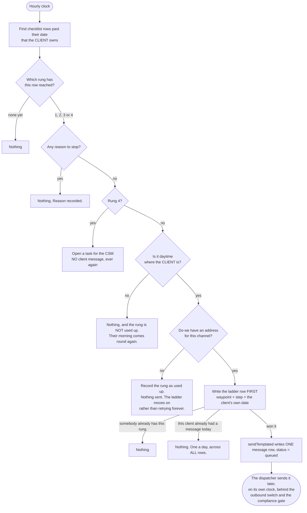
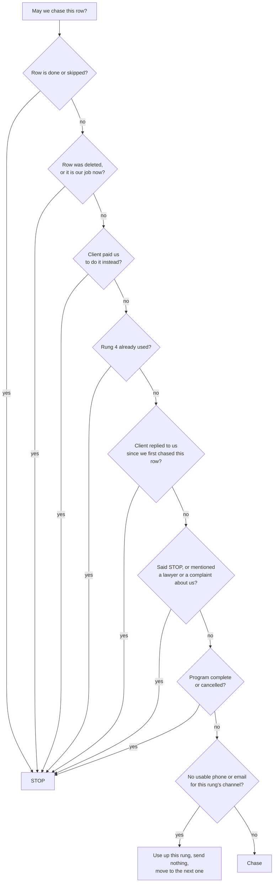
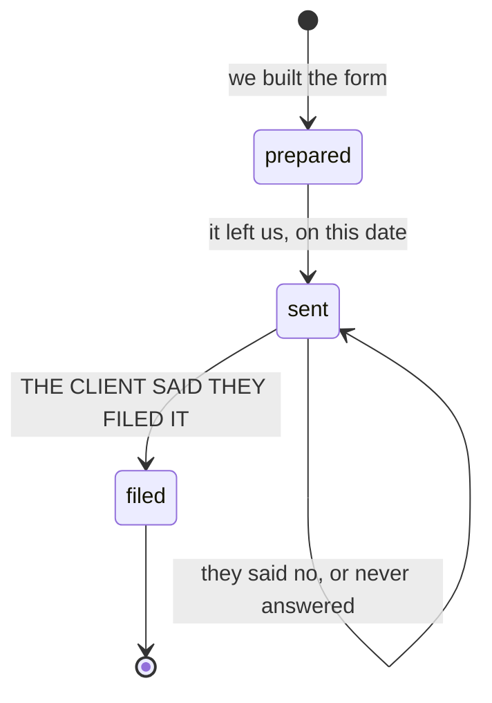

# waypoint nudge — actual

**COMPLIANCE REVIEW REQUIRED** (CLAUDE.md §7) — credit-repair messaging.

What the code **does** when a checklist step the client owns goes past its date.
Traced from `src/nudge/run.mjs`, `src/nudge/exits.mjs`, `src/nudge/ladder.mjs`,
`src/nudge/clock.mjs` and `db/migrations/365_waypoint_nudges.sql`, and watched running
against a real Postgres in `src/nudge/run.pg.test.mjs`. Hand-maintained: this feature is not
part of the generated set in `scripts/journeys/generate.mjs`, which draws routes and this has
none.

## The short version

A client has a checklist. Some rows are their job, some are ours. When a row that is **their
job** goes past its date, we reach out — at most three times, then we hand it to a person, and
never more than once a day however many rows are late. Any sign we should stop, and we stop for
good.

## The ladder

| Step | When | What happens | Template key |
|---|---|---|---|
| 1 | on the due date | text message | `SMS-WAYPOINT-DUE` |
| 2 | 2 days late | email | `EMAIL-WAYPOINT-NUDGE-1` |
| 3 | 5 days late | text message | `SMS-WAYPOINT-NUDGE-2` |
| 4 | 9 days late | **a task for a person. The client is sent nothing.** | — |

There is no step 5. `db/migrations/365_waypoint_nudges.sql` carries
`CHECK (step BETWEEN 1 AND 4)` and `UNIQUE (waypoint_id, step)`, so a fifth message about one
checklist row cannot be written to the database at all.

The days are the owner's to change. The four rungs and the human at the end are not.

## One pass

## Every reason it stops

All of these are checked **again at send time**, against the live row — not once when the pass
was planned. A row the client finishes in between produces nothing.

Where each one lives in the code:

| Stop | Where |
|---|---|
| done / skipped / blocked | `client_waypoints.state`, read fresh in `exits.mjs` |
| deleted, or ours now | `client_waypoints` row missing, or `owner_kind <> 'client'` |
| paid the alternative | `paid_service_requests.status` in paid / staged / fulfilled / refunded |
| rung 4 used | a `waypoint_nudges` row at step 4 — stored, never remembered |
| the client replied | an inbound `messages` row after our first nudge on that row |
| STOP or opt-out | `isOptedOut()` — the existing `opt_outs` table, no second store |
| a lawyer or a complaint about us | a keyword screen over the client's own inbound messages |
| program complete / cancelled | `repair_programs.status` |
| no address | `clients.phone` / `clients.email`, plus that channel's do-not-disturb flag |

**On hold is not one of them, and that is a gap, not an omission.** `repair_programs.status`
permits only `active`, `complete`, `upsell_pending` and `cancelled`, and nothing in this
database records a client being paused. Nothing was invented to cover it. The lever that does
exist is per-row: setting a checklist row's state to `blocked` stops its chase.

## Rounds 4 and 5 — the regulator ping

We prepare the CFPB and state attorney general complaints. The client signs them under penalty
of perjury and files them personally.

`prepared → filed` is refused by a database trigger: a form that never left us cannot have been
filed. `filed` is refused without `filed_source = 'client_reported'`, so no staff member, no
workflow and no hand-written SQL can put a complaint in that state. If the client hands over a
CFPB case number with their yes, it is stored; a blank one is dropped rather than kept, because
`NULL` means we do not know and an empty string looks like an answer.

A page renders `sent` as sent. It renders `filed` as filed only because the client said so.

## What this does NOT do

* It does not send. `src/nudge/run.mjs` writes one `messages` row with `status='queued'`.
  `src/messaging/dispatch.mjs` hands queued rows to a provider on its own five-minute clock,
  behind the per-company outbound switch and the compliance gate. There is no `fetch` anywhere
  under `src/nudge/`, and a test asserts there is none.
* It never chases a step FundHub owes. Those are filtered out in SQL, not in code.
* It writes no client-facing copy of its own. The three template keys are stable; the words
  behind them are placeholders in `db/seed/025_waypoint_nudge_templates.sql`, changeable in the
  template editor without a code change.

## Proved by running it

`src/nudge/run.pg.test.mjs`, 25 tests, against a real Postgres:

* a row completed between planning and sending — nothing sent, no rung used
* sixteen duplicate triggers, sequential and concurrent — one message row each time
* three late rows on one client on one day — one message
* the paid alternative bought — the chase stops; a mere quote does not stop it
* STOP received — nothing on day 0, 2, 5, 9 or 30
* rung 4 — one task, no client message, and none for the following month
* a client with no phone — the text rung is used up once, the email rung still runs
* 05:00 where the client is — not queued; queued when their morning comes
