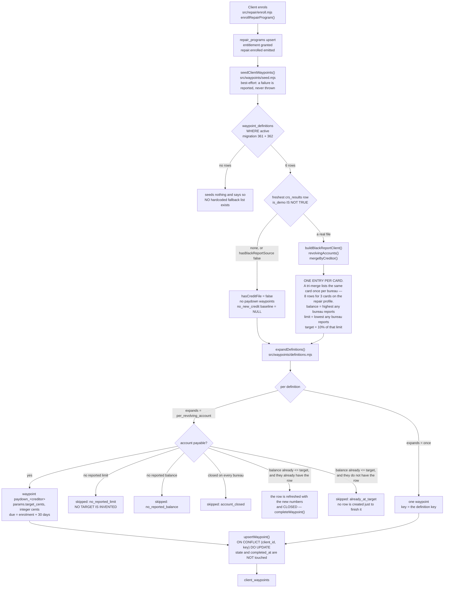
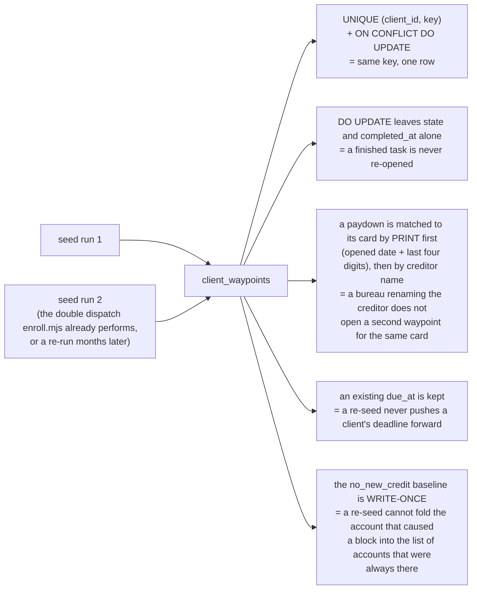
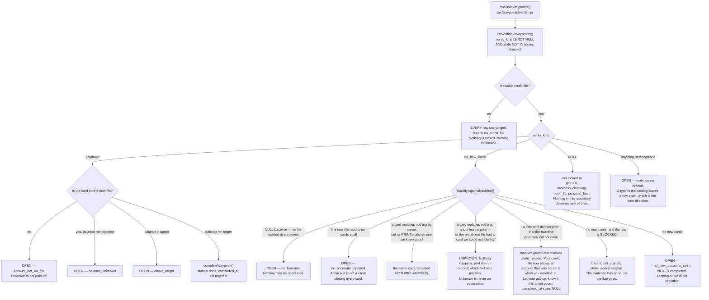
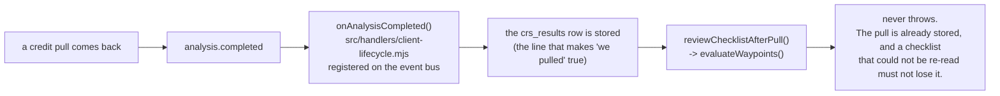

# Waypoint seeding — ACTUAL

Generated from code on 2026-09-06, branch `fix/waypoint-seeding-repair`, base `origin/main` 8010b1b9.
Every box below was traced to a line that runs. Nothing here is drawn from the plan.

**Re-traced 2026-09-06 after an adversarial review returned FAIL.** Eight defects were found by
running the code, and this page is rewritten around what the code does now. The four that changed
behaviour a client can see: the checklist no longer promises anybody a loan, a card whose creditor
has been renamed is no longer reported as new credit, a re-pull now actually closes the list, and a
blocked row has a way back.

## In one paragraph, for a person

A client who signs up for the optimization program now gets a **checklist**. It is built the
moment they enrol. It lists the things **they** have to do — pay specific cards down to specific
numbers, do not open new credit, talk to their advisor about a personal loan, file the LLC, get an
EIN, open a business bank account. The dispute letters are not on it, because those are our job. Nothing on
the list has a price on it, because we do not sell any of those services today. The list is not
written into the code: it is rows in a table, so changing what clients are asked to do is a
change to the data and not a new release.

When a client's credit is pulled again, the platform closes the parts of the list it can actually
see. A card that reached its target is ticked off. A card that did not is left alone. A card that
is missing from the new report is left alone, because we do not know what happened to it. The
EIN, the bank account and the LLC are never ticked off by a credit pull, because nothing in this
system can see any of them.

**The list only says what a client has to DO.** No step tells them they qualify for anything, that
they will be approved, that a number will move, or by when. That rule is now enforced by a test:
if `qualify`, `approved`, `guaranteed`, `boost`, `points`, `score` or a dollar figure ever reaches
a task's words, the test suite fails.

**A card is not its name.** Credit bureaus rewrite creditor names all the time — the same card can
come back as "Credit One Bank" one month and "CREDIT ONE BANK N.A." the next. The platform now
recognises a card by the day it was opened plus the last four digits of its number, so a renamed
card is still the same card. When it genuinely cannot tell whether a card is new or just renamed,
IT DOES NOTHING: no message, no flag, nothing on the client's screen.

## What was true before this change

`client_waypoints` (migration 330) and `src/waypoints/store.mjs` had both existed since
2026-09-05. **Nothing outside a test had ever written a row.** Measured 2026-09-06 by grepping
every caller of `upsertWaypoint` on `origin/main` 8010b1b9: four files, three of them `*.test.mjs`
and the fourth `docs/workflows/wave-3-checks/seed-live-client.mjs`, a manual check script. Proved
by running it too — enrolling a client on a scratch database with all 255 migrations applied left
`client_waypoints` empty.

## Seeding

### What gets seeded, today

| key | whose job | deadline | closable from data? | price |
|---|---|---|---|---|
| `paydown_<creditor>` (one per card) | client | enrolment + 30 days | yes — `paydown` | none |
| `no_new_credit` | client | none | one direction only — `no_new_credit` | none |
| `personal_loan` | client | enrolment + 14 days | no | none |
| `form_llc` | client | enrolment + 30 days | no | none |
| `get_ein` | client | none | no | none |
| `business_checking` | client | none | no | none |

**Not seeded, on purpose.** DUNS / Dun & Bradstreet, net-30 vendor accounts (Uline, Quill,
Grainger) and Paydex. Owner-set: "we dont do DUNS", Chris 2026-09-05, TODO.md item 0. The platform
also holds no vendor list, no Paydex field and no business-credit tracking, so those rows could
never be closed by anything. A test in `src/waypoints/seed.pg.test.mjs` fails if any of those
words reaches the catalog.

**Three deadlines are deliberately NULL.** The six-month sequence is recorded as not finalised,
and the roadmap itself puts "open a business checking account" in Month 1 in one place and Month 5
in another. A waypoint with no due date is never overdue, so leaving it NULL is the honest state.
Setting them later is one `UPDATE`.

**Every price is NULL.** The only priced self-serve product this platform has is a dispute round,
and a dispute round is not the client's job. The column and the whole path through the seeder are
built and tested; nothing on the client's list is for sale today.

## Idempotency

## Closing it from the data

## What fires the closing pass

`evaluateWaypoints()` had **no production caller at all** until this change — a grep across the
branch found it in test files and nowhere else, so a client who paid a card down was told to pay it
down forever. It now hangs off `analysis.completed`, which is the event a finished credit pull
raises and the same event the `crs_results` INSERT already reacts to. It is best-effort in exactly
the way seeding is best-effort at enrolment: the pull is committed before it runs, so nothing
inside it can undo or block the pull. It is outside every transaction in `src/finance/soft-pulls.mjs`
for the same reason.

`src/waypoints/seed.pg.test.mjs` drives the real handler — not a stub — with a real
`crs_results` row: pay a card down, fire the event, the card's row moves to `done` and nothing else
on the list moves. Firing the same event again changes nothing.

## UNVERIFIED / not wired

* **No screen reads the checklist as a tick-box list.** `api/read/client-progress.mjs` already
  returns the rows via `listWaypoints` (`src/progress/read.mjs:187`), so the data reaches the
  browser; nothing lets a client tick one off. Deliberately out of scope for this lane.
* **No nudge, no message.** Nothing here queues or sends anything.

## Files

| file | what it does |
|---|---|
| `db/migrations/360_waypoint_verification.sql` | `verify_kind` and `params` on `client_waypoints` |
| `db/migrations/361_waypoint_definitions.sql` | the catalog table |
| `db/migrations/362_waypoint_definitions_seed.sql` | the six tasks |
| `db/migrations/363_waypoint_definitions_copy_and_grants.sql` | the corrected wording, and the policy/grant fix, for any database that already applied 361 and 362 |
| `src/waypoints/definitions.mjs` | catalog → one client's waypoints, pure |
| `src/waypoints/seed.mjs` | the write, idempotent |
| `src/waypoints/verify.mjs` | closing from a re-pull |
| `src/waypoints/store.mjs` | `verify_kind`/`params` on the upsert, `listVerifiableWaypoints`, `markWaypointState` |
| `src/repair/enroll.mjs` | calls the seeder beside the `repair.enrolled` emit |
| `src/handlers/client-lifecycle.mjs` | `reviewChecklistAfterPull()` — the credit pull that closes the list |

## Who may change the checklist

The point of holding the list in a table is that Chris can change what clients are asked to do with
one `UPDATE` instead of a release. That promise was broken on the first attempt and is fixed here.

Migration 361 puts `FORCE ROW LEVEL SECURITY` on `waypoint_definitions`, and FORCE applies the
table's own policies **to the table's owner as well**. With the SELECT-only policy 361 originally
carried, every write to the table failed for any database role that is not a superuser:

| as a plain (non-superuser) role, under the old shape | result |
|---|---|
| `INSERT` | `ERROR: new row violates row-level security policy` |
| `UPDATE` | `UPDATE 0` — **and no error at all** |
| `DELETE` | `DELETE 0` — **and no error at all** |

Two things were wrong with that. Migration 362 inserts the six rows **as the migration role**, so on
a production database whose migration role is not a superuser the deploy itself would have failed.
And an `UPDATE` that reports success while changing nothing is the worst possible way for the
"edit it with SQL" promise to break.

So the policy now permits (the same `USING (true) WITH CHECK (true)` shape migration 330 already
runs in production), and the application's read-only-ness is a **grant**:

* `fundhub_app` holds `SELECT` on `waypoint_definitions` and nothing else, verified by reading
  `information_schema.role_table_grants` in a test rather than by asserting it in prose.
* That took an explicit `REVOKE`. `104_app_role.sql` runs `ALTER DEFAULT PRIVILEGES … GRANT SELECT,
  INSERT, UPDATE, DELETE`, so the app was handed all four rights the moment the table was created.
  The earlier claim that it "holds SELECT and nothing else" was **not true**: writes were stopped by
  row-level security, not by the grant.
* An attempted write by the application now raises `permission denied for table
  waypoint_definitions`. A refusal that raises is a refusal somebody notices.
