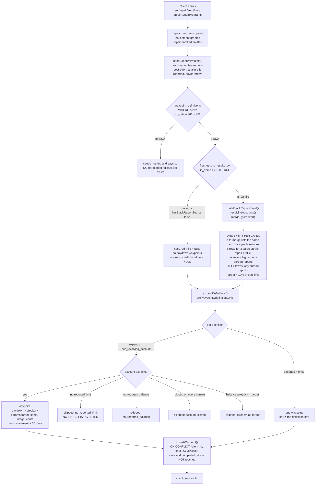
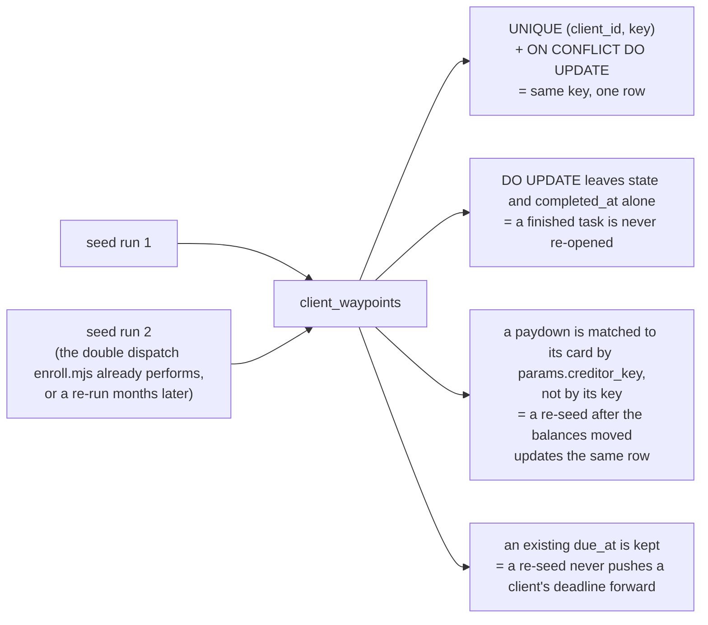
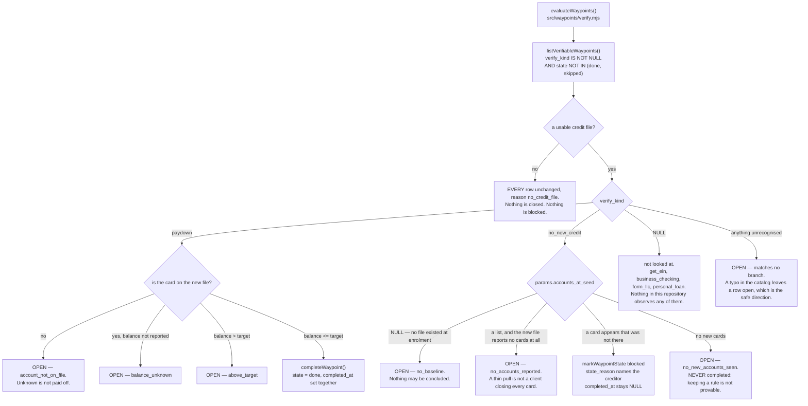

# Waypoint seeding — ACTUAL

Generated from code on 2026-09-06, branch `feat/waypoint-seeding-2`, base `origin/main` 8010b1b9.
Every box below was traced to a line that runs. Nothing here is drawn from the plan.

## In one paragraph, for a person

A client who signs up for the optimization program now gets a **checklist**. It is built the
moment they enrol. It lists the things **they** have to do — pay specific cards down to specific
numbers, do not open new credit, take the personal loan now, file the LLC, get an EIN, open a
business bank account. The dispute letters are not on it, because those are our job. Nothing on
the list has a price on it, because we do not sell any of those services today. The list is not
written into the code: it is rows in a table, so changing what clients are asked to do is a
change to the data and not a new release.

When a client's credit is pulled again, the platform closes the parts of the list it can actually
see. A card that reached its target is ticked off. A card that did not is left alone. A card that
is missing from the new report is left alone, because we do not know what happened to it. The
EIN, the bank account and the LLC are never ticked off by a credit pull, because nothing in this
system can see any of them.

## What was true before this change

`client_waypoints` (migration 330) and `src/waypoints/store.mjs` had both existed since
2026-09-05. **Nothing outside a test had ever written a row.** Measured 2026-09-06 by grepping
every caller of `upsertWaypoint` on `origin/main` 8010b1b9: four files, three of them `*.test.mjs`
and the fourth `docs/workflows/wave-3-checks/seed-live-client.mjs`, a manual check script. Proved
by running it too — enrolling a client on a scratch database with all 255 migrations applied left
`client_waypoints` empty.

## Seeding

### What gets seeded, today

| key | whose job | deadline | closable from data? | price |
|---|---|---|---|---|
| `paydown_<creditor>` (one per card) | client | enrolment + 30 days | yes — `paydown` | none |
| `no_new_credit` | client | none | one direction only — `no_new_credit` | none |
| `personal_loan` | client | enrolment + 14 days | no | none |
| `form_llc` | client | enrolment + 30 days | no | none |
| `get_ein` | client | none | no | none |
| `business_checking` | client | none | no | none |

**Not seeded, on purpose.** DUNS / Dun & Bradstreet, net-30 vendor accounts (Uline, Quill,
Grainger) and Paydex. Owner-set: "we dont do DUNS", Chris 2026-09-05, TODO.md item 0. The platform
also holds no vendor list, no Paydex field and no business-credit tracking, so those rows could
never be closed by anything. A test in `src/waypoints/seed.pg.test.mjs` fails if any of those
words reaches the catalog.

**Three deadlines are deliberately NULL.** The six-month sequence is recorded as not finalised,
and the roadmap itself puts "open a business checking account" in Month 1 in one place and Month 5
in another. A waypoint with no due date is never overdue, so leaving it NULL is the honest state.
Setting them later is one `UPDATE`.

**Every price is NULL.** The only priced self-serve product this platform has is a dispute round,
and a dispute round is not the client's job. The column and the whole path through the seeder are
built and tested; nothing on the client's list is for sale today.

## Idempotency

## Closing it from the data

## UNVERIFIED / not wired

* **`evaluateWaypoints()` is not called by production code.** It is proved by
  `src/waypoints/seed.pg.test.mjs` against real rows, but no credit-pull path calls it yet. The
  wiring point is `src/finance/soft-pulls.mjs` (the two `INSERT INTO crs_results` at :496 and
  :613), which is outside this lane's owned paths. Until that call exists, a re-pull does not move
  anybody's checklist on its own.
* **No screen reads the checklist as a tick-box list.** `api/read/client-progress.mjs` already
  returns the rows via `listWaypoints` (`src/progress/read.mjs:187`), so the data reaches the
  browser; nothing lets a client tick one off. Deliberately out of scope for this lane.
* **No nudge, no message.** Nothing here queues or sends anything.

## Files

| file | what it does |
|---|---|
| `db/migrations/360_waypoint_verification.sql` | `verify_kind` and `params` on `client_waypoints` |
| `db/migrations/361_waypoint_definitions.sql` | the catalog table |
| `db/migrations/362_waypoint_definitions_seed.sql` | the six tasks |
| `src/waypoints/definitions.mjs` | catalog → one client's waypoints, pure |
| `src/waypoints/seed.mjs` | the write, idempotent |
| `src/waypoints/verify.mjs` | closing from a re-pull |
| `src/waypoints/store.mjs` | `verify_kind`/`params` on the upsert, `listVerifiableWaypoints`, `markWaypointState` |
| `src/repair/enroll.mjs` | calls the seeder beside the `repair.enrolled` emit |
