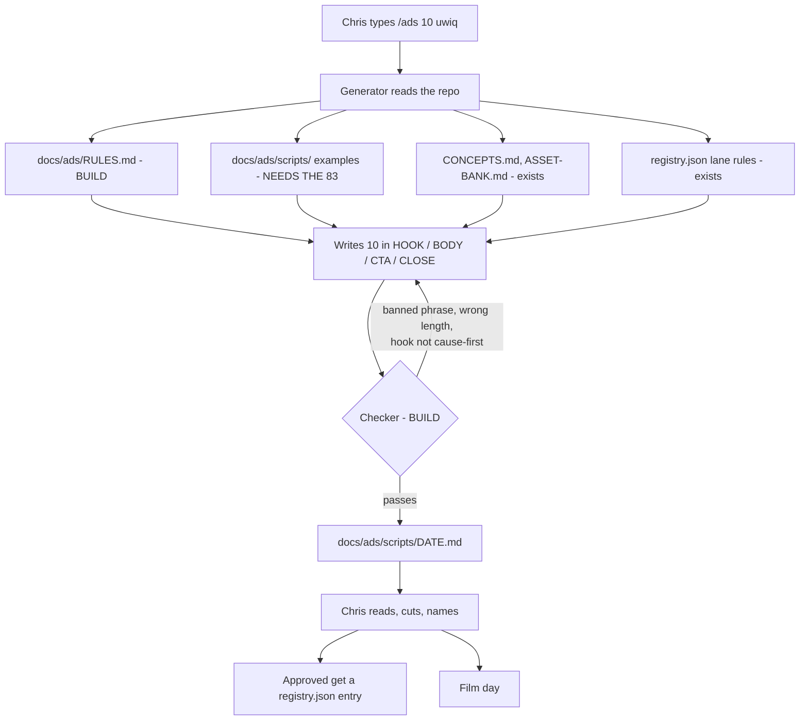

# Self-analysis: how this repo runs, and where the marketing week goes

Date: 2026-09-06. Branch at the time: `feat/csm-role-schema`.
Written for Chris. Plain English throughout, per `CLAUDE.md` section 10.

This is Phase 1 of a four-phase job. Phase 2 (questions) and Phase 3 (designs) are
appended to the bottom of this same file as they happen.

Raw evidence sits in `docs/ops/_lanes/`, four files, one per inventory lane. Every
number in this summary is traceable to a command printed in one of those four.

---

## The one thing to read

**The week's ad scripts are not in this repository, and never have been.**

`fundhub-scripts.md` (83 numbered ads) and `fundhub-vsl.md` do not exist. Not in the
repo, not on any branch, not in git history, and not anywhere on this Mac. Two lanes
searched independently and both came back empty. A depth-limited search of the whole
home folder found nothing.

The repo already knows. `docs/ads/scripts/README.md` is one sentence long:

> Ad scripts (83) and VSLs from 2026-09-02 live in the Claude chat outputs as
> fundhub-scripts.md and fundhub-vsl.md until Chris drops them here.

`docs/ads/registry.json` records the same problem from the other side. Its own header
says the file it was supposed to be built from "was NOT in the repository or any branch
when this file was written," which is why 21 of its 24 ads still have no name.

**Why this decides everything else.** The plan is a scheduled agent that reads the ad
rules and writes the week's scripts. An agent can only read what is in the repo. Today
it would open the ad folder and find 102 written pieces, four different numbering
systems, and a note saying the real scripts are in a chat window. Everything in Phase 3
depends on fixing this first, and it is a copy-and-paste job, not a build.

Two more files `docs/ads/README.md` tells people to open have never been committed
either: `20-ads.md` and `SHOOT-PLAN.md`.

---

## What IS in the repo: 102 written pieces

More than the chat-only note suggests. Counted and named:

| Where | What | State |
|---|---|---|
| `docs/ads/CONCEPTS.md` | 48 cold concepts, grouped by FICO gate | committed 2026-09-01 |
| `docs/ads/POST-BOOKING-15.md` | 30 retargeting concepts for people who already booked | **untracked - never committed** |
| `docs/flywheel/partner/04-copy.md` | 24 finished white-label pieces | committed 2026-08-31 |
| `docs/ads/CONTROLS.md` | 4 live ads + 3 scripts + the founder VSL, locked | committed 2026-09-01 |
| `docs/ads/registry.json` | 24 ads tagged by lane | committed 2026-09-03 |

**Filmed and running: five, by name.** `docs/ads/CONTROLS.md` line 13 says it in bold:
`Ad_1_Denial`, `Ad_2_Broker_Burn`, `Ad_3_Competitor`, `Ad_4_Blind_Application`,
`VSL_Script_DirectROAS_v1`. They book calls at **$32-36 each**. The same file says they
were shot in a room, look it, and still work.

**White-label: zero filmed.** `docs/flywheel/partner/05-ad-strategy.md` line 206 says
"Zero videos exist... No shoot is scheduled. No shoot is budgeted." That lane has 24
finished scripts and no video.

**No file anywhere records a shoot date.** So there is no way to measure a filming rate
from the repo. Five filmed is a floor, not a count.

### Your two money lanes are the two smallest

| Lane | Tagged in `registry.json` | On the 48-concept sheet | Best floor |
|---|---|---|---|
| **uwiq / Capital Blueprint** | 6 | 3 (the `educated` door) | **9** |
| **premium-funding** | 2 | 6 (the `Premium/strict` gate) | **8** |

Those two files number ads differently and the overlap was not proven, so treat 9 and 8
as floors, not sums.

The shape underneath is the real finding. Of 48 cold concepts, **31 point at the one
door that needs a $3,000 cash cheque** (`funded`). The two doors that finance the fee
are `sorted` (6) and `educated` (3). `docs/ads/NEXT.md` says the same thing in your own
words and asks for **10 more open-Sorting-Hat ads**, owner-set 2026-09-01.

### Four numbering systems, all using small numbers

This will bite any generator that is not told which one it is writing in.

- `registry.json` ids: 24 of them, 16 / 26-31 / 42-46 / 72-83. Ad 42 is "ringlights".
- `CONCEPTS.md` and `concepts.data.json`: 1 to 48. Concept 42 is "Nobody Stacks $200K
  In One Shot". Different ad, same number.
- `CONTROLS.md`: Ad 1-4, then Script 7-9, then the VSL. Ads 5 and 6 are simply absent.
- **Your own: 83 scripts.** Nothing in the repo holds 83 of anything. The registry's
  highest id is 83, which makes it look like a match. It is not.

### The naming rule a generator must obey

`scripts/ads/check-registry-titles.mjs` lines 11-14: the ad title is the word after the
dash in `utm_content`. `42-ringlights` is ad 42 titled "ringlights". So the title is
half of the tracking link, not a label. The test fails if any ad has no title, and 21
of 24 currently sit on an allow-list to keep the suite green. **An agent may not invent
a title.** Naming an ad is your call and the test exists to enforce that.

### The one machine-readable concept file, and the script that should read it

`docs/ads/build/concepts.data.json` is a real 48-entry array with a fixed 14-field
shape: `n, title, hook, angle, who, gate, door, enemy, mech, shape, aware, run, bet,
rec`. **This is the shape a generator should produce.**

Nothing reads it. `docs/ads/build/build-sheet.py` loads `batch1.json`, `batch2.json`
and `batch3.json`, none of which exist in that folder, so running it today builds an
empty sheet and reports no error.

---

## The rules: two thirds of them are not where an agent can read them

### The never-say lists exist. They are in the wrong folder.

Two of them, both tracked, both in `docs/company-resources/`:

- `closer-playbook-2026-08-24.md` line 7, a **"Never say"** block, plus five more
  "Do not say" blocks and a second Never-say section at line 468. Banned: "Your score
  will go up", "We will get you funded", a dollar amount a bank "will" give, a bad item
  that "will" come off, "0% interest / no damage to credit", any made-up win.
- `sales-manager-objections-and-funding-2026-09-01.md` line 15: "Never say these. Not
  as a joke, not as a 'well technically,' not to save a deal." Thirteen banned lines and
  a closing Never-say table.

**Nothing links these to the ad folder.** They are written for people on the phone. An
agent told to "read the never-say list from the repo" would open `docs/ads/`, find a
short "Avoid these" list in `ASSET-BANK.md` section 8, and never open
`docs/company-resources/` at all.

### The banned-AI-words list is not in the repo at all

34 banned words, 20 banned phrases, 11 banned openers, 8 banned shapes. It lives at
`~/.claude/skills/humanizer/SKILL.md` on this laptop, untracked, with a second hand copy
pasted into `.claude/workflows/copy.js` lines 33-47.

Three more marketing skills sit beside it and are also untracked: `copywriting`,
`offer`, `get-to-the-point`. **Those four files are the marketing brain and they are one
laptop wipe from gone.**

### What IS enforced by a machine

Four places, and they are the good news:

1. `.claude/workflows/copy.js` - the humanizer scan, as a regex. Runs only in the
   `/flywheel` copy stage. Never touches `docs/ads/`.
2. `db/migrations/047_compliance_rules.sql` + `src/compliance/screen.mjs` - **twelve**
   legal rules in four groups, run against ad copy before it goes out. A trap for
   whoever adds a thirteenth: patterns compile in both Postgres and JavaScript and the
   two spell word boundaries differently, so `\b` or `\y` saves cleanly and then
   silently matches nothing.
3. `src/brand/copy-generate.mjs` - five hard rules handed to the model before it writes
   funnel copy.
4. `src/http/optimize-html.test.mjs` - fails the build if "credit repair" appears on the
   `/optimize` page.

### Two rule checks you named this morning do not exist

Your kickoff asked for a rule check on "word count, banned phrases, hook is cause-first."

- **"Hook is cause-first"** appears exactly once across 105 chat transcripts: in your
  message today. It is nowhere in the repo.
- **A word count** does not exist either. The only number is "Minimum 60 seconds"
  (owner-set 2026-09-01), which is a filming length, not something a checker can measure
  on text.

### 22 of your 52 standing rules are missing from the repo

Every memory note was graded against a repo search. The tally:

| Verdict | Count |
|---|---|
| In a file an agent loads | 16 |
| Half there | 3 |
| Stale note | 1 |
| Only in a dated session log, which nothing loads | 10 |
| Not in the repo at all | 22 |

The ones that made it in got there because somebody wrote a test or a standard, not
because they were written down as rules.

### Three rule problems worth fixing regardless of the marketing work

**1. Two tracked files tell agents opposite things.** `WORKFLOW-AUTONOMY.md` at the repo
root opens "Golden rule: No questions to the user. Decide, document, move forward" and
says "Never gate a PR on compliance." `CLAUDE.md` section 2 says "Ask when you are not
certain. This is a hard rule" and section 7 says flagged changes ship only after
approval. `CLAUDE.md` wins today only by luck: Claude Code loads it automatically and
does not load the other one. Six files name `WORKFLOW-AUTONOMY.md`, so an agent handed
one of those does get the opposite rule. Your own note `ship-then-fix-not-block-then-ship`
sides with the autonomy file, so the contradiction may be one you want. Nothing states
which wins.

**2. Two specs tell an agent to build the thing you banned.** You decided: no Google
Workspace, per-user OAuth only, never domain-wide delegation. `docs/STILL-MISSING.md`
line 57 asks for a service-account JSON with "Workspace domain-wide delegation", and
`docs/COMPANY-BRAIN-BUILD-SPEC.md` lines 39-40 say to enable delegation and authorize it
in the Workspace admin console. An agent finishing the Company Brain would go buy the
Workspace account, and would be following the repo correctly.

**3. 20 of the 21 `.cursor/rules/*.mdc` files are invisible to a Claude Code session.**
Only `CLAUDE.md` loads automatically. One rule file is reachable because `CLAUDE.md`
names it by path. Ten of the twenty-one are named by nothing at all.

---

## Where the last 60 days went

1,404 commits across all branches. The repo's first commit ever is 2026-07-24, so the
real window is **44 days, 40 of them with commits**.

| Area | Commits | Days touched | Estimated hours |
|---|---|---|---|
| Backend | 581 | 37 | 525 |
| Ops | 454 | 34 | 352 |
| Frontend | 230 | 29 | 169 |
| Docs | 108 | 24 | 59 |
| **Marketing** | **22** | **7** | **19** |

**Read the hours as shape, not as a bill.** They come from a fixed rule: 20 minutes per
commit plus 1 minute per 25 changed lines, capped at 4 hours. Nobody timed this work.
The total, 1,128 hours over 44 days, is 26 hours a day, which is the proof that this is
machine output and not one person's week. **More than nine in ten commits carry an agent
co-author line** (1,296 of 1,404).

**Marketing is 1.6% of the commits and 7 of the 40 working days.** That is not because
you spend little time on marketing. It is because the marketing output does not land in
git. The scripts are in a chat window, the film day leaves no trace, and picking ads
happens in your head. **Git cannot see most of your marketing week, so every marketing
number in this document is a floor.**

### The context-switching number

Days that touched both marketing files and code files, out of 40 working days:

- Counting only the ad folder and landing pages: **9 days, 23%**.
- Counting the ClickFunnels funnel pages too: **14 days, 35%**.

From the chat side, which sees more: **9 of the 12 days that have a saved transcript had
both marketing work and coding work on them.** Three days out of four, neither got a
clean run.

Marketing days cluster after 2026-08-11. There are none before it.

### Estimated hours in chat

Rough, and the method matters more than the number. 105 transcript files, each capped at
4 hours, overlapping chats merged so parallel agents are not counted twice:

| | Real wall-clock | Per week |
|---|---|---|
| Marketing | 28.5 h | 3.3 h |
| Mixed | 23.0 h | 2.6 h |
| Coding | 68.2 h | 7.8 h |

**Three cautions.** Only 12 of 60 days have a saved transcript, against 40 days with
commits, so at least 28 working days are missing. The 4-hour cap throws away three
quarters of the raw recorded span (817 hours uncapped, 207 capped). And the
marketing-versus-coding split moves by one or two files depending on how whole-word
matching is done. **Treat the ratio as the reliable part and the hours as a shape.**

---

## The jobs you do by hand, scored

Score = hours for one run x runs per week, so the score is hours per week.

| Job | Runs/week | Hours each | Score |
|---|---|---|---|
| Write a new board or day plan under `docs/workflows/` | 40 | 0.25 | **10.0** |
| **Film the week's creatives** | 1 | 6.0 | **6.0** |
| Redraw the journey pictures (`-actual.md`) | 20 | 0.15 | **3.0** |
| **Refine the week's ad scripts** | 10 | 0.3 | **3.0** |
| Append one line to `docs/journeys/CHANGELOG.md` | 49 | 0.03 | **1.5** |

Then, below 1.5: rewrite `TODO.md` (1.2), update `db/expected-migrations.mjs` (1.1),
answer the open decision list (1.0), pick and cut the ads (1.0), add a handler to the
routes list (0.9), edit `CLAUDE.md` (0.8), chase the outside services (0.5), the Tucker
Albin handoff (0.5), name the ads and update the registry (0.5), send cut creatives to
the editor (0.5), rotate the one free Zoho job slot (0.25), and move the ad scripts out
of chat (0.25).

**Three notes that change how to read that table.**

The board-writing job scores highest because **253 new boards were created in 44 days**,
40 a week. That is the biggest single sink and it is not marketing.

`docs/journeys/CHANGELOG.md` was edited **307 times**, more than twice any other file.
759 lines were added and 479 deleted, and the file is 294 lines long today. Something
keeps emptying it. Every append is also a merge conflict on every branch after the first.

**Not one of the 40 most-edited files is an ad file.** The busiest file in `docs/ads/`
over 60 days had four edits.

### Keep manual, owner decision, no score

The six system walkthroughs, plus the runs named in `day-plan-2026-09-06.md` and the
fulfilment walk. Their board is the most-edited workflow file in the repo at 53 edits.
That is the price of keeping them manual and it is accepted.

---

## Weekly baseline, 2026-09-06

Targets get filled in after Phase 3, in this table, so before and after sit together.

| | Today | Target |
|---|---|---|
| Scripts written | 102 pieces in the repo, plus 83 that exist only in a chat window | TBD |
| Scripts in the uwiq lane | 9 (floor) | TBD |
| Scripts in the premium-funding lane | 8 (floor) | TBD |
| Ads filmed | 5 named and running, 0 on white-label. No shoot dates recorded anywhere | TBD |
| Features shipped | 35.7 merged pull requests a week, 213 commits a week | TBD |
| Marketing hours in chat | about 3.3 h a week, estimated from 12 saved days out of 60 | TBD |

**Features shipped is the only solid number on this page.** 306 merged pull requests,
every one inside the window, 1,827 commits on `main`. Week 8 alone (08-26 to 09-01) had
174 merges.

---

## What this inventory could not measure

Listed so nobody quotes a number it did not earn.

- **A per-week rate for scripts or filming.** Everything tracked landed in one five-day
  dump, 08-31 to 09-04. No file carries a shoot date.
- **Whether the two lane counts double-count.** Two files number ads differently.
- **True hours.** 48 of 60 days have no saved chat, then a 4-hour cap removes three
  quarters of what is saved.
- **Whether a big pull request was big work.** Lines changed is size, not effort.
- **85 of the 92 recent workflow boards** were word-swept, not read line by line.
- **Whether the four laptop-only skills are backed up anywhere.** No git history exists
  for them, so their dates are file timestamps only.

---

## What can actually run on a schedule

The target is a job that runs weekly without you, reads the ad rules out of the repo,
asks a model for the week's scripts, writes them back, and opens a pull request.

### What exists

| Runner | Clock | Can it write to the repo? |
|---|---|---|
| GitHub Actions | **no scheduled job exists** | not today, permission is read-only |
| Netlify scheduled functions | 5 running, every 1 to 10 minutes | **no** - no checkout of the code |
| Inngest cron | 11 jobs registered, wiring verified | **no** - runs inside a Netlify function |
| An always-on server | none exists | n/a |

**GitHub Actions is the only runner that gets a copy of the code**, so it is the only
place this job can live. Netlify and Inngest can call a model all day; neither can save
a file or open a pull request. Worth stating plainly so nobody spends a day on it.

There is one Actions file, `.github/workflows/tests.yml`. Its triggers are push, pull
request, and manual. There is no `schedule:` key anywhere in `.github/`.

### What is missing, most blocking first

1. **No weekly clock.** No Actions `schedule:` trigger exists.
2. **Actions cannot write.** The workflow declares `contents: read`, and the repository
   default is read-only too. Both must change before a job can save a draft.
3. **Actions cannot open a pull request.** No `pull-requests: write` permission.
4. **No model key reaches Actions.** `ANTHROPIC_API_KEY` and `OPENAI_API_KEY` are both
   set in the Netlify production environment, but Netlify's variables are invisible to
   GitHub. The key has to be added as a GitHub repository secret as well.
5. **No generator exists to schedule.** The five flywheel stage runners in
   `.claude/workflows/` are written for a live agent session. None has a command-line
   entry point, so none can run headless.
6. **Nothing checks the rules are current.** `npm run flywheel:status` is the staleness
   gate and only a person can start it. A weekly job would happily build on stale input.

### One thing that is already built and useful

`src/agents/model.mjs` is a shared model caller, written as a plain `fetch` on purpose so
no package had to be added. Owner decision recorded in the file on 2026-08-25: OpenAI
first, fall back to Anthropic, switch to Anthropic when a PDF is involved. With no key
set it returns a shadow result rather than throwing. **A weekly job should call this, not
invent a second way to talk to a model.**

There is no Anthropic SDK, no OpenAI package and no Claude CLI in `package.json`. Six
runtime packages total. Adding one needs your say-so under `CLAUDE.md` section 8.

---

# Phase 2 — what Chris said, 2026-09-06

Recorded as stated, in his words where possible.

1. **The goal is speed, not automation.** "I want to get the marketing down super quick.
   I want to be able to generate scripts, generate ads, generate VSLs, generate shit
   really quickly. I want a systematic way to do it."
2. **Chat is a fine interface.** "Right now I use Claude Chat to do it, which is fine...
   We just need a system to be able to use what's in the repository so we can get these
   scripts hitting really good." **This kills the scheduled-job design.** No GitHub
   Actions, no repository secret, no permission changes. The gap was never the trigger.
   The gap is that a chat session has nothing good to read.
3. **The second ask is a time audit.** "Audit and see what else I'm wasting my time with
   building so we can move past this. I spend way too much time on the computer and not
   enough time making money."
4. **Volume, from the kickoff:** 6 creatives per film day today, 10 a week to support
   $100k a month in ad spend. More in the uwiq and premium-funding lanes, because those
   two fund the upfront fees.
5. **Still open:** whether the chat holding the 83 scripts can still be opened.

---

# Phase 3 — the designs

## Correction to the Lane C scores before anything is ranked

Lane C scored recurring jobs as if Chris did them. **He does not.** More than nine in ten
commits in this repo carry an agent co-author line. The boards, the journey redraws, the
changelog appends and the hand-maintained lists are written by agents, not by hand.

So the top of the Lane C table is **agent** hours, not Chris hours. Re-sorted, here is
what actually costs Chris his own time each week:

| Job | Hours/week | Can a machine do it? |
|---|---|---|
| Film the week's creatives | 6.0 | No. Owner decision: stays manual |
| Refine and cut the week's ad scripts | 3.0 | Partly - the first draft, yes |
| Answer the open decision list | 1.0 | No |
| Pick the ads, name them, send cuts to the editor | 2.0 | Naming no, the rest partly |
| Reading agent output and boards | ~2.0 | Yes, by producing less of it |

**That is the honest answer to "what else am I wasting time on."** It is not the ad
scripts. It is that 1,128 estimated machine-hours of build work landed in 44 days on a
product that is already live, and every one of those hours produced something Chris had
to read, judge, or merge. The computer time is supervision, not marketing.

---

## Design 1 — the script generator

**Shape:** a skill invoked from the chat Chris already uses. `/ads 10 uwiq` produces ten
scripts in the locked format, checked, written into the repo.

**What has to be built. Three files.**

1. **`docs/ads/RULES.md`** - one file a writer must obey. Pulls together things that
   already exist but are scattered: the ad-relevant never-say lines from
   `docs/company-resources/`, the 34 banned words and 20 banned phrases from the
   untracked humanizer skill, the format from `ANGLE-GENERATOR.md`, and two rules that
   exist nowhere yet - a word count per runtime band, and the cause-first hook test.
2. **The generator skill** - reads the rules pack, the examples, the concept sheet and
   the lane rules, and writes in the locked format. Lives in `.cursor/skills/`, which is
   already symlinked into `.claude/skills/`, so it appears in the chat with no setup.
3. **`scripts/ads/check-script.mjs`** - a plain regex checker, plus a call into the
   twelve compliance rules that already run in `src/compliance/screen.mjs`. It runs
   before Chris sees anything, and a failed script is rewritten silently. A regex cannot
   lie about having run; an agent can. `.claude/workflows/copy.js` already proves the
   pattern.

**Hours saved per week:** 3 to 5. The first draft of ten scripts stops being Chris's job.
**What Chris still touches:** reading, cutting, naming, filming. All of it on purpose.
**What breaks if the output is wrong:** an off-voice or non-compliant script gets filmed
and spend goes behind it. Two guards: the checker blocks the legal failures outright, and
Chris still reads every line before a camera turns on.
**Build effort:** about 6 hours.
**Blocked on Chris:** the 83 scripts. Without them the generator copies the five filmed
ads and nothing else, and the voice match will be weaker.

---

## Design 2 — the VSL generator

Same machine, different format and length. `docs/ads/CONTROLS.md` holds the founder VSL
as the one worked example, and `docs/flywheel/partner/` holds 24 finished long pieces.

**Hours saved per week:** 1 to 2, and lumpy - a VSL is not a weekly job.
**Build effort:** 2 hours, once Design 1 exists. It is a second format in the same skill.
**Recommendation:** fold it into Design 1 rather than building it separately.

---

## Design 3 — stop the board sprawl

253 new planning boards in 44 days. Agents write them, Chris reads them.

**Shape:** one standing board per active batch, which agents append to. No new file per
session. This is a rule in `CLAUDE.md` section 5 plus a check that fails when a new
top-level `docs/workflows/*.md` appears without a batch name.

**Hours saved per week:** about 2 of Chris's reading time, plus a large token bill.
**What breaks if wrong:** two agents work the same file because coordination got thinner.
**Build effort:** 2 hours.

---

## Design 4 — name the 21 unnamed ads

Not a build. `scripts/ads/check-registry-titles.mjs` already fails when an ad has no
title, and 21 of 24 sit on an allow-list to keep the suite green. The title is the word
after the dash in `utm_content`, so an unnamed ad reports as a bare digit and nobody can
tell which creative is working.

**Hours saved per week:** none directly. It is the difference between knowing which ad
earns and guessing.
**Build effort:** 30 minutes, and only Chris can do it. An agent may not invent a title.

---

## Design 5 — back up the four laptop-only skills

`humanizer`, `copywriting`, `offer`, `get-to-the-point`. Untracked, no git history
anywhere, and the humanizer file is the banned-word list Design 1 depends on.

**Hours saved per week:** none. It prevents losing the marketing brain to a disk failure.
**Build effort:** 30 minutes. Copy four files into the repo and point the flywheel code at
the copy instead of holding its own duplicate.

---

## The ranking

Hours saved per week, divided by build hours.

| # | Build | Saves/wk | Effort | Ratio |
|---|---|---|---|---|
| 1 | Stop the board sprawl | 2.0 | 2 h | 1.00 |
| 2 | Script generator + rules pack | 4.0 | 6 h | 0.67 |
| 3 | VSL format, folded into #2 | 1.5 | 2 h | 0.75 |
| 4 | Back up the four skills | 0 | 0.5 h | insurance |
| 5 | Name the 21 ads | 0 | 0.5 h | measurement |

**The ratio is not the whole answer and should not pick the winner.** Stopping the board
sprawl saves reading time. The script generator moves ad spend from $100k a month being
impossible to being possible. Those are not the same kind of hour.

**Recommended first build, in one sentence:** build `docs/ads/RULES.md` and the script
generator together in one session, and do items 4 and 5 in the same afternoon because
between them they cost an hour and one of them is the only thing standing between you and
knowing which ads make money.

---

# Phase 3, corrected — 2026-09-06, after Chris read the first design

The first design was wrong in one important way and over-built in another. Chris:

> "What we're basically doing is testing to make sure that the scripts sound natural,
> editing them, and then feeding them back in, and then training AI to not make those
> mistakes again, because AI has a really hard time with natural language... over time
> you get to hear my voice and learn."

> "I don't want to over-engineer something. It just needs to be really simple and good
> and save me time."

## What changes

**The generator is not the system. The correction loop is.** A generator that writes ten
scripts and forgets what Chris fixed will need re-teaching every single week, forever.
The value is in keeping the fixes. That was missing from Design 1 entirely.

**So there is a second file, and it is the important one.** `docs/ads/VOICE.md` holds
before-and-after pairs: the line the model wrote, and the line Chris replaced it with. It
starts empty. Every review adds to it. Every run reads it before writing a word.

Week one Chris rewrites a lot. Week six he rewrites a little. That curve is the whole
point, and nothing else in this plan produces it.

**Why before-and-after pairs and not a list of rules.** Chris's objection is about how
copy sounds, not about what it claims. "Sounds stupid" cannot be written as a rule a
model will obey, but it can be shown. A model matches examples far better than it follows
adjectives. The hard no's still belong in `RULES.md`, where a regex can enforce them.

**The format is not one format.** It varies by ad type and it varies again for a VSL.
The inputs already exist: `registry.json` carries lane, gate, entry and door;
`ANGLE-GENERATOR.md` carries the runtime bands and the four-part shape;
`CONTROLS.md` carries the founder VSL as the one worked long-form example. The skill
takes the type as an argument rather than assuming one shape.

## The build, cut down

Three files. Nothing else. No GitHub Action, no cron, no secret, no new package.

1. **`docs/ads/RULES.md`** - the hard no's only. Never-say lines, banned AI words, word
   count per runtime band, the cause-first hook test, the format per ad type.
2. **`docs/ads/VOICE.md`** - before-and-after pairs from Chris's edits. Starts empty and
   is the only file that grows.
3. **The skill** - reads both, plus the concept sheet and the lane rules, and writes.
   A small checker runs first so banned phrases never reach Chris.

**Effort:** about half a day. **Saves:** 3 to 5 hours a week immediately, and more every
week as `VOICE.md` fills.

## Parked, on purpose

**Feeding results back from the Meta advertising API.** Chris named it and called it "a
whole nother cookie". It is parked for one concrete reason: performance data is keyed to
the ad name, the name is the word after the dash in `utm_content`, and **21 of the 24
registered ads have no name.** Every report would come back as a bare digit. Naming the
21 is a 30-minute job only Chris can do, and it is the real prerequisite. Build the loop
first, name the ads, then wire the numbers.

**The wider FundHub AI product.** This is being built for Chris's own use first. Nothing
here should be generalised for other tenants until he has used it for a few weeks.

---

# Correction 2 — the Meta pull is already built, and ads do not need names

Chris pushed back on both halves of the "parked" recommendation. He was right on both,
and the second one was a repeat of a mistake this repo has a memory note about: reporting
something as not built without running the code.

## Ads do not need names. The database already says so.

`db/migrations/286_client_ad_attribution.sql` line 79:

> `utm_content` → ad id. Leading digits, **optionally** followed by `-slug` or `_slug`.

The generated column is `fundhub_ad_id(utm_content)`, and its regex is
`^([0-9]{1,9})(?:[-_][^[:space:]]*)?$`. **The slug is optional.** `utm_content=43` with
no name at all resolves to ad 43, and `src/http/ad-attribution.pg.test.mjs` line 156
tests exactly that case and passes.

`scripts/ads/check-registry-titles.mjs` says the same thing in its own header: "An ad
with no title still tracks correctly, but every report grouped by ad name shows a bare
digit." So the title was never load-bearing. It makes a report readable. Nothing joins on
it, nothing breaks without it.

**Owner decision, 2026-09-06: ads are identified by id. Naming is optional and is not a
prerequisite for anything.** The 30-minute naming job is dropped from the plan.

*One small follow-up, not done this session:* `src/ads/registry.test.mjs` carries an
`UNTITLED_ALLOW_LIST` of 21 ids so the suite stays green. If names are optional forever,
that test should be relaxed rather than left with a list that grows with every new ad.

## The Meta pull exists, is routed, and is not connected

Calling it "parked" was wrong. It is built.

- `api/campaigns/sync.mjs` - "pull Meta campaigns / ad sets / ads / insights into local
  tables for one partner connection." It walks the ad account, reads each ad, and calls
  `/{ad_id}/insights`, keyed on **Meta's own ad id**, exactly as Chris said it should.
- `src/adplatforms/meta.mjs` - 241 lines. `fetchInsights` and `normalizeInsight`, plus
  create, pause, resume and budget calls.
- Both are routed. `netlify/functions/api.mjs` lines 607-611 map `campaigns/sync`,
  `campaigns/connections` and `campaigns/meta-agency`.
- `db/migrations/046_ad_platforms.sql` has the tables, and `ad_platform_connections`
  stores the access token encrypted at rest, scoped to one partner.

**What is actually missing is one row, not a build.** There is no
`ad_platform_connections` record, so there is no ad account and no token, and the sync
returns `credential_missing` rather than inventing one. `META_API_VERSION` is the only
Meta name in `.env.example`; `META_APP_ID` and `META_APP_SECRET` are optional and only
needed for token refresh.

**Two things that will fail closed when it is first connected, by design:**

1. `ad_platform_category_map` ships empty on purpose. The spec named
   `FINANCIAL_PRODUCTS_AND_SERVICES`, which is not a real Meta enum value, and for funding
   and credit-card offers the right one is probably `CREDIT`. Every Meta **write** refuses
   until a human sets it. Reads and insights are unaffected.
2. `src/adplatforms/meta.mjs` carries a "CONFIRM BEFORE THIS RUNS LIVE" marker. The
   endpoint shapes follow the documented API but have never been run against a real ad
   account. First connection should be one read call, checked by eye.

## What this changes in the plan

Reading what is running in the ad account, its copy, its spend and its cost per booking is
a **connection job, not a build job**. It is independent of the script generator and can
happen in either order.

---

# Correction 3 — the 83 scripts are not the seed. The five filmed ads are.

Chris, 2026-09-06: **"we dont want those."**

He is right and the first design had this backwards. The 83 are unfiltered. `TODO.md`
already says "Filter 83 ads to top 30 = source of truth" and "Cut ad 41". `docs/ads/NEXT.md`
describes a revision pass in progress. `docs/flywheel/partner/04-copy.md` records 39
pieces dropped for sanding the concrete numbers off. Seeding a voice file with all 83
would teach the model the **average** of that set, and the average is what sounds fake.

**The seed is `docs/ads/CONTROLS.md`.** Four ads plus three scripts plus the founder VSL,
marked LIVE and DO NOT EDIT, filmed and running, booking calls at $32-36. That is the
only proven copy in the repo, it is already in the exact format, and it is small enough
that every line in it is there on merit.

**What this changes:**

1. **Nothing is blocked on Chris.** The build can start with what is in the repo today.
2. `docs/ads/VOICE.md` starts from `CONTROLS.md` and grows only from Chris's own edits.
   Every pair in it is either proven live or hand-written by him. Nothing average ever
   enters it.
3. The 83 stay where they are. If Chris later picks his top 30, those can be added. The
   unfiltered set never should be.

**The rule underneath, worth keeping:** a voice file is seeded from work that won, not
from work that exists. Volume is what made the model sound like a robot in the first
place.
