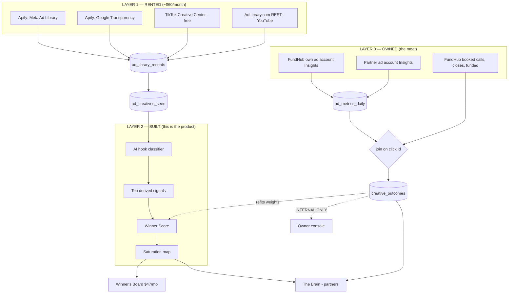

# W2 — Creative Intelligence Spine

**Status:** specification only. No code, no migrations, no commits.
**Written:** 2026-08-31 · branch `claude/white-label-models-offer-page-31vn4q`
**COMPLIANCE REVIEW REQUIRED** — this spec touches credit-repair messaging (the ad
classifier reads and stores competitor claims about credit outcomes), fee timing (a
$47/month recurring charge), and payment rails (a new recurring product). Labelled per
CLAUDE.md §7. This is a marker, not a recommendation.

---

## 1. What this is, in one paragraph

FundHub builds one pile of data about funding ads and sells access to it at two depths.

**Depth 1 — the Winner's Board.** $47 a month. A web page, refreshed every week, showing
which ads in the small-business-funding world are actually working, why they work, and
which angles nobody is using yet. Anyone can buy it. It pays for the data collection.

**Depth 2 — the Brain.** Included, and required, for white-label partners. Same data,
but it also writes hook ideas, splits the country into audience territories, and hands
each partner a territory nobody else has. Without it, 100 partners each spending
$20,000–$30,000 a month would end up bidding against each other for the same people and
driving everyone's costs up.

It is one build. The Board is the Brain with most of the screens turned off.

---

## 2. Assumptions (NOT yet decided)

These are defaults I picked so the spec could be written. **Any of them can change
without a rewrite.** They are not owner decisions.

| # | Assumption | Where it bites if it changes |
|---|---|---|
| A1 | Winner's Board price is **$47/month** | `src/config/offers.mjs` one line; checkout copy |
| A2 | Decline Autopsy is **$27**, Live Trial is **$297** (W4 owns these; named here only because the Board cross-sells them) | Nothing in W2 |
| A3 | Sub-affiliates run on FundHub rails and are **auto-deducted from the partner's half** | Ledger write in §9 worked example |
| A4 | Live Trial covers the machine only; the partner funds their own **$500–$1,000** test budget | W4, not W2 |
| A5 | The Winner's Board is a **digital product**, so it is 100% FundHub — no partner share, no affiliate commission | §9. Grounded, not guessed: `db/migrations/260_affiliate_commission_rates_20260824.sql` and `261_affiliate_tier1_20pct_20260824.sql` pay only on funding deposit collected or repair enrollment fee. A $47 subscription is neither. |
| A6 | Watch-list starts at **120 advertisers**, refreshed **weekly** | Layer 1 cost (§6) |
| A7 | Territory = one **DMA** (a TV market area — the US has 210) crossed with one hook angle | §8 |
| A8 | A territory lease runs **60 days** and auto-releases if the partner spends under the production floor | §8 |
| A9 | Winner Score weights are **hand-set in phase 1** and refit against real closes in phase 2 | §7 |

---

## 3. Locked owner decisions this spec obeys

Carried forward, not re-opened.

- Partner share is **50%** on repair and funding, front end and back end, including the
  10% success fee. E-products (courses, education, digital) stay **100% FundHub**.
- Entry fee **$10,000 one time. No monthly fee.** Nothing in this spec adds one for
  partners.
- **No credit gate on entry.** Because entry filters nobody out, the **production floor
  is the only partner filter that exists.** This spec treats that as load-bearing: the
  territory lease in §8 is the mechanism that gives the floor teeth.
- Partner-recruits-partner pays **$2,000 one time** on the $10,000 entry. Nothing on the
  recruited partner's production.
- A partner's own affiliates are paid **out of the partner's half.** FundHub's 50% never
  moves.
- Live affiliate schedule: Tier 1 direct **20%**, Tier 2 downline override **5%**.
- Ad data is **rented from vendor APIs. FundHub infrastructure never scrapes Meta or
  Google.** This is a hard line and §6 is built around it.
- Hiring is never a blocker.

---

## 4. Blocking findings carried (NOT fixed here)

These were found before this spec and are carried, not silently patched.

1. **Nothing in production writes the partner ledger.** The only rows ever inserted into
   `partner_revenue` are test fixtures at `src/partners/scope.pg.test.mjs:202-336`. The
   50% split is hand-math today. Same hole on the affiliate side:
   `src/affiliates/economics.mjs` exports `convert()` and nothing in production calls it
   from a payment event — only `attribute()` is wired, through
   `src/workflows/af-02-referral-ownership-capture.mjs`. **W2 does not fix this.** W2's
   money example in §9 shows exactly which rows the missing writer must produce.
2. **The schema is already right — build on it.** `db/migrations/042_partners.sql` gives
   `partners.revenue_share_pct` (per-partner, default 50), a `partner_revenue` row that
   freezes `share_pct_applied` at accrual so a rate change never restates history, dual
   idempotency, a no-delete trigger (void-with-reason only), and `partner_payouts` with a
   database-enforced gate that blocks payout unless `agreement_signed_at` is stamped and
   status is active. **Do not design a second ledger.**
3. **No earnings claims on any public page.** FundHub's own projection files record
   **zero measured paid closes.** Modeled partner earnings never appear publicly. The
   Winner's Board sells ad *intelligence*, never an income promise.
4. **NEW — found while writing this spec.** `db/migrations/075_subscriptions.sql` exists
   and models a recurring arrangement, but its own header says: *"Nothing in this file,
   and nothing in `src/subscriptions/`, moves money."* **There is no scheduler in this
   repo that charges a card every month.** A $47/month product therefore has no working
   rail today. See §11 — this is the single biggest thing standing between the Winner's
   Board and revenue, and it is not an ad problem.
5. **Meta partner ad-account access is blocked and recorded.** See §12.

---

## 5. The three layers, in one picture



---

## 6. LAYER 1 — Rented raw data

### 6.1 The rule that shapes everything

FundHub does not scrape. Vendors scrape; FundHub buys rows. The vendor carries the
terms-of-service risk. This is not a technical preference — it is the whole reason
Layer 1 is a line item and not a codebase.

### 6.2 What is actually gettable (already researched — do not re-derive)

| Source | What it gives | What it does NOT give |
|---|---|---|
| Meta Ad Library **API** | Political and social-issue ads only, and only outside the EU/UK | **US commercial ads are not in it at all** |
| Meta Ad Library **web** | US commercial creative, visible | **Spend. Nowhere. Not in the API, not in the browser.** |
| Google Ads Transparency Center | Creative, no official commercial API | Spend; BigQuery covers political + EEA only |
| TikTok Creative Center | **Free**, real CTR/CVR signal on top ads | Only as high / medium / low buckets, never a number |

**The single most important sentence in this spec:** every "competitor spend" figure in
every spy tool on the market — AdSpy, BigSpy, Minea, Foreplay, Atria — is an **estimate**
inferred from how long a creative has been running and how much engagement it shows.
Nobody has real competitor spend. The ceiling here is legal, not technical. So FundHub
must never print a competitor spend number, and must beat the field on a different axis:
**how well the creative is understood**, which is Layer 2.

### 6.3 Vendor choice

| Job | Vendor | Rate |
|---|---|---|
| Meta creative | Apify — Meta Ads Library Scraper | ~$1.50 / 1,000 ad records + ~$0.01–0.02 / 1K compute |
| Google + YouTube creative | Apify — Google Transparency | ~$0.45 / 1,000 records |
| TikTok signal | TikTok Creative Center | Free |
| Backfill / gap-fill | AdLibrary.com REST (FB, IG, TikTok, YouTube, Google) | Free tier first |

*Cheaper Apify Meta scrapers exist at ~$1/1K and a heavier one at $3.40–$5.80/1K. Start
on the $1.50 one; it is the middle and it is the documented one.*

**Pricing note, stated honestly:** these rates come from the research handed to this
workflow. They were not re-verified against vendor pricing pages today. Confirm before
the first invoice.

### 6.4 Cost at realistic volume

- 120 watched advertisers × ~60 live ads each = **~7,200 records per weekly pull**
- ~31,000 Meta records / month × $1.50 per 1,000 = **$46.50**
- Apify compute at ~$0.02/1K = **~$0.60**
- ~8,000 Google/YouTube records / month × $0.45 per 1,000 = **$3.60**
- TikTok = **$0.00**

**Total ≈ $51/month.** Round to **$60/month** for overage and re-runs.

At $47/month, **two Winner's Board subscribers cover the entire data bill.** That is what
"self-liquidating" means here, and it is worth saying plainly to Chris: this asset is
cash-flow-positive at customer number two.

### 6.5 The watch-list

`ad_watch_advertisers` — a table, not a hard-coded list, because the owner will add
names. Seeded from four groups:

1. **Direct competitors** — funding, card-stacking, business-credit operators.
2. **Adjacent** — credit repair, tradelines, EIN/business-credit-building courses.
3. **Upstream** — the guru/course layer that feeds this vertical (this is where
   Impruvu.io sits, and where new entrants show up first).
4. **FundHub's own accounts** — so the board can show FundHub next to everyone else
   internally. Never externally.

Each row carries: platform page/advertiser id, display name, group, `active`, and
`first_seen_at`. A watched advertiser that stops running ads is **not deleted** — it is
marked dormant, because the disappearance is itself the "death watch" signal (§7.2.9).

### 6.6 Refresh cadence

- **Weekly full pull**, Sunday night, so the board is fresh Monday morning. Weekly is
  what the $47 product promises, and it is what makes ad-age arithmetic clean.
- **Daily light pull** on the top 200 creatives by Winner Score only. This exists purely
  so "still running / went dark" is accurate to the day, which is the difference between
  a death watch that is useful and one that is a week late.
- Runs as an Inngest cron registered in `src/workflows/index.mjs`, the same way
  `message-dispatch-sweeper` is registered. **Reuse the existing registration pattern —
  do not add a second scheduler.**

### 6.7 Storage

Three new tables. Next free migration number **at the time of writing is 271** — other
workflows are running in parallel, so **check `ls db/migrations/ | sort -n | tail -1`
before you name the file.** Editing an applied migration is a silent no-op (CLAUDE.md
§12); always supersede with a new file.

**`ad_watch_advertisers`** — the list above.

**`ad_library_records`** — the append-only observation log. One row per
(platform, external_ad_id, observed_on). This table is never updated, only inserted into.
That is what makes ad age, re-launch and death watch computable at all: they are all
questions about a sequence of observations, and you cannot ask them of a table that
overwrites itself.

Columns: `org_id`, `platform`, `external_ad_id`, `advertiser_id`, `observed_on` (date),
`first_seen_at`, `last_seen_at`, `body_text`, `headline`, `cta`, `destination_url`,
`destination_domain`, `media_kind` (image/video/carousel), `media_url`, `placements`
(jsonb), `raw` (jsonb, the vendor payload verbatim), `vendor`, `vendor_run_id`.
Unique index on `(platform, external_ad_id, observed_on)` — that is the idempotency key,
so re-running a pull costs nothing and duplicates nothing.

**`ad_creatives_seen`** — the deduped creative. Keyed on `content_hash`, a SHA-256 of
normalised body text + headline + media URL. This is the row Layer 2 classifies, and it
exists so **the same creative is never sent to the model twice.** With ~31,000 records a
month collapsing to maybe 3,000 distinct creatives, this one index is roughly a 90%
saving on the classification bill.

All three tables get `org_id`, RLS enabled and forced, matching the pattern in
`db/migrations/046_ad_platforms.sql`.

**Where the data does NOT go:** `ad_library_records` is competitor data, not partner
data. It is **org-scoped, not partner-scoped.** Do not add a `partner_id` column. Partner
scoping is for a partner's own book (`src/partners/scope.mjs`,
`PARTNER_SCOPED_TABLES`); putting competitor ads behind partner scope would mean every
partner needs their own copy of the same 31,000 rows.

---

## 7. LAYER 2 — Built. This is the product.

Layer 1 is a commodity anyone can rent. Layer 2 is the reason to pay FundHub $47 instead
of $149 for AdSpy.

### 7.1 The classifier

**One model call per creative, ever.** Keyed on `ad_creatives_seen.content_hash`.

**Batching.** 25 creatives per call. Big enough to amortise the taxonomy in the prompt,
small enough that one bad row does not poison a whole batch.

**Structured output, enums only.** Every axis below is a fixed list. The model picks from
the list; it does not write prose. The one free-text field is `hook_line` — the opening
line of the ad, **copied verbatim, never paraphrased.** A paraphrased hook is worthless
to someone trying to learn what works.

**Reuse, do not rebuild.** `src/creative/providers/` already holds the provider wrappers
(`copy.mjs`, `_http.mjs`, `index.mjs` with `resolve()`), and
`src/creative/generate.mjs` already implements exactly the five properties this job needs
— idempotency on a key, retry with backoff, a per-partner concurrency cap, cost recorded
on every job whether it succeeded or not, and a provider outage degrading to `queued`
rather than to a silent empty result. **The classifier runs through
`src/creative/generate.mjs`, as a new `assetKind`.** Do not write a second job runner.

**Token accounting — an important call.** `src/brand/meter.mjs` meters a partner against
a 250,000-token monthly cap (`DEFAULT_TOKEN_CAP`), and
`docs/journeys/white-label-intended.md` line 31 says hitting the cap stops more writing.
**Classification of competitor ads is FundHub's own cost and must NOT be metered against
any partner's cap.** If it were, one partner browsing the board would burn the allowance
they need for their own ad copy. Concretely: `recordUsage()` is called with FundHub's
internal partner row, never the viewing partner's. Hook *generation* on behalf of a
partner (§7.4) **is** metered against that partner, because that is the partner's own
writing.

### 7.2 The taxonomy

Five axes. Every classified creative carries one value on each.

**Axis 1 — Angle (why should I care?)**
`speed_of_money` · `amount_of_money` · `approval_without_credit` · `lender_secret` ·
`business_growth` · `debt_rescue` · `status_lifestyle` · `credentialing` ·
`anti_guru_contrarian` · `case_study_receipt`

**Axis 2 — Format**
`talking_head_ugc` · `screen_record_proof` · `text_on_image` · `carousel` ·
`whiteboard_explainer` · `meme_static` · `testimonial_montage` · `faceless_voiceover`

**Axis 3 — Promise shape**
`specific_dollar` · `specific_timeframe` · `guarantee_language` · `curiosity_no_promise`

**Axis 4 — Compliance risk** *(this axis is why the board is safe to sell)*
`names_a_credit_outcome` · `implies_guaranteed_approval` · `uses_no_credit_check` ·
`clean`

**Axis 5 — Funnel**
`free_lead_magnet` · `webinar` · `book` · `call_booking` · `low_ticket_slo` ·
`direct_application`

Axis 4 earns its place. This is a regulated consumer-finance vertical. A partner who
copies a competitor's "guaranteed approval, no credit check" ad gets FundHub's ad
accounts banned and FundHub's name on a complaint. So **every creative on the board
carries a risk badge, and a `names_a_credit_outcome` or `implies_guaranteed_approval` ad
is shown greyed with a "do not copy this" banner.** The existing rules engine
`src/compliance/screen.mjs` (`screen()`, `OFFER_TYPES`, `PLATFORMS`, `appliesTo()`,
`toRegex()`) already holds FundHub's own blocked-phrase rules — **run competitor copy
through the same `screen()` call** so there is one definition of a banned claim, not two.
`docs/compliance/creative-block-reasons.md` is the reason vocabulary.

### 7.3 The ten derived signals

Nine were named in the brief. The tenth is proposed below and is **not owner-set.**

1. **Ad age** — days between `first_seen_at` and the latest `observed_on`. The strongest
   single proxy there is: an ad running 90 days is running because it makes money.
2. **Variant count** — distinct `content_hash` values sharing one advertiser + angle +
   destination domain. Ten variants of one hook means the advertiser found something and
   is scaling it.
3. **Re-launch pattern** — a `content_hash` that goes dark for 14+ days and comes back.
   Advertisers only resurrect winners.
4. **Creative velocity** — new distinct hashes per advertiser per week, 4-week rolling.
   Rising velocity means they are in testing; flat-and-old means they are in harvest.
5. **Placement spread** — how many distinct placements the same creative appears in.
   Broad spread = the advertiser trusts it enough to let it run everywhere.
6. **Landing-page change detection** — hash `destination_url` after stripping tracking
   parameters, plus a weekly fetch of the page's own text hash. A funnel that changed
   right after a creative scaled is the tell that the offer changed, not the ad.
7. **Offer / price extraction** — pull the dollar figure, the term, and the guarantee
   language out of the body text. This is what turns "here is a competitor ad" into
   "here is what the market is charging."
8. **New-entrant detection** — an advertiser id never seen before, in a watched group.
   Early warning that someone new is spending in the vertical.
9. **Death watch** — a creative that was in the top decile of Winner Score and has now
   been unseen for 14+ days. **This is the most commercially useful signal on the board**
   and nobody publishes it, because everyone else's product is a search box over what is
   live *now*. Knowing what stopped working is worth more than knowing what is running.
10. **Cross-platform echo** *(proposed — the brief said ten and named nine)* — the same
    angle + promise + destination domain appearing on two or more of Meta, Google,
    YouTube, TikTok within 14 days. A hook that carries across platforms is a hook about
    the market, not about one algorithm. No single-platform tool can compute this;
    FundHub can, because Layer 1 spans four.

### 7.4 The Winner Score

**Phase 1 — honest, hand-set, shown as a rank.**

Weights are a guess until Layer 3 has real closes to fit against. So phase 1 shows a
**rank and a band (Hot / Warm / Cold), never a decimal.** A number with two decimal
places implies a precision that does not exist yet, and Chris cannot audit a number that
was invented.

Starting weights (assumption A9, changeable in one config object):

| Signal | Weight | Why |
|---|---|---|
| Ad age | 30 | Longevity is the closest thing to real spend evidence available |
| Variant count | 20 | Scaling behaviour |
| Re-launch | 15 | Resurrection is a strong revealed preference |
| Placement spread | 10 | Advertiser confidence |
| Cross-platform echo | 10 | Market-level, not algorithm-level |
| Creative velocity | 10 | Testing intensity |
| TikTok CTR/CVR bucket | 5 | Only real performance signal available, but ordinal |

Each signal is normalised to its own percentile **within its angle**, not across the
whole board. Otherwise `case_study_receipt` ads — which naturally run long — would
occupy the whole top of the list forever, and the board would say the same thing every
week.

**Phase 2 — refit against outcomes.** Once Layer 3 holds booked calls and closes,
re-fit the weights against "did creatives with this signal profile actually produce
booked calls." The refit is **internal only** and the weights are never published; they
are the moat.

**NULL survives.** A creative with no TikTok data gets NULL for that signal, and the
score is computed over the signals that exist with the weights renormalised.
**Never default a missing signal to 0** — a missing signal and a zero signal are
different facts, and CLAUDE.md §12 is explicit that NULL means unknown and must survive.

### 7.5 The saturation map

Cross-tabulate **angle × format × funnel** and count distinct advertisers currently
running each cell. Render as a grid. Crowded cells are red, empty cells are green.

This is the single screen that turns the board from a swipe file into a decision tool,
and it is what feeds §8. "Nobody in this vertical is running `anti_guru_contrarian` +
`screen_record_proof` + `low_ticket_slo`" is an actionable sentence. "Here are 400 ads"
is not.

### 7.6 Layer 2 storage

**`ad_creative_classification`** — one row per `content_hash`. The five axes, the verbatim
`hook_line`, `model`, `classified_at`, `input_tokens`, `output_tokens`, `cost_cents`, and
the `screen()` verdict. Written once, never re-run for the same hash unless the taxonomy
version changes — so carry a `taxonomy_version` column and re-classify only on bump.

**`ad_creative_signals`** — one row per `content_hash` per ISO week. The ten signals plus
`winner_score_rank`, `winner_score_band`, `weights_version`. Recomputed weekly, kept
forever. Keeping history is what makes the death watch and the trend arrows possible.

---

## 8. The Brain — territory assignment

The problem in Chris's words: if 100 partners each spend $25,000 a month and all of them
target "small business owners, 35-55, interested in business loans" in Los Angeles, they
are bidding against each other. Meta's auction charges more when two advertisers want the
same person. Every partner's costs go up and every partner blames FundHub.

### 8.1 What a territory is

`territory = (geo bucket) × (angle) × (seed source)`

- **Geo bucket** is the primary separator, because it is the only one Meta enforces
  cleanly and the only one that is mutually exclusive by construction. The US has 210
  DMAs (TV market areas). Bucket them into ~100 baskets balanced by **small-business
  establishment count**, not by population — the target is business owners, and Wyoming
  and Manhattan are not the same market at the same population.
- **Angle** is the second separator, from the Axis 1 taxonomy. Past 210 partners, or
  where a partner insists on a specific metro, two partners can share a DMA only if they
  hold **different angles.**
- **Seed source** is the third. Each partner's lookalike audiences are built from a
  distinct seed — their own converters, their own page engagers, their own video viewers.
  Two partners seeded from the same list produce near-identical lookalikes no matter what
  the interest stack says.

### 8.2 Assignment algorithm

On partner activation:

1. Read `ad_creative_signals` for the current week and take the **saturation map**.
   Rank angles by *inverse* crowding — the least-contested angle first. This is the point
   where Layer 2 pays for Depth 2.
2. Read `partner_segment_leases` for every live lease.
3. Build the candidate set: every `(geo_bucket, angle)` pair with no live lease.
4. Score candidates by: small-business establishment count (higher better) × angle
   whitespace (higher better) ÷ historical CPM in that DMA where known (lower better).
   CPM comes from `ad_metrics_daily`, derived as
   `spend_cents / impressions * 1000` — the table stores `spend_cents` and `impressions`
   but not CPM, so compute it, do not add a column.
5. Assign the top candidate. Write a lease.
6. Where CPM is unknown for a DMA, it is **NULL, and the candidate is ranked on the other
   two factors only.** Do not substitute an average — a made-up CPM would silently push
   partners into markets nobody has ever tested.

### 8.3 Leases, and why they are the production floor

**A territory is a lease, not a grant.** 60 days (A8), auto-renewing while the partner
meets the production floor, auto-releasing to the pool when they do not.

This is the load-bearing part. The $10,000 entry fee is financeable down to a 405 FICO
with no credit gate, so **entry filters nobody out.** The production floor is the only
filter that exists. A floor with no consequence is not a filter. The consequence is:
**miss the floor, lose the territory.** The territory then goes to a partner who will
spend in it.

`partner_segment_leases` columns: `org_id`, `partner_id`, `territory_id`, `granted_at`,
`expires_at`, `state` (`active` / `released` / `revoked`), `release_reason`,
`last_floor_check_at`, `floor_met`. Never deleted — released with a reason, matching the
no-delete-void-with-reason pattern already used by `partner_revenue` in
`db/migrations/042_partners.sql`.

### 8.4 Exclusions — an honest limit

Each partner's campaigns should exclude the other partners' converted audiences. **They
cannot.** Meta does not let one advertiser exclude another advertiser's custom audience.
Each advertiser can only exclude their own lists.

So exclusion is a **partial control, not a guarantee**, and this spec says so rather than
pretending. What FundHub can actually do:

- Enforce geo and angle separation, which is real and which does work.
- Enforce distinct lookalike seeds, which is real.
- **Measure** collisions after the fact — see next.

### 8.5 Collision detection, measured

This is the part no competitor can copy, because it needs both partners' data in one
place.

Two partners in overlapping territory show a characteristic pattern: **frequency rising
and CPM rising together, in the same DMA, in the same week, for both accounts, while
their conversion rates fall.** Frequency alone is fatigue; frequency plus CPM plus a
third-party in the same geo is an auction collision.

`ad_metrics_daily` already stores `frequency`, `spend_cents`, `impressions`,
`conversions` per ad per day (`db/migrations/046_ad_platforms.sql:432`). A weekly job
reads it across partners, flags candidate collisions, and either re-assigns a territory
or narrows an angle.

**Requires Layer 3 partner access. See §12 — this is on the far side of the Meta
blocker.** Before that clears, collisions are *prevented by assignment* and *not
measured*. Say that on the screen; do not imply a measurement that is not happening.

---

## 9. LAYER 3 — Owned. The moat. And the wall.

### 9.1 What Layer 3 is

The **Meta Marketing API** — a different thing from the Ad Library API — returns full
Insights on any ad account FundHub has access to: 70+ metrics including **actual spend**,
impressions, reach, frequency, clicks, link clicks, CTR, CPM, CPC, conversions, action
values and ROAS, at campaign / ad-set / ad level, with 37 months of history.

Joined to FundHub's own booked calls, closes and funded amounts, that answers the
question no spy tool can: **which creative angle actually produces a funded deal**, not
which one gets a click.

### 9.2 The join

```
ads (db/migrations/046_ad_platforms.sql:282)
  └── ad_metrics_daily          per ad, per day: spend, impressions, clicks, conversions
        │
        │  join key: the click id carried in the landing URL
        │  (fbclid / ttclid / gclid), captured at form submit and stored on the lead
        ▼
  leads / clients
        └── sale_attributions   (db/migrations/012_attribution.sql:136)
              └── sales         (db/migrations/011_sales.sql)
                    └── funded amount, close date
```

The click id is the only reliable join. Not email — people use a different address at
checkout than on the form. Not phone. Not "last touch by time window." A stored click id
is a fact; a time window is a guess.

**New table `creative_outcomes`** — one row per (`ad_id`, `week`), holding: spend_cents,
booked_calls, closes, funded_amount_cents, and the creative's classification axes copied
in at write time. **Copied, not joined** — the same reason `partner_revenue` freezes
`share_pct_applied`: if the taxonomy changes next quarter, last quarter's outcome rows
must not silently re-label themselves.

`funded_amount_cents` is **NULL when unknown, never 0.** A deal that closed but has not
funded yet is not a $0 deal.

### 9.3 The wall — what partners see and what stays inside

Owner decision, stated in the brief: FundHub's own winning-creative performance is **not**
handed to partners wholesale. That is the asset.

| | Partner sees | Owner / internal only |
|---|---|---|
| Their own ad spend, CTR, CPM, conversions | Yes | |
| Their own cost per booked call and per close | Yes | |
| Winner's Board — competitor creative, signals, ranks, bands | Yes | |
| Saturation map | Yes | |
| Their assigned territory and why | Yes | |
| **FundHub's own ads' performance numbers** | **No** | Yes |
| **Other partners' performance, named or not** | **No** | Yes |
| **Winner Score weights and the refit** | **No** | Yes |
| **Which angles convert to funded deals, with the numbers** | **No** | Yes |
| **Which angles convert, as a ranked list with no numbers** | Yes | Yes |

That last row is the deliberate compromise. A partner gets **"try this angle next, it is
ranked second this month."** They do not get **"this angle books calls at $41 and closes
at 19%."** The direction is the service; the arithmetic is the moat.

Enforcement is not a UI convention. It is a **projection**: the partner-facing endpoint
selects a fixed allow-list of columns and never `SELECT *`. Same discipline
`db/migrations/046_ad_platforms.sql:54-57` applies to encrypted tokens — the comment
there says a plaintext sibling column must never exist because *some* `SELECT *` will
eventually carry it into a JSON body. Same failure mode, same defence.

### 9.4 Token security — already solved, reuse it

Partner ad-account tokens live in `ad_platform_connections.encrypted_access_token`,
encrypted by `src/adplatforms/tokens.mjs` with AES-256-GCM and **the partner id bound in
as additional authenticated data**, so a ciphertext copied from partner A's row into
partner B's row fails to decrypt rather than silently working. Key id is stored alongside
so rotation does not need a flag day. Requires `AD_TOKEN_ENC_KEY` (32 bytes, base64).

**Reuse this module unchanged. Do not add a second token store, and never add a plaintext
sibling column.**

Per CLAUDE.md §11, if `AD_TOKEN_ENC_KEY` is not set in an environment, set it without
asking:
`netlify env:set AD_TOKEN_ENC_KEY "<32 random bytes, base64>" --context production --context deploy-preview --context branch-deploy --secret`
Batch it with every other variable and **deploy exactly once at the end.**

---

## 10. Cold start

Layer 3 is empty on day one. Here is the honest sequence.

**Day 1 — FundHub's own account.** Already works. `docs/workflows/ads-affiliate-stack-2026-08-24.md:214`
records that FundHub's own ad account `act_982103620742368` reads fine on **standard**
access — no App Review needed for accounts you own. So Layer 3 starts with a real join on
FundHub's own spend against FundHub's own closes, immediately.

**Week 1–4 — Live Trials (spec W4).** Every Live Trial runs ads that FundHub controls,
producing first-party creative-to-outcome data on FundHub's own account. This is the
bootstrap: trials generate the outcome rows that the Winner Score refit needs, and they
do it without any partner ever connecting an account.

**Month 2+ — partners self-invite.** See §12; the partner-initiated share works today.

**What the board says while Layer 3 is thin.** Phase-1 bands only, and a visible line:
*"Ranks are based on how long ads run and how hard advertisers push them. Outcome data
is still being collected."* Not a disclaimer in 8pt grey — a stated limitation. Per
CLAUDE.md §2, absence is a finding, not a gap to paper over.

---

## 11. Pricing and checkout

### 11.1 Following the offers pattern

`src/config/offers.mjs` is the single catalog. Its header is explicit: prices, names and
financing flags live there and are not hardcoded in HTML or JS. Add one entry, matching
the existing frozen-object shape:

```
WINNERS_BOARD: {
  key: "WINNERS_BOARD",
  name: "Winner's Board",
  priceCents: 4700,               // A1 — assumption, not owner-set
  financing: false,               // $47 is not financed
  letters: false,                 // no dispute letters
  paymentPurpose: "custom",
  productCode: "winners-board",
  commasProductTitle: "Consulting Services Package"
}
```

`priceCents: 4700` is $47.00 in integer cents, matching every other price in the file
(`FUNDING_DFY` is `300000`, `REPAIR_DFY` is `100000`).

The `OfferKey` typedef at the top of the file must gain `"WINNERS_BOARD"`, and
`COMMAS_TITLE_BY_PRODUCT_CODE` should gain `"winners-board"` so the vendor-facing title
is never staff free text.

### 11.2 The recurring problem — carried finding #4

**$47/month has no working rail in this repo.** `db/migrations/075_subscriptions.sql`
models the arrangement; its own header says nothing in it and nothing in
`src/subscriptions/` moves money. There is no scheduler that charges a card monthly.

Three options, for the owner to pick — **not decided here**:

1. **Bill through the existing SLO rail.** `db/migrations/264_slo_connections.sql` already
   maps a ClickFunnels funnel + product to a FundHub product, and a signed ClickFunnels
   paid webhook writes the sale. ClickFunnels handles the recurring charge; FundHub
   receives a webhook each month. **Least code. Recommended.** Add one
   `slo_connections` row pointing at the `winners-board` product.
2. Build the missing scheduler on `subscriptions`. Most work, most risk, touches payment
   rails.
3. Sell it annually at a discount so it is a one-off charge on the existing rail.

Option 1 reuses two things that already exist and adds no new payment code. That matters
because payment rails are compliance-flagged (§7 of CLAUDE.md) and the cheapest
compliant change is the one that adds no rail.

### 11.3 Routing — the trap that has shipped twice

Every new handler under `api/` must appear in the hardcoded `ROUTES` map in
`netlify/functions/api.mjs`. A handler absent from it 404s locally **and** deployed, with
a fully green test suite. `src/http/routes.test.mjs` fails if a handler is neither routed
nor on a written allow-list — its header records that this has already happened twice, at
scale (21 handler files, the whole Creative Factory among them).

New routes this spec needs, all of which must be added to `ROUTES` at the same time as
the handler file:

| Route key | Handler file | Who |
|---|---|---|
| `winners-board/feed` | `api/winners-board/feed.mjs` | subscriber |
| `winners-board/creative` | `api/winners-board/creative.mjs` | subscriber |
| `winners-board/saturation` | `api/winners-board/saturation.mjs` | subscriber |
| `brain/hooks` | `api/brain/hooks.mjs` | partner |
| `brain/territory` | `api/brain/territory.mjs` | partner |
| `brain/collisions` | `api/brain/collisions.mjs` | **owner only** |
| `adintel/refresh` | `api/adintel/refresh.mjs` | cron |

Endpoint tests live at `src/http/<name>.pg.test.mjs` and import the `api/` handler —
**a test placed under `api/` silently never runs**, because `npm test`'s glob is
`src/**` and `scripts/**` only.

And: `requireAuth` **ignores a `roles` key.** It forwards options to `authenticate()`,
which reads only `db` and `env`. Gate with `requireRole` *after* it.
`src/http/auth-gate.test.mjs` fails on the broken shape. This matters most for
`brain/collisions`, which is the owner-only endpoint — getting the gate shape wrong there
hands FundHub's internal performance data to partners.

---

## 12. Before and after the Meta blocker

**The blocker is real and recorded.** `docs/workflows/ads-affiliate-stack-2026-08-24.md`
lines 195–220:

- Business Verification — **DONE** (FUNDHUB ENTERPRISES LLC, owner-confirmed 2026-08-24).
- App Review → **Advanced Access** on `ads_management` and `ads_read` — **OPEN.** This is
  the unlock. Managing *other people's* ad accounts needs Advanced Access, not Standard.
- App Review → Advanced Access on `business_management` — request alongside.
- Marketing API Access Tier → Full — a **separate dial**, header currently reads
  `development_access`. Eligible only after 500 calls in 15 days. **Do not block the
  permission request on this.**
- **Cannot be done through the API at all:** submitting App Review, flipping Advanced
  Access, or lifting Meta error `#3`. It is a UI action at
  `developers.facebook.com/apps/1512828066718833/app-review/permissions/`.

### Ships BEFORE App Review — roughly 85% of this spec

- **All of Layer 1.** Vendor APIs need no Meta permission of any kind.
- **All of Layer 2.** Classifier, ten signals, Winner Score, saturation map.
- **The entire Winner's Board $47/mo product.** It is sellable the day Layer 2 lands.
- **Layer 3 on FundHub's own accounts.** Standard access is enough for accounts you own —
  `act_982103620742368` works today (line 214 of that same doc).
- **Territory assignment, prevention side.** Geo buckets, angle separation, seed
  separation, leases, the production-floor release.

### Ships AFTER — and the workaround that means "after" is not "blocked"

Needs Advanced Access:
- FundHub's app *sending* a partner request via `POST client_ad_accounts` — this is the
  one that returns Meta `#3` today.
- Measured collision detection across partners (§8.5).
- The outcome-weighted Winner Score refit at partner scale.

**The workaround, and it is a real one.** Line 220 of that doc: *"Client-side 'invite
Fundhub as Partner' can still work for read listing after share; API send of partner
request stays blocked until Advanced Access."*

Translated: **the partner does the invite, not FundHub.** The partner opens their own
Business Manager, adds FundHub as a Partner on their ad account, and FundHub can then
read it. The only thing App Review unlocks is FundHub being able to *start* that
conversation from its own side.

So the onboarding step is a short instruction page with FundHub's Business ID and five
screenshots, not an OAuth button. It is worse onboarding. It is not a blocker. **Layer 3
can have partner data before App Review clears**, at the cost of asking the partner to do
four clicks. And per CLAUDE.md, hiring is never the constraint — someone can walk each
partner through it live.

**What to say to Chris:** the Meta thing gates *convenience*, not *capability*. The one
action only he can take is opening that App Review page and clicking "Request advanced
access" on `ads_management`, `ads_read` and `business_management`. Business verification
is already done, so there is nothing else in the way.

---

## 13. Screens

**Winner's Board — `public/winners-board/index.html`** *(new; follow the pattern of the
existing `public/affiliates/index.html`)*

1. **This week's movers** — top 20 by Winner Score band, with the verbatim hook line, the
   creative, ad age, variant count, and the risk badge. Trend arrow vs last week.
2. **Death watch** — what dropped out of the top decile and when. The differentiator.
3. **Saturation map** — the angle × format × funnel grid, red to green.
4. **New entrants** — advertisers first seen this week.
5. **Search** — filter by any of the five axes.

**No earnings claims anywhere on this page.** Not in a testimonial, not in a headline, not
in a case-study card. FundHub's own projection files record **zero measured paid closes**
(carried finding #3). The page sells ad intelligence.

**The Brain — partner console** *(inside the existing partner app, not a public page)*

6. **My territory** — the DMA map, the assigned angle, the lease expiry, and the
   production-floor status with days remaining. This screen is where the floor becomes
   visible, so it should be blunt: *"You have 22 days left on this territory. To keep it,
   spend at least $X this month."*
7. **Hook generator** — takes the partner's territory angle and the top-ranked
   unsaturated hooks, and writes variants. Runs through
   `src/creative/generate.mjs`, metered against **that partner's** 250,000-token cap via
   `src/brand/meter.mjs`, and screened by `src/compliance/screen.mjs` before anything is
   shown. Assets land `compliance_state='pending'` — nothing in the generation path can
   set `approved`; that is a human action.
8. **My numbers** — the partner's own spend, CTR, CPM, cost per booked call, cost per
   close. Their data only. Nothing about FundHub's ads, nothing about anyone else's.

**Owner console** *(existing owner screens)*

9. **Collision monitor** — cross-partner frequency + CPM overlap, and the re-assignment
   queue.
10. **Angle truth table** — which angles actually produce funded deals, with the numbers.
    Owner only, per §9.3.

**Playwright check required on every one of these** — CLAUDE.md §6 item 4.

---

## 14. Reuse map — what already exists, use it

| Need | Use this — do not rebuild |
|---|---|
| AI job queue, idempotency, retry, concurrency cap, cost recording, degrade-to-queued | `src/creative/generate.mjs` (`enqueue`, `claim`, `run`) |
| Cron drain of that queue | `src/creative/runner.mjs` (`runDue`) |
| Model provider wrappers | `src/creative/providers/index.mjs` (`resolve`), `copy.mjs`, `_http.mjs` |
| Token metering and the 250,000 cap | `src/brand/meter.mjs` — `DEFAULT_TOKEN_CAP`, `assertSuiteEnabled`, `assertUnderCap`, `recordUsage`, `usageThisMonth`, `remainingTokens` |
| Blocked-phrase / claim screening | `src/compliance/screen.mjs` — `screen()`, `OFFER_TYPES`, `PLATFORMS`, `appliesTo()`, `toRegex()` |
| Compliance reason vocabulary | `docs/compliance/creative-block-reasons.md` |
| Any write to a platform | `src/adplatforms/index.mjs` — `guardedWrite()` (guardrail → action log → platform, in that order) and `undo()` |
| Meta / TikTok adapters | `src/adplatforms/meta.mjs`, `src/adplatforms/tiktok.mjs` |
| Token encryption at rest | `src/adplatforms/tokens.mjs` (`encryptToken`, partner id as AAD) |
| Budget ceilings | `src/optimize/ceilings.mjs` (`checkBudgetWrite`) |
| Partner row-level scoping | `src/partners/scope.mjs`, `src/partners/rls.mjs` (`withPartnerScope`) |
| All money arithmetic | `src/commissions/money.mjs` — `toCents`, `fromCents`, `percentOf`, `applySplit`, `roundHalfUp`, `wholeUnits`, `clampAmount` |
| Partner ledger | `db/migrations/042_partners.sql` — `partner_revenue`, `partner_payouts`. **One ledger only.** |
| Affiliate commission | `src/affiliates/economics.mjs` — `attribute`, `convert`, `findRule`, `commissionFor`, `basisFor` |
| Prices and offer catalog | `src/config/offers.mjs` |
| Recurring billing rail | `db/migrations/264_slo_connections.sql` + `db/migrations/010_products.sql` |
| Daily ad metrics store | `ad_metrics_daily`, `db/migrations/046_ad_platforms.sql:432` |
| Sale attribution | `db/migrations/012_attribution.sql`, `db/migrations/011_sales.sql` |
| Cron registration | `src/workflows/index.mjs` |

---

## 15. Worked money example, end to end, in integer cents

One partner, one Winner's Board subscriber, one funded deal. Every figure is integer
cents, using the helpers in `src/commissions/money.mjs`.

### Part A — the Winner's Board subscription

- Price: **`4700`** cents ($47.00) — `src/config/offers.mjs` → `WINNERS_BOARD.priceCents`
- The Winner's Board is a digital product. Per the locked decision that e-products stay
  100% FundHub:
  - `partner_revenue` rows written: **zero**
  - affiliate commission rows written: **zero**
- Grounding, not assumption: `db/migrations/260_affiliate_commission_rates_20260824.sql`
  and `261_affiliate_tier1_20pct_20260824.sql` pay on **funding deposit collected** or
  **repair enrollment fee**. A $47 subscription is neither, so no rule matches and
  `findRule()` returns nothing.
- **FundHub nets `4700`.** Two subscribers ($9,400 cents... precisely `9400` cents = $94)
  cover the ~$60/month Layer 1 bill.

### Part B — the funding deal the territory produced

The partner runs an ad on their assigned territory. A client books, closes, and pays.

**B1. Deposit.**
- `FUNDING_DFY.priceCents` = **`300000`** ($3,000.00)
- Partner share: `applySplit(300000, 50)` = **`150000`** ($1,500.00)
- `partner_revenue` row:
  - `gross_amount` = `fromCents(300000)` = **`"3000.00"`**
  - `share_pct_applied` = **`50.00000`** — copied from `partners.revenue_share_pct` at
    accrual and **never back-filled**, so a later rate change cannot restate this row
  - `share_amount` = `fromCents(150000)` = **`"1500.00"`**
  - `status` = `accrued`, `source_event_id` set for replay protection

**B2. Success fee, once funded.**
- Funded amount: $125,000 = **`12500000`** cents (mid-point of the owner-set $100K–$150K
  average)
- Total 10% success fee: `percentOf(12500000, 10)` = **`1250000`** ($12,500.00)
- **The $3,000 deposit counts toward the 10%.** It is not additional. So the amount still
  owed is `1250000 − 300000` = **`950000`** ($9,500.00)
- Partner share of that back end: `applySplit(950000, 50)` = **`475000`** ($4,750.00)
- Second `partner_revenue` row:
  - `gross_amount` = `fromCents(950000)` = **`"9500.00"`**
  - `share_pct_applied` = **`50.00000`**
  - `share_amount` = `fromCents(475000)` = **`"4750.00"`**

**B3. Check the arithmetic.**
- Partner total: `150000 + 475000` = **`625000`** ($6,250.00)
- FundHub total: `150000 + 475000` = **`625000`** ($6,250.00)
- Sum: **`1250000`** = the whole 10% fee. Nothing is created or lost. The partner gets
  exactly half of the 10%, front end and back end, as decided.

**B4. The partner's own sub-affiliate, paid out of the partner's half (A3).**
- Tier 1 direct is 20% on funding deposit collected:
  `percentOf(300000, 20)` = **`60000`** ($600.00)
- Deducted from the **partner's** `150000`, so the partner nets `150000 − 60000` =
  **`90000`** ($900.00) on the deposit.
- **FundHub's `150000` does not move.** Not by one cent.

**B5. NULL survival — the rule that is easiest to break.**
- If the deal has closed but the funded amount is not known yet, **row B2 is not
  written at all.**
- Do **not** write a B2 row with `share_amount = "0.00"`. Zero means "the partner earned
  nothing." Unknown means "we do not know yet." Those are different facts and
  `partner_revenue` has no way to tell them apart once a zero is in there.
- CLAUDE.md §12: NULL means unknown and must survive — never default it to 0.

**B6. What this proves.** Steps B1–B5 are the exact rows the missing production writer
(carried finding #1) has to produce. **W2 does not build it.** W2 states precisely what it
must write, so whichever workflow builds it has no room to improvise.

---

## 16. What is genuinely unknown

Stated as absence, not filled with a plausible number.

1. **Real competitor spend does not exist and never will.** Not through any API, not in
   any UI, not from any vendor. Every number in every spy tool is inferred. This is a
   permanent ceiling.
2. **TikTok gives buckets, not numbers.** High / medium / low CTR. There is no way to turn
   a bucket into a rate, so signal 7 in the Winner Score is capped at 5% weight.
3. **The Winner Score weights are unvalidated.** They are a starting guess (A9). They stay
   a guess until Layer 3 has enough closes to fit against, and this spec does not know
   how many that is because there are **zero measured paid closes on record today.**
4. **Vendor pricing was not re-verified today.** The Apify and AdLibrary rates come from
   prior research handed to this workflow. Confirm before the first invoice.
5. **How many distinct advertisers are actually running in this vertical is unmeasured.**
   120 (A6) is a plausible watch-list size, not a count. The first Layer 1 pull will
   produce the real number and the cost model should be re-run against it.
6. **Nobody has measured whether 100 partners at $20–30K/month actually collide** in this
   vertical. The territory design is a reasonable precaution; the collision *rate* is
   unknown until Layer 3 measures it, which is the far side of §12.
7. **Whether the Winner's Board is an "e-product" for revenue-share purposes** — A5 reads
   it as a digital product (100% FundHub), which is consistent with the live affiliate
   rules paying only on funding and repair. If the owner wants the Board revenue-shared,
   that is a one-line change to A5 and a new `commission_rules` row, not a rewrite.
8. **How many DMAs a single partner needs** to absorb $25K–$100K/month of ad spend. If one
   DMA cannot absorb $100K, the geo bucket is the wrong unit and territories need to be
   multi-DMA. First real partner answers this.
9. **The Layer 3 join's click-id capture rate.** The join is only as good as the fraction
   of leads that arrive with an `fbclid` intact. iOS and browser privacy settings drop
   some. Unmeasured.

---

## 17. Compliance

**COMPLIANCE REVIEW REQUIRED** — repeated from the top.

Three touches:

1. **Credit-repair messaging.** The classifier reads and stores competitor claims about
   credit outcomes. Axis 4 exists to label them. Run every stored competitor creative
   through the same `src/compliance/screen.mjs` rules FundHub applies to its own copy, so
   there is one definition of a banned claim.
2. **Fee timing.** A recurring $47 monthly charge is new fee behaviour.
3. **Payment rails.** §11.2 adds a recurring product. Option 1 (the existing SLO rail)
   adds the least new rail, which is the point.

**FundHub never drafts a customer-facing claim about credit outcomes.** The hook generator
in screen 7 produces copy about *funding*, and everything it produces is screened before
a partner sees it. Assets land `compliance_state='pending'`; nothing in the generation
path can set `approved`.

---

## 18. Journey impact

Per CLAUDE.md §4:

- `docs/journeys/white-label-intended.md` — **read, not edited.** Agents do not write
  intended journeys.
- **Gap found, reported not reconciled:** the intended white-label journey (line 31)
  describes the Creative Factory as tokens-against-a-cap with *"Meta and Google send stay
  stubbed."* This spec adds two things it does not cover — reading a partner's Meta
  Insights (a read, not a send, so it does not contradict "send stays stubbed" but is not
  described either) and territory assignment, which is a wholly new partner-facing step.
  **Per §4's most important rule: if code requires a step not in the intended journey,
  stop and ask. Do not add the step, and do not edit the intended file to match.** So
  before the Brain's partner screens are built, the owner has to decide whether the
  intended journey grows a "Territory" step. **This is a real gate, and it is on the
  build workflow, not on this spec.**
- `docs/journeys/white-label-actual.md` — must be regenerated **from code**, in the same
  commit as the code change, never a follow-up. Anything not traceable in code is marked
  `UNVERIFIED` in the diagram, not drawn from this spec.
- `docs/journeys/CHANGELOG.md` — one line appended per journey change, newest at top:
  `YYYY-MM-DD | white-label | <what changed> | <why> | <commit>`

---

## 19. Build order

Sequenced so each step is sellable on its own. Splittable across workflows — steps 1, 2
and 5 have no dependency on each other.

| # | Unit | Depends on | Ships what |
|---|---|---|---|
| 1 | Migration: 3 Layer-1 tables + watch-list seed | — | Nothing visible |
| 2 | Vendor pull job + weekly cron | 1 | Raw data flowing |
| 3 | Classifier as a `generate.mjs` assetKind + taxonomy | 1, 2 | Classified creative |
| 4 | Ten signals + Winner Score + saturation map | 3 | **The Winner's Board is now real** |
| 5 | `WINNERS_BOARD` offer + SLO rail row + checkout | — | **Revenue** |
| 6 | Winner's Board public screens (1–5) | 4, 5 | Sellable product |
| 7 | Territory tables, assignment, leases | 4 | Partner filter with teeth |
| 8 | Brain partner screens (6–8) | 7 | **Owner decision on the journey step first — see §18** |
| 9 | Layer 3 join, FundHub's own account only | — | Outcome truth begins |
| 10 | Weight refit + owner screens (9–10) | 9 | The moat |
| 11 | Partner-invite onboarding page | 9 | Partner Layer 3, no App Review needed |
| 12 | Measured collision detection | 11, App Review | Post-blocker |

**Definition of done for every unit** — CLAUDE.md §6, all six, no exceptions:
`npm run lint` · `npx tsc --noEmit` · suite green with nothing skipped, deleted or
weakened · Playwright on any UI change · `-actual.md` journeys updated and changelog
appended · change manifest emitted.

Two traps to re-read before the first commit: endpoint tests go at
`src/http/<name>.pg.test.mjs` (a test under `api/` never runs), and every handler must be
in the `ROUTES` map in `netlify/functions/api.mjs` or it 404s everywhere with a green
suite.

---

## 20. Task report

**1. What changed.** One document written. A plan for turning funding-ad data into a $47/month
product and, at greater depth, into the system that keeps 100 partners from bidding
against each other. No code, no database changes, nothing committed.

**2. What I need you to check.**
   - **The one action only you can take:** open
     `developers.facebook.com/apps/1512828066718833/app-review/permissions/`, find
     `ads_management`, click **Request advanced access**. Do the same for `ads_read` and
     `business_management` if they still say Standard. Business verification is already
     done, so nothing else is in the way. This gates convenience, not capability — about
     85% of this spec ships without it.
   - **Nine assumptions in §2**, top of the document. Read them and change any you
     disagree with. The $47 price, the 120-advertiser watch-list, and the 60-day territory
     lease are the three that matter most.
   - **The journey gate in §18.** Territory assignment is a new step for partners that the
     intended white-label journey does not describe. You decide whether that journey grows
     a "Territory" step before anyone builds screens 6–8.

**3. Risk.** One line: nothing here can break anything, because nothing was built. The real
risk is downstream — the $47/month has no working recurring-charge rail in this repo
(§11.2), so the product could be finished and still not able to bill.

**4. Left undone.** Named, not silent:
   - Did not fix the missing partner-ledger writer. Carried as finding #1; §15 states
     exactly what it must write.
   - Did not verify vendor pricing against live pricing pages.
   - Did not write to `docs/workflows/` — the orchestrator assembles the shared board.

**5. Next.** Read §2 and
tell me which assumptions are wrong.
