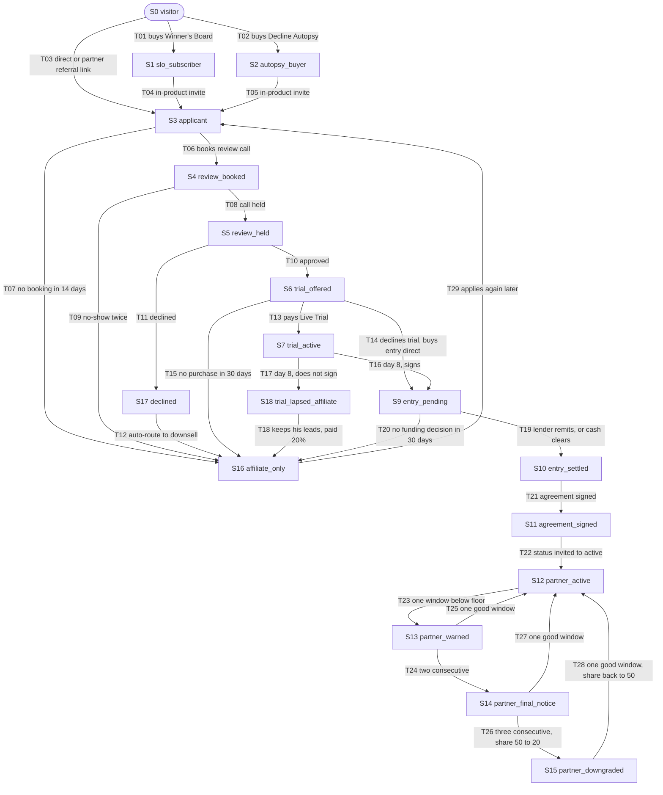

# W5 — The Offer Page and the Funnel (white-label partner channel)

> **COMPLIANCE REVIEW REQUIRED** — this document specifies a public sales page for a
> regulated consumer-finance product. It touches consent capture (the SMS checkbox),
> fee timing (how a $10,000 financed entry fee is presented), and credit-repair
> messaging (the page sells repair services). Per CLAUDE.md §7 the label stays on it.
> It is a marker, not a recommendation, and nothing here asks anyone to revisit an
> owner decision.

**Status:** specification only. No code, no migrations, no page written, nothing applied.
**Written:** 2026-08-31 · branch `claude/white-label-models-offer-page-31vn4q`
**Depends on:** `/home/user/fundhub-platform/docs/specs/W1-money-model.md` (landed). Every
number in this document comes from W1 or from a file named here. None are invented.

---

## Read this first, in one minute

Right now there is one page that offers two things at once: be an affiliate, or be a
white-label partner. It works, it looks good, and it is the wrong shape for what we are
about to sell. A $10,000 offer that people can finance needs its own room.

So: build a **second page** for white-label only. Keep the page we have. Change two links
on it so the white-label side points at the new page. The affiliate page becomes the place
people land when white-label is not for them — nobody who walks in is wasted.

Then the funnel. Four front doors lead to that page. One application form. One review call.
One trial. Then either you become a partner, or you become an affiliate. There is no exit
that ends in nothing.

**Two things are broken today and I am not fixing them here, only naming them.** First, the
application form makes somebody a live partner the instant they hit submit — a login, a
published branded web page, the lot — before any review call, before any agreement, before
any money. Second, if somebody already bought one of our small products, the same form will
refuse their partner application with an error. Both are in §3.

---

## Assumptions (not yet decided)

These are **not** owner decisions. Any one can change without rewriting this document.

| # | Assumption | Where it bites in W5 |
|---|---|---|
| **A1** | Winner's Board **$47/mo** · Decline Autopsy **$27** · Live Trial **$297** | §4 state machine entry points, §5 page sections, and the worked example in §11. These are e-products (W1 D2), so they are 100% FundHub and never touch `partner_revenue`. If a price moves, only the display numbers move. |
| **A2** | Sub-affiliates run on FundHub rails, auto-deducted from the partner's half | §9 attribution. The page must therefore say the partner's referrers are paid *by FundHub out of the partner's share*, not invoiced separately. |
| **A3** | Live Trial covers the machine only; the partner funds their own $500–$1,000 test budget | §8 field 7 — this needs its own checkbox on the form, or it becomes a refund argument on day 2. |
| **A4** | The new page is `noindex`, like the existing partner page | §5. Paid and emailed traffic still reaches it; search engines and competitors do not. Reversible in one line. |
| **A5** | The white-label offer keeps the existing page's "invite only / application, review call, signed agreement before launch" gate | Carried straight from `public/affiliates/index.html` lines 442 and 502. The task confirms the gate stays. |
| **A6** | The `$10,000` product's public-facing name is a **program** name, not a licence or entry fee | §7. Forced by W1 D4: Commas finances courses only, so the thing being bought must be a training product. The exact name is Chris's call, not mine. |

---

## Locked owner decisions carried in (2026-08-31)

Recorded as fact. Not re-opened, not commented on.

- Partner share **50%** on repair services and funding services, front end and back end,
  including the 10% success fee.
- **E-products excluded** — courses, education, digital products stay 100% FundHub. All
  three front doors (Winner's Board, Decline Autopsy, Live Trial) are e-products.
- **Entry fee $10,000, one time. No monthly fee.** Do not spec one, do not display one.
- Entry fee is **financeable through FundHub's own rails**, structured as a training
  product. **No credit gate** — financing is a payment option on the entry fee, not a
  qualification. Who becomes a partner is the review call's decision, never the lender's.
- Because entry filters nobody out, the **production floor is the only partner filter**.
- **Partner recruits a partner: 20% of the $10,000 = $2,000, one time.** Nothing on the
  recruit's production.
- A partner's own affiliates are paid **out of the partner's half**. FundHub's 50% never moves.
- Live affiliate schedule: **Tier 1 direct 20%**, **Tier 2 downline override 5%**, on funding
  deposit collected or repair enrolment fee.
- **Live Trial, day 8, prospect does not sign:** the prospect **keeps the leads his trial
  produced**. FundHub fulfils any that convert. He is paid as an affiliate at the standard
  20%. He becomes an affiliate rather than walking away with nothing. **Consumers must be
  told on day 1 that fulfilment is performed by FundHub.**
- Ad data is **rented from vendor APIs**. Never scrape Meta or Google from FundHub infrastructure.
- Hiring is not a constraint. Do not raise headcount anywhere.

---

## 3. Blocking findings — carried, not fixed here

### F1 — Submitting the form makes you a live partner. Today. Immediately.

`/home/user/fundhub-platform/api/public/partner-apply.mjs`, in `runPartnerApply()`, the
white-label branch:

- line 248–252 inserts a `partners` row with **`status = 'active'`** hardcoded
- line 254–262 creates a real login account
- line 263–268 writes a `partner_brand` row
- line 271–280 publishes a `partner_pages` row with `status = 'published'` and
  `published_at = now()`, live at `/sites/{partnerId}/apply`
- line 281 places a pipeline card at stage key **`"active"`**

So anyone who types a name, an email, a sentence about their audience, and picks
"White-Label Partner" from the dropdown gets a portal login and a **published branded web
page on FundHub's domain**, with no human involved.

That contradicts what the same page promises the applicant two screens earlier —
`public/affiliates/index.html` line 442: *"Application, review call, and a signed partner
agreement before launch."*

**Money is safe.** `db/migrations/042_partners.sql` has a database-enforced payout gate that
refuses to pay anybody without `agreement_signed_at` stamped. Nobody can be paid. But a
stranger can get a published page carrying FundHub's brand promise.

**The fix is one word, and the schema already has it.** `042_partners.sql` defines:

```
status text NOT NULL DEFAULT 'invited',
CONSTRAINT partners_status_ck CHECK (status IN ('invited', 'active', 'paused'))
```

with the comment: *"invited — record exists, cannot sign in, cannot be paid."* That is
exactly the applicant state. The applicant branch should write `'invited'`, not `'active'`,
and the page publish + account creation should move to the approval step. **No migration is
needed.** I am not making that change in this workflow. It belongs to whoever owns
`partner-apply.mjs`, and it must not be done as a drive-by (CLAUDE.md §8).

### F2 — An existing customer cannot apply

`runPartnerApply()` lines 187–199: if an `accounts` row already exists for that email, the
whole thing rolls back and returns **409 `already_registered`**.

The funnel in §4 is built on promoting people who already bought something. If W2 (Winner's
Board) or W3 (Decline Autopsy) create an `accounts` row at purchase, then **every warm
prospect the funnel is designed to promote will be refused by the application form.** The
person most likely to become a partner is the person the form rejects.

W2 and W3 are not written yet — `/home/user/fundhub-platform/docs/specs/` contains only
`W1-money-model.md` as of today, so I cannot confirm whether they create accounts. **This is
a cross-workflow dependency, flagged not fixed.** Either W2/W3 do not create an account at
SLO purchase, or the apply path upgrades an existing account instead of refusing it. One of
the two must be true before this funnel runs.

### F3 — No production code writes `partner_revenue` (from W1)

The only INSERTs are test fixtures at
`/home/user/fundhub-platform/src/partners/scope.pg.test.mjs` lines 202–336. On the affiliate
side, `convert()` in `/home/user/fundhub-platform/src/affiliates/economics.mjs` (line 233)
exists and **nothing in production calls it from a payment event** — only `attribute()` is
wired, via `/home/user/fundhub-platform/src/workflows/af-02-referral-ownership-capture.mjs`.

W5 does not fix this. W5 **depends** on it: the $2,000 recruit bonus in §10 is a
`partner_revenue` row, and nothing writes those yet. The page can ship before the writer
does — nobody can be paid until the agreement is signed anyway — but the attribution has to
be captured from day one or the bonus can never be reconstructed.

### F4 — No earnings claims on any public page (from W1)

FundHub's projection files record **zero measured paid closes**. Modelled partner earnings
must never appear on a public page. §12 says what can be shown instead.

### F5 — A stale comment worth re-reading before anyone trusts it

`/home/user/fundhub-platform/api/public/affiliate-click.mjs` carries a header comment saying
*"NOTHING CALLS THIS YET"* and that `public/start.html` "still writes the code to
localStorage and immediately location.replace()s ... without touching a server."

But `/home/user/fundhub-platform/public/start.html` lines 34–48 now reads `?ref=` / `?a1=`,
stores `fh_ref`, and **builds an affiliate-click request body**. One of the two is out of
date. Read both properly before relying on either. I am recording the contradiction, not
guessing which side is right.

---

## 4. One page or two? — Two. Here is why.

**Recommendation: a new dedicated page at `/home/user/fundhub-platform/public/partners/index.html`,
serving `/partners/`. Keep `/home/user/fundhub-platform/public/affiliates/index.html` and
change exactly two links on it.**

### Why not expand the existing page

1. **Different reader, different temperature.** The affiliates page speaks to someone with an
   audience who wants a tracking link and no risk. The white-label page speaks to someone
   with $25,000–$100,000 of ad budget who is buying a business unit for $10,000. One page
   cannot hold both voices without one of them sounding wrong. The existing page's own copy
   proves the tension — the white-label card is four lines and a bullet list, because
   anything longer would drown the affiliate side.
2. **Different form.** The affiliate track needs six fields and should keep them; it is the
   open door. The white-label track needs the nine fields in §8. Putting nine
   white-label-only fields behind a dropdown on a shared form makes the affiliate
   application feel heavy for no reason, and every conditional field is a place for the
   form to break.
3. **Different traffic.** Front-door traffic (Winner's Board, Decline Autopsy, Live Trial)
   arrives warm and mid-funnel. Affiliate traffic arrives cold. They need different opening
   sentences and different attribution parameters.
4. **The file is already large.** `public/affiliates/index.html` is **721 lines** with its
   entire stylesheet inlined in one `<style>` block. Adding the twelve sections in §5 makes
   it roughly double that, and every future edit to either track risks the other. CLAUDE.md
   §8 (scope discipline) says extend beside, not rebuild inside.
5. **It costs nothing on the back end.** Both pages POST to the same handler,
   `/home/user/fundhub-platform/api/public/partner-apply.mjs`, with `track` set. That handler
   is already in the hardcoded `ROUTES` map at
   `/home/user/fundhub-platform/netlify/functions/api.mjs` line 593 as
   `"public/partner-apply"`. **No new route, no new handler, so nothing for
   `src/http/routes.test.mjs` to fail on.** A static page under `public/` is served by
   Netlify directly and is not a route at all.

### What the affiliates page keeps, and what changes on it

The affiliates page stays exactly as it is except:

- line 444: `<a class="btn" href="#apply">Apply for white-label</a>` → points to `/partners/`
- line 480 area: the white-label column in the `.cmp` compare table gets a link to `/partners/`

That is the whole edit. Two links. The `.tracks` grid, the copy, the compare table, the
marquee line *"White-label · 50% revenue share"*, and the strip cell *"White-label share /
50% revenue share"* all stay — they are accurate and they set expectations before the click.

### What the new page reuses, so it does not become a second design system

The existing page's visual language is the house style and the new page copies it **verbatim**,
not approximately:

- The `:root` token block — `--spectrum`, `--paper`, `--ink`, `--ink2`, `--gray`, `--gray2`,
  `--line`, `--soft`, `--card`, `--cardline`, `--cardtext`, `--mono`, `--sans`. The canonical
  copy of these tokens lives at `/home/user/fundhub-platform/public/fh.css`. Note that
  `public/affiliates/index.html` **does not link `fh.css`** — it inlines its own copy of the
  same tokens. The new page follows the file it sits beside (CLAUDE.md §8: match existing
  patterns over your own preference), so it inlines them too, copied from `fh.css` so the
  values cannot drift.
- Components, reused by class name, not reinvented: `.wrap` `.eyebrow` `.btn` `.btn-inv`
  `.hero` `.hero-grid` `.term` `.stack` `.fcard` `.marq` `.strip` `.blk` `.sec-head` `.steps`
  `.opts` `.tracks` `.trk` `.cmp` `.eng` `.ag` `.chip` `.cta-band` `.appform` `.field`
  `.consent` `.success` `.err` `.disclaim` `footer` `.trust-row` `.ghost-mark`.
- Behaviour, reused as-is: the boot veil, the `.rv` scroll-reveal `IntersectionObserver`, the
  scroll-progress bar, the headline word reveal, the custom cursor, and **every
  `prefers-reduced-motion` guard**. The existing page handles reduced motion properly in nine
  places. Do not ship a page that does it in eight.
- The logo is an inlined base64 SVG data URI. Copy the same one. Do not add an image request.

**Do not** build a shared partial, a template engine, or a build step for two static files.
That is speculative abstraction (CLAUDE.md §8).

---

## 5. The funnel as a state machine

Every transition is named. Nothing dead-ends into nothing.

### The picture



### The transitions in words

| # | From → To | What fires it | What is written, and where |
|---|---|---|---|
| **T01** | S0 → S1 | Buys Winner's Board (A1 $47/mo) | W2 owns this. E-product: 100% FundHub, no `partner_revenue` row, ever. |
| **T02** | S0 → S2 | Buys Decline Autopsy (A1 $27) | W3 owns this. E-product. |
| **T03** | S0 → S3 | Lands on `/partners/` and submits the form | See §8. `partners` row at `status='invited'` (see F1). |
| **T04 / T05** | S1 / S2 → S3 | Invite shown inside the product they already bought, not a cold ad | Carries `source=winners_board` or `source=decline_autopsy` into the form. **Blocked by F2 today.** |
| **T06** | S3 → S4 | Applicant books the review call | The `affiliates_white_label` pipeline already exists — `partner-apply.mjs` line 72 reads `pipelines.key = 'affiliates_white_label'` and looks up `pipeline_stages` by key. **Read the real stage keys from that table and map these states onto them. Do not build a second tracker.** |
| **T07** | S3 → S16 | 14 days, no booking | Automatic downsell. He becomes an affiliate. Nobody is dropped. |
| **T08** | S4 → S5 | Call held | Human step. |
| **T09** | S4 → S16 | Two no-shows | Downsell. |
| **T10** | S5 → S6 | Approved on the call | Human decision. There is **no credit gate** — this is a fit decision, not a credit decision. |
| **T11 / T12** | S5 → S17 → S16 | Declined | S17 is a bookkeeping state that exists for one second. It always routes to S16. There is no terminal "no". |
| **T13** | S6 → S7 | Pays Live Trial (A1 $297) | W4 owns this. E-product. **Day 1: the consumer-facing disclosure that fulfilment is performed by FundHub goes out here** — locked decision, and it is a day-1 obligation, not a day-8 one. |
| **T14** | S6 → S9 | Skips the trial, goes straight to entry | Allowed. Some people do not need a test drive. |
| **T15** | S6 → S16 | 30 days, no purchase | Downsell. |
| **T16** | S7 → S9 | Day 8, signs | Trial fee is **not** credited against the $10,000 unless Chris says so — see O-W5-3. |
| **T17** | S7 → S18 | **Day 8, does not sign** | Locked: he **keeps the leads his trial produced**. FundHub fulfils any that convert. |
| **T18** | S18 → S16 | Leads convert | He is paid as an affiliate at the standard **20%** (Tier 1). This is a live rule row already in the database — `db/migrations/260` and `261`. No new rate. |
| **T19** | S9 → S10 | The lender's remittance lands and clears, or the cash clears | **This is the money moment**, per W1 §5. Not signature, not loan approval. |
| **T20** | S9 → S16 | 30 days, no funding decision | Downsell. |
| **T21** | S10 → S11 | Partner agreement signed | Stamps `partners.agreement_signed_at`. The database payout gate in `042_partners.sql` will refuse every payout until this exists. |
| **T22** | S11 → S12 | Activation | `partners.status` `'invited'` → `'active'`. **This is where the login, the `partner_brand` row, and the published `partner_pages` row belong** — not at T03 (F1). Starts the 90-day production-floor grace clock (W1 §6). |
| **T23–T28** | S12 ⇄ S13 ⇄ S14 → S15 → S12 | The production floor ladder | Entirely W1 §6. Warning at one window below, final notice at two with a 30-day cure, downgrade `revenue_share_pct` 50→20 at three, restore at 50 after one good window. `partners.status` stays `'active'` throughout — flipping it to `'paused'` would block money the partner genuinely earned. |
| **T29** | S16 → S3 | An affiliate applies again later | Re-enters at S3. **This is the loop that makes the downsell worth having** — an affiliate who has been earning for six months is the best white-label applicant there is. |

### The one rule that makes this whole machine worth building

**Every arrow out of the funnel points at S16, not at nothing.** S16 (`affiliate_only`) is a
real, paying, live product with rates already in the database. A prospect who fails the
review call, no-shows twice, or lets his trial lapse still ends up with a tracking link and
a 20% rate. That is the locked day-8 decision generalised to every exit.

---

## 6. The page, section by section — structure and copy direction

Copy **direction**, not finished copy. Twelve sections. Order matters.

| # | Section | Reuses | What it must do | Copy direction |
|---|---|---|---|---|
| **1** | Nav | `header` `.brand` `.navlinks` `.btn` | Same nav as `/affiliates/`, plus a link back to `/affiliates/` labelled "Affiliate program" | One CTA in the nav: "Apply for white-label" → `#apply`. |
| **2** | Hero | `.hero` `.hero-grid` `.term` `.stack` `.fcard` `.stars` `.glowdot` | Name the offer in one sentence and make the financing visible above the fold | Headline names the thing: *your funding company, our engine.* Sub-line carries the three facts that decide it — **your brand, 50% of the money, we do the work.** The terminal panel replays a partner launch (`partner --launch`) the way the affiliates page replays `partner --apply`. **A financing line goes in the hero, not further down** (§7). |
| **3** | Marquee | `.marq` | Set the frame in six words | Reuse the existing rotation and add: *"$10,000 one time · no monthly"*, *"Financing available"*, *"Fulfilment by fundhub"*. Never add an earnings phrase to this strip. |
| **4** | Strip | `.strip` (four cells) | Four hard facts, no adjectives | `Entry / $10,000 one time` · `Monthly / None` · `Your share / 50%, front and back end` · `Fulfilment / Handled by fundhub`. |
| **5** | The problem | `.blk` `.sec-head` | Name the thing they are stuck on | Direction: they can generate demand, they cannot fulfil it. Underwriting, funding operations, disputes, documents, compliance — that is a company, not a task. **Do not name or attack a competitor.** |
| **6** | What you get | `.blk.dark` `.eng` (three) + `.ag` (four) | The machine, concretely | Reuse the existing four agent cards — attribution, live pipeline, payout ledger, creative kit — and add the white-label-only ones: your brand on the front, your own portal showing only your clients, branded apply pages at your own domain. All verifiable in the product today. |
| **7** | Who does the work | `.blk` `.steps` (three) | The fulfilment promise, and who performs it | **The locked disclosure lives here in plain words: fulfilment is performed by FundHub.** Say it once, clearly, in a sentence a consumer could read. It is not fine print. |
| **8** | The economics | `.blk` `.opts` or `.cmp` | The split, as a rule | 50% of the money collected on your book, front end and back end, including the success fee. Your own referrers are paid out of your half — FundHub's half never moves. A calculator and dollar figures of partner income are permitted here (owner reversal, 2026-08-31). See §12. |
| **9** | **The entry, and how it is paid** | `.blk` | The sharpest edge in the whole offer | Its own section, not a footnote. §7 specifies it completely. |
| **10** | How to start | `.blk` `.steps` (four) | The four steps | Apply → review call → live trial → launch. Each step says what happens and roughly how long. Honest, dated, no urgency theatre. |
| **11** | Compare | `.cmp` | Affiliate vs white-label, and a route out | Reuse the existing compare table wholesale — it is already correct. Add a closing line and link: *not ready for this? the affiliate program is open.* → `/affiliates/`. **This is the S16 downsell, on the page, before the form.** |
| **12** | Apply | `.form-grid` `.appform` `.consent` `.success` `.err` `.disclaim` | The application | §8 specifies the fields. Reuse the existing `.assure` block, the SMS consent block verbatim (it is compliant and it works), and the `.success` panel. |
| — | Footer | `footer` `.foot-cols` `.trust-row` `.ghost-mark` | Same as `/affiliates/` | Same legal links, same address, same disclaimer block. |

### Voice, matched to the existing page

Short declarative sentences. Lower-case brand ("fundhub") in body copy, exactly as the
existing page does. Monospace for labels and numbers, sans for prose. No exclamation marks —
there is not one on the existing page. No "unlock", no "empire", no "6-figure", no "secret".
The existing page's tone is *engineering confidence*, and that tone is the differentiator in
a category that shouts.

---

## 7. How the $10,000 is presented — the offer's sharpest edge

Competitors charging an entry fee cannot finance it. FundHub can, through its own rails.
That is the single strongest thing on the page, so it does not get buried in a FAQ.

### Where it appears

1. **In the hero**, one line, above the fold: the price is stated and the financing is stated
   in the same breath. Direction: *$10,000 one time. No monthly. And you do not need it in
   the bank — we finance it through the same rails our clients use.*
2. **In the strip** (section 4): `Entry / $10,000 one time` and `Monthly / None`.
3. **In its own section** (section 9), in full.

### What section 9 says

| Say this | Do not say this | Why |
|---|---|---|
| $10,000, one time. There is no monthly fee. | Anything implying a recurring charge | Locked. Do not spec a monthly. |
| We finance it on the same rails our clients use. | The lender's name, the remittance bands, or FundHub's net | W1 §5's band table (85/77/75/72/62/50/42/30%) is FundHub's economics with a lender. Publishing it tells a competitor the lender's floor. **Internal only.** |
| There is no credit-score cut-off to apply. | **"We finance down to a 405 FICO."** | True, locked, and must stay internal. Publishing a floor score is an invitation to adverse selection and it is the fastest way to fill a partner base with people who cannot run a business. Say the door is open; do not publish the number. |
| It is a training and enablement program, and that is what you are enrolling in. | "Licence fee", "franchise fee", "territory", "exclusive area", "protected market", "guaranteed" | Two reasons, both structural. Commas finances **courses only** (locked D4), so the product must genuinely be a training product. And an entry fee plus a required system plus territory language is the shape regulators associate with franchise and business-opportunity offerings. **Ban those words at the copy level.** Stated once; not raised again. |
| Applying for financing takes minutes and does not affect your application. | Any credit question **on this page** | §8. No FICO, no SSN, no date of birth, no income. There is no credit gate, so nothing on this page uses that data. Collecting it creates exposure for zero benefit. |
| What happens after you are approved: the money reaches us, you sign, you launch. | A promise about approval odds | Unknown. See §14. |

### The one hard build constraint

The vendor-facing product title for the $10,000 goes through
**`commasProductTitleFor()` and `COMMAS_TITLE_BY_PRODUCT_CODE` in
`/home/user/fundhub-platform/src/config/offers.mjs`** and nowhere else. That file is the
single place prices, product codes, and financing flags live — its own first line says so.
`OFFERS` there already carries `FUNDING_MASTERY` at `priceCents: 500000` with
`financing: true` and `productCode: "funding-mastery"`, which is the existing pattern the
$10,000 entry follows. **Do not hardcode a title on the page, in the form, or in the
handler.**

---

## 8. The application form — the fields that find $25K–$100K

### What exists today

`parsePartnerApplyBody()` in `/home/user/fundhub-platform/api/public/partner-apply.mjs`
lines 103–131 accepts exactly: `name`, `email`, `phone`, `company`, `track`, `audience`
(400 chars), `sms_consent`. It requires name, a valid email, a track, and a non-empty
`audience`.

`audience` is one free-text line. It qualifies nobody. Somebody with a $60,000/month ad
budget and somebody with an Instagram account both type a sentence into it.

### The white-label fields

Nine additions, **on the white-label page only**. The affiliate form on `/affiliates/` keeps
its six fields — it is the open door and lengthening it costs applications for no gain.

| # | Field | Type | Why it earns its place |
|---|---|---|---|
| 1 | **What do you spend on ads in a typical month?** | Select, banded: `none` · `under_5k` · `5k_25k` · `25k_100k` · `over_100k` | **This is the qualifier.** Bands, not a number box — a number box invites a made-up number and produces something you cannot filter on. Two bands matter: `25k_100k` is the target, `over_100k` is a priority call. |
| 2 | **Where do you spend it?** | Multi-select: Meta · Google · TikTok · YouTube · email list · organic social · affiliates · cold outbound · other | Tells FundHub which vendor ad data to rent for this partner. Locked: **rent from vendor APIs, never scrape.** |
| 3 | **Who runs the ads?** | Select: `me` · `in_house_team` · `agency` · `not_yet` | Predicts whether the Live Trial actually gets run. "Not yet" is not a rejection; it changes the call. |
| 4 | **What do you sell today?** | Select: business funding · credit repair · real-estate or investing education · insurance · agency services · coaching · other · nothing yet | Tells FundHub whether the leads are already in the building. Someone selling credit repair today is a different conversation entirely. |
| 5 | **Roughly how big is your list or audience?** | Select, banded. Optional. | Second-order signal. Optional so it does not cost completions. |
| 6 | **How soon do you want to launch?** | Select: `now` · `30_days` · `90_days` · `just_looking` | Sorts the review-call queue. `just_looking` is honest and gets a slower lane, not a rejection. |
| 7 | **Test budget acknowledgement** | Required checkbox | *"I understand the Live Trial covers the machine, and that I fund my own test ad budget."* Assumption **A3**. Without this the trial becomes a refund argument on day 2. |
| 8 | **Do you want to finance the $10,000?** | Select: `yes` · `no` · `tell_me_more` | Captures **interest only**. It is not a credit application and must not look like one. |
| 9 | *(hidden)* `referred_by_partner_slug` · `source` · `first_touch_at` | Hidden | §9 and §10. Never shown, never editable. |

### The hard rule on this form

**No credit-score question. No SSN. No date of birth. No income. No bank details.** There is
no credit gate, so nothing downstream consumes any of it. Anything collected here has to be
stored, secured, retained, and deleted — for nothing. The credit conversation happens later,
on the lender's own rails, where it belongs.

### Where the answers go

Today the white-label branch (lines 242–252) concatenates `phone=…\naudience=…\nsms_consent=…`
into the free-text `partners.notes` column. Adding nine more fields to a text blob gives you
something no one can query and no one can trust.

**Before proposing anything new, check two existing things:**

1. `/home/user/fundhub-platform/api/public/survey-submit.mjs` — routed at
   `netlify/functions/api.mjs` as `"public/survey-submit"`. If it already stores structured
   public-form answers keyed to an entity, **use it and add nothing.**
2. `partner_brand` already carries a `jsonb` column (`selected_funnels`), so jsonb on a
   partner-adjacent table is an established pattern here.

If neither fits: **one new nullable `jsonb` column on `partners`** — call it
`application_json` — added by a **new** migration file. `notes` stays as it is, for humans.

**Migration trap (CLAUDE.md §12):** editing `042_partners.sql` is a silent no-op —
`db/migrate.mjs` records each file in `schema_migrations` keyed `<dir>/<file>`, so a changed
file that is already recorded never runs again. Read `db/migrations/` for the current highest
number and take the next one. And per the owner-set 2026-08-19 rule, **a new migration is not
live until the branch is merged** — a preview build will not have it.

---

## 9. Tracking and attribution — reuse, do not rebuild

There are **three different things being attributed** and they must not collide.

| | What it tracks | Code space | Browser key | Pays |
|---|---|---|---|---|
| **A. Client referral** | An affiliate refers a business owner | `affiliates.tracking_id` | `fh_ref` (exists, `public/start.html` line 36) | 20% Tier 1 / 5% Tier 2, **out of the partner's half** |
| **B. Partner recruit** | A partner refers another partner | `partners.slug` | `fh_partner_ref` (**new, deliberately separate**) | **$2,000 flat, one time**, to the recruiter |
| **C. Front door** | Which product they came from | `source` string | query param only | Nothing. Routing and reporting. |

**Why A and B need separate browser keys.** They are different code spaces on different
tables with different id shapes — `042_partners.sql` opens with exactly this point:
*"PARTNERS ARE NOT AFFILIATES, and keeping them apart in the schema is the point of having
two sets of tables."* If both codes shared `fh_ref`, a prospect who clicked a client referral
link on Monday and a partner recruit link on Friday silently loses one of them, and which one
he loses depends on click order. Two keys, two questions on submit, no collision.

### What gets reused, by name

| Reuse | From | For |
|---|---|---|
| The `/start` redirect + `?ref=` / `?a1=` reader + `localStorage` write | `/home/user/fundhub-platform/public/start.html` lines 34–48 | The whole first-touch capture mechanism. Copy the pattern for `fh_partner_ref`; do not invent a second one. |
| `POST /api/public/affiliate-click` | `/home/user/fundhub-platform/api/public/affiliate-click.mjs`, routed at `netlify/functions/api.mjs` line 603 | Click recording. It is already write-only by design, already returns a byte-identical response whether the code matched or not (so the partner roster cannot be enumerated), and already refuses to store a raw IP or user agent. **Do not write a second click recorder.** See F5 first. |
| `attribute()` | `/home/user/fundhub-platform/src/affiliates/economics.mjs` line 48 | Sticky first-touch ownership. |
| `af02ReferralOwnershipCapture` | `/home/user/fundhub-platform/src/workflows/af-02-referral-ownership-capture.mjs` line 80 | The workflow that drives it. It writes the sticky mirror into `custom_fields` — `first_touch_date`, `affiliate_tier1_owner`, `affiliate_tier2_owner` (line 27) — and **first touch is never overwritten** (line 42 only sets the date when it is absent). The existing page already promises exactly this: *"Attribution is sticky and never overwritten"* (line 423). Code and copy already agree. |
| `maybeUnlockTier2()` / `voidReferral()` | same file, lines 322 / 359 | Tier 2 unlock and reversal. |
| `findRule()` / `commissionFor()` / `basisFor()` / `convert()` | same file | All commission arithmetic. `convert()` exists and is unreached — F3. Do not write a second calculator. |
| `applySplit` / `percentOf` / `toCents` / `fromCents` | `/home/user/fundhub-platform/src/commissions/money.mjs` | Every number. Integer cents in, a 2-decimal **string** out. `percentOf` takes **percent units** — `20` means 20%, not 0.2. **NULL means unknown and must survive as NULL; never default it to 0.** |

**Do not build:** a new attribution table, a second cookie, a UTM parser, or a bespoke
tracking pixel.

**On advertising pixels, precisely.** The locked "never scrape Meta or Google from FundHub
infrastructure" decision is about **where ad data comes from** — rent it from vendor APIs.
It is not a statement about ad-platform pixels. Whether a pixel goes on `/partners/` is a
separate decision (**O-W5-4**). Today `public/affiliates/index.html` carries no third-party
script at all and is `noindex` (line 12). A5/A4 keep both properties on the new page by
default.

### Two-key flow, end to end

1. Recruiting partner's link: `https://fundhub.ai/partners/?ref=<partners.slug>`.
   `slug` already exists, is unique per org (enforced by `uniqueSlug()` in
   `partner-apply.mjs` line 133 plus `partners_slug_uniq`), is format-constrained by
   `partners_slug_fmt_ck`, and is **already the public identifier** — `partner-apply.mjs`
   line 270 builds `${APPLY_ORIGIN}/?a1=${slug}`.
2. Page load reads `?ref=`. If `fh_partner_ref` is empty, write it. **If it is already set,
   leave it — first touch wins.**
3. Same load reads `?src=` into `fh_partner_src` for front-door reporting (C).
4. Fire the existing click recorder with `source: "partners"`.
5. On submit, the hidden fields carry both values plus `first_touch_at`.

---

## 10. The $2,000 recruit bonus — how the attribution survives to payday

The bonus does not accrue at application. Per W1 §5 it accrues at **T19** — when the lender's
remittance lands and clears — which can be **weeks after** the form was submitted, in a
different browser, on a different device. So the recruiter has to be written down at
application time and stay written down.

### What is missing

There is **no referrer column on `partners`**. I grepped `db/migrations/*partner*` and
`db/schema/` for `referred_by`, `referrer`, and `recruit` and found nothing.

### The recommendation

**One new nullable `uuid` column on `partners`** — `referred_by_partner_id`, foreign key to
`partners(id)` — added by a **new** migration file (never edit 042). Rationale:

- The recruiter must be durable and auditable weeks later. `notes` is free text; money
  attribution does not belong in free text.
- W1's proposed `accrueRecruitBonus(db, { orgId, recruiterPartnerId, transactionId,
  sourceEventId, now })` needs somewhere to read `recruiterPartnerId` from at remittance time.
- It is one nullable column. NULL means "no recruiter", which is the common case and is
  genuinely unknown-free.

`runPartnerApply()` resolves `referred_by_partner_slug` → `partners.id` **inside the existing
transaction** (it already opens one at line 185) and writes the column. An unrecognised slug
resolves to NULL and the application still succeeds — a bad referral code must never cost
someone their application.

### What is written when the money lands

Straight from W1 §5, no new table and no new column:

| Column | Value |
|---|---|
| `partner_id` | the **recruiter** |
| `client_id` | `NULL` — partner-to-partner, there is no client |
| `gross_amount` | `10000.00` (1,000,000¢) — the sticker |
| `share_pct_applied` | **`20`**, not 50 — a different rate for a different event, frozen forever on this row |
| `share_amount` | `2000.00` (200,000¢) = `percentOf(1000000, 20)` |
| `transaction_id` | the lender's remittance transaction |
| `source_event_id` | the `payment.received` event |
| `status` | `accrued` |

`share_amount / gross_amount` reconciles to `share_pct_applied` exactly, which keeps the
ledger self-checking.

**Idempotency:** set both `source_event_id` and `transaction_id` whenever both are known and
insert with a bare `ON CONFLICT DO NOTHING` — no conflict target, which in Postgres covers
every unique index on the table. `042_partners.sql` already has both partial unique indexes
(`partner_revenue_event_uniq` on `(org_id, source_event_id, partner_id)` and
`partner_revenue_tx_uniq` on `(org_id, transaction_id, partner_id)`). Zero rows affected is a
**successful no-op**, not an error.

**Payout gate, free and already enforced:** the recruiter must have `agreement_signed_at`
stamped and `status = 'active'`, or the trigger in `042_partners.sql` raises. Do not
re-implement that check in application code.

### The edge, stated once

At the weakest lender band the remittance is 300,000¢ and the bonus is 200,000¢, so FundHub
nets 100,000¢ ($1,000) on a recruited entry and two thirds of the arriving cash walks
straight back out. Positive at every band. But a chargeback after the recruiter has been paid
leaves FundHub down $2,000 on that partner. That is why the bonus accrues on **cash received**,
not on signature. Recorded, dropped.

---

## 11. Worked example — one prospect through the whole funnel, in integer cents

**INTERNAL ACCOUNTING ONLY. NOT ONE OF THESE NUMBERS APPEARS ON A PUBLIC PAGE.** (F4.)

Partner **P** is recruited by Partner **R**. Every figure is from W1 or from
`src/config/offers.mjs`. SLO prices are **Assumption A1** and must be recomputed if a price
moves.

| Step | Event | Cents | Who gets it |
|---|---|---|---|
| 1 | P buys Decline Autopsy (A1) | 2,700 | 100% FundHub — e-product, no `partner_revenue` row |
| 2 | P subscribes Winner's Board, one month (A1) | 4,700 | 100% FundHub — e-product |
| 3 | P buys Live Trial (A1) | 29,700 | 100% FundHub — e-product |
| 4 | P finances entry; sticker 1,000,000¢; **Sub Prime A band (42%)**; lender remits | 420,000 | FundHub cash in |
| 5 | Recruit bonus to **R** — `percentOf(1000000, 20)` | −200,000 | R. Flat, one time, on sticker. |
| | **FundHub net on the entry** | **220,000** | **$2,200.00** |
| 6 | P's first funding client pays the deposit | 300,000 | — |
| 6a | FundHub half — `applySplit(300000, 50)` | 150,000 | FundHub |
| 6b | P's half | 150,000 | P (gross) |
| 6c | — P's Tier 1 affiliate, `percentOf(300000, 20)` | 60,000 | **out of P's half** |
| 6d | — Tier 2 override, `percentOf(300000, 5)` | 15,000 | **out of P's half** |
| 6e | **P net on the deposit** | **75,000** | Check: 150,000 + 60,000 + 15,000 + 75,000 = **300,000** ✓ |
| 7 | Client funds $120,000. Total 10% fee 1,200,000¢, **less the 300,000¢ deposit already credited** | 900,000 invoiced | The deposit counts toward the 10%; it is not additional |
| 7a | FundHub half — `applySplit(900000, 50)` | 450,000 | FundHub |
| 7b | P's half | 450,000 | P |
| 7c | Affiliates on the back end | **Tier 1 20% / Tier 2 5% of the success fee, out of the PARTNER's half** | **CHANGED 2026-08-31 (owner-set).** Live rules are deposit-basis only today, so this needs a NEW rule row in migrations 260/261's versioned schedule. See `W0-decisions.md`. |

**Lifetime on that one funded deal**

| Party | Cents | Dollars |
|---|---|---|
| FundHub | 600,000 | $6,000.00 |
| P gross | 600,000 | $6,000.00 — exactly 50% of the 1,200,000¢ fee, no double count |
| P's Tier 1 affiliate | 60,000 | $600.00 |
| P's Tier 2 override | 15,000 | $150.00 |
| **P net** | **525,000** | **$5,250.00** |
| **Client paid, total** | **1,200,000** | **$12,000.00** |

**FundHub's position from this one prospect:** e-products 2,700 + 4,700 + 29,700 = **37,100¢**,
plus entry net **220,000¢**, plus deal **600,000¢** = **857,100¢ ($8,571.00)**. R was paid
**200,000¢ ($2,000)**.

**Two cautions on this example.**

- The Winner's Board line counts **one month only**. Do not annualise it — the retention rate
  is unknown (§14).
- Repair products are financed (`REPAIR_DFY` and `REPAIR_TRIAL` both carry `financing: true`
  in `src/config/offers.mjs`), so W1 §1's cash-basis rule bites there: the partner's half is
  half of **what the lender remits**, not half of sticker. `FUNDING_DFY` carries
  `financing: false`, so on the $3,000 deposit sticker and cash are the same number.

---

## 12. What can honestly be shown — and what can never be

### Never, anywhere public

**OWNER REVERSAL, 2026-08-31.** This section previously banned a calculator, a slider, an
ROI projection, modelled partner earnings and any "partners earn $X" figure. Chris removed
that ban. It is not re-raised here and it is not to be re-added by a later pass. What an
earnings figure says, how it is framed, and what assumptions sit beside it are the owner's
call, and the page may carry a calculator.

Still off the page, unchanged and not part of the reversal: no dashboard screenshot with
real client dollar figures, no partner count, no logo wall, no testimonial implying income,
no lender band table, no remittance percentages, no minimum FICO, no fund rate — that last
one because it is genuinely unknown (§14), not because it is forbidden.

Biz-opp earnings claims are the single most enforced area in this category, and FundHub's own
projection files record **zero measured paid closes**. There is no number to stand behind.

### What is honest, and sells

1. **The terms.** 50% revenue share, front end and back end. $10,000 one time, no monthly.
   Financing available. These are contract terms, not results.
2. **What FundHub does.** Underwriting, funding operations, inquiry removal, dispute letters,
   documents, compliance rails, message dispatch. Every item verifiable in the product.
3. **The catalogue and its real prices**, straight from `src/config/offers.mjs`: $3,000
   funding deposit with a 10% success fee, $1,000 credit repair, $200 repair test run,
   $32 soft-pull assessment. **Stating your own price is not an earnings claim.**
4. **The split as a rule, in words, with no dollar figure attached.** *"Half of the money
   collected on your book, front end and back end."* The worked arithmetic in §11 belongs in
   the partner agreement and the review call, where it is a disclosed term between two
   parties, not an advertisement. The worked arithmetic is now
   permitted on the public page (owner reversal, 2026-08-31); the note that follows records
   what the numbers rest on, so whoever writes the copy knows what is behind them.
5. **Screenshots of the actual software** — portal, ledger, pipeline — with every dollar
   figure blurred or replaced by an em-dash. The system is the proof. Per CLAUDE.md §8
   (owner-set 2026-08-19), any screenshot shown to Chris for a decision is marked up with red
   boxes and a numbered legend using
   `/home/user/fundhub-platform/docs/workflows/*-evidence/_mark-shots.mjs` and `_apply-marks.py`
   before it counts as done.
6. **The fulfilment disclosure**, as a feature and an obligation: fulfilment is performed by
   FundHub. Locked, and it must reach the consumer on day 1 of the trial — so it belongs on
   the partner's client-facing pages too, not only on this one.
7. **The process**, dated and named: application → review call → live trial → launch.
8. **Founding-cohort framing.** FundHub has never launched a white-label partner. Do not
   imply a roster. *"We are opening the first cohort"* is true, converts better than an
   invented track record, and cannot be contradicted.

### The disclaimer block

Carry forward the existing one at `public/affiliates/index.html` line 482 — it is already
right: *"Commissions and revenue share are paid only on qualified, completed client outcomes
as defined in the partner agreement, which also sets schedules, caps, and payout timing. No
earnings are guaranteed; results depend on your audience and your effort. Fundhub is not a
direct lender."*

Add one sentence: **"Fundhub has not yet launched a white-label partner. There are no partner
results to report."**

Keep the existing submit-button disclaimer verbatim (line 522) — *"no commission or revenue
share is earned until a partner agreement is signed"* — because it is exactly what the
database enforces.

---

## 13. Files, reuse, tests

### Files this work touches

| Path | New / edit | What |
|---|---|---|
| `/home/user/fundhub-platform/public/partners/index.html` | **NEW** | The offer page. Twelve sections, §6. |
| `/home/user/fundhub-platform/public/affiliates/index.html` | edit, 2 lines | Line 444 CTA and the compare-table white-label cell point at `/partners/`. Nothing else. |
| `/home/user/fundhub-platform/api/public/partner-apply.mjs` | edit | `parsePartnerApplyBody()` accepts the nine §8 fields; `runPartnerApply()` resolves `referred_by_partner_slug`. **F1's `'active'` → `'invited'` change is named here but is not this workflow's to make.** |
| `/home/user/fundhub-platform/public/start.html` | edit, small | Add the `fh_partner_ref` capture beside the existing `fh_ref` capture (lines 34–48). Same pattern, second key. |
| `db/migrations/<next number>_partner_referrer.sql` | **NEW** | `partners.referred_by_partner_id uuid NULL` + FK, and `application_json jsonb NULL` if §8's two reuse checks come back empty. **Never edit 042.** Read the directory for the next free number. |
| `/home/user/fundhub-platform/docs/journeys/white-label-actual.md` | regenerate | **From the code, in the same commit as the code.** Not from this spec, not from memory. |
| `/home/user/fundhub-platform/docs/journeys/affiliate-actual.md` | regenerate | The S16 downsell path changes what an affiliate can arrive from. |
| `/home/user/fundhub-platform/docs/journeys/CHANGELOG.md` | append | One line per journey change, newest at top: `YYYY-MM-DD \| <journey> \| <what> \| <why> \| <commit>` |

**`/home/user/fundhub-platform/docs/journeys/white-label-intended.md` is hand-authored and
agents do not edit it** (CLAUDE.md §4). If this funnel needs a step the intended journey does
not have — and the S13/S14/S15 production-floor states almost certainly are not in it —
**stop and ask.** Do not add the step. Do not edit the intended file to match.

**No new ROUTES entry.** Both pages POST to `public/partner-apply`, already mapped at
`netlify/functions/api.mjs` line 593. A static file under `public/` is not a route. If anyone
later adds a handler, it must go in that hardcoded map or it 404s locally **and** deployed —
`src/http/routes.test.mjs` fails on a handler that is neither routed nor allow-listed. This
has shipped broken twice.

### Reuse table

| Reuse | From | For |
|---|---|---|
| Design tokens (`--spectrum`, `--paper`, `--ink`, `--mono`, `--sans`, …) | `/home/user/fundhub-platform/public/fh.css` | The new page's inlined `:root` block. Copy the values; do not invent a palette. |
| Every component class and every reduced-motion guard | `/home/user/fundhub-platform/public/affiliates/index.html` | §4. |
| `parsePartnerApplyBody` · `runPartnerApply` · `slugFromName` · `uniqueSlug` · `placeWhiteLabelRailCard` · `generateFirstPassword` | `/home/user/fundhub-platform/api/public/partner-apply.mjs` | The whole application path. Extend; do not fork. |
| `queuePartnerWelcome` | `/home/user/fundhub-platform/src/partners/welcome.mjs` | Post-approval welcome. Already called at line 288. |
| `queueAffiliateTemplate` | `/home/user/fundhub-platform/src/affiliates/drip.mjs` | The S16 downsell drip. Already exists for the affiliate track. |
| `attribute` · `convert` · `basisFor` · `findRule` · `commissionFor` · `maybeUnlockTier2` · `voidReferral` · `qualifyingOutcome` · `TIER` · `FUNDING_PRODUCT_CODES` · `REPAIR_PRODUCT_CODES` | `/home/user/fundhub-platform/src/affiliates/economics.mjs` | All commission logic, §9. |
| `af02ReferralOwnershipCapture` | `/home/user/fundhub-platform/src/workflows/af-02-referral-ownership-capture.mjs` | First-touch capture. |
| `applySplit` · `percentOf` · `toCents` · `fromCents` · `roundHalfUp` | `/home/user/fundhub-platform/src/commissions/money.mjs` | Every number. |
| `scopeFor` · `partnerPrincipal` · `where` | `/home/user/fundhub-platform/src/partners/scope.mjs` | Every partner-facing read. The tenancy boundary. |
| `OFFERS` · `getOffer` · `formatCents` · `offersForClient` · `commasProductTitleFor` · `COMMAS_TITLE_BY_PRODUCT_CODE` | `/home/user/fundhub-platform/src/config/offers.mjs` | Every price and the $10,000's vendor title. |
| `partners` · `partner_revenue` · `partner_payouts` · `v_partner_balance` and the payout trigger | `/home/user/fundhub-platform/db/migrations/042_partners.sql` | The ledger. **Do not design a second one.** |
| The `affiliates_white_label` pipeline and its stages | queried at `api/public/partner-apply.mjs` lines 68–77 | The state machine's storage. Read the real stage keys; do not invent a second tracker. |

### Tests

**The glob trap:** `npm test` globs `src/**` and `scripts/**` only. **A test under `api/`
silently never runs.** Endpoint tests live at `src/http/<name>.pg.test.mjs` and import the
`api/` handler.

| Test | Proves |
|---|---|
| `/home/user/fundhub-platform/src/http/partner-apply.pg.test.mjs` (extend if it exists, else new) | The nine new fields parse and round-trip. A missing ad-spend band is rejected for `white_label` and **ignored for `affiliate`**. An unknown `referred_by_partner_slug` resolves to NULL and the application **still succeeds**. `referred_by_partner_id` is written and is stable across a re-read. |
| `/home/user/fundhub-platform/src/partners/scope.pg.test.mjs` (extend) | Partner A can never see Partner B's application data, including the new jsonb column. The existing cross-tenant attacks (lines 202–336) still pass. |
| `/home/user/fundhub-platform/src/affiliates/economics.pg.test.mjs` (extend) | `fh_ref` and `fh_partner_ref` resolve on different tables and cannot cross-contaminate. First touch is not overwritten by a second click. |
| `/home/user/fundhub-platform/src/http/routes.test.mjs` (existing, keep green) | Nothing new is unrouted. |
| `/home/user/fundhub-platform/src/http/auth-gate.test.mjs` (existing, keep green) | `requireAuth` **ignores a `roles` key** — it forwards `opts` to `authenticate()`, which reads only `db` and `env`. Gate with `requireRole` after it. |
| Playwright, both pages | CLAUDE.md §6 requires a Playwright check on any UI change. Cover: form submits, validation fires, `?ref=` survives a reload, the reduced-motion path renders, mobile down to 430px (the existing page has explicit breakpoints at 880 / 680 / 560 / 430). |

### Definition of done (CLAUDE.md §6)

`npm run lint` · `npx tsc --noEmit` · full suite green with **no skipped, deleted or weakened
tests** · Playwright on both pages · `white-label-actual.md` and `affiliate-actual.md`
regenerated from code in the same commit · CHANGELOG appended · change manifest emitted.

**On the suite count:** measured 2026-08-27 on branch `fix/full-width-shell-v2` against local
Postgres 16.14 — **6,867 tests, 6,866 pass, 1 fail, 0 skipped**, and the one failure is an
artifact of connecting as the database owner rather than `fundhub_app`. Re-measure rather
than quoting that line; the environment demonstrably moves the number.

---

## 14. Open questions — Chris decides. Nothing here blocks starting.

Carried from W1, still open and still relevant to this page:

| # | Question |
|---|---|
| **O1** | **What is the 90-day production floor, in dollars of collected client cash?** It is the only partner filter that exists. Whatever it is, **the number goes on this page and in the agreement**, or the first downgrade is a fight. |
| **O2** | Hold the affiliate's 20%+5% from the partner's payout, or pay gross and recover later? |
| ~~O3~~ | **CLOSED — no hold-back, pay fast.** See `W0-decisions.md`. |
| **O4** | Do a partner's affiliates earn anything on the 10% success fee? Today: no. |
| **O5** | Is the $10,000 refundable, and in what window? **This one has to be answered before the page ships** — a page selling a $10,000 financed product with no refund statement is a page that will be asked about the refund policy by every applicant. |
| **O6** | On downgrade, accept the small basis difference or build exact parity? |

New, from W5:

| # | Question |
|---|---|
| **O-W5-1** | **What is the $10,000 product called?** It must be a genuine training/enablement program (Commas finances courses only), and the name drives the page headline, the contract, and the `commasProductTitleFor()` entry. A6. |
| **O-W5-2** | **Is the Live Trial a required step, or can an applicant buy entry directly?** The state machine supports both (T13 and T14). A required trial filters better; an optional one converts faster. |
| **O-W5-3** | **Does the $297 Live Trial credit against the $10,000?** Crediting it makes the trial an easy yes. Not crediting it keeps $297 of margin on everyone who never converts. |
| **O-W5-4** | **Does `/partners/` carry an ad platform pixel?** Paid traffic is the point, but the page currently carries no third-party script and is `noindex`. A4. |
| **O-W5-5** | **What are the review-call slots and who runs them?** T08 is a human step and the only human step in the funnel. Not a headcount question — a scheduling one. |
| **O-W5-6** | **Does the day-8 lapsed prospect (S18) get a portal login, or just a tracking link?** Locked: he keeps his leads and is paid at 20%. Whether he gets the affiliate dashboard is not specified. |

---

## 15. Genuinely unknown — recorded, not invented

- **Conversion rate at every step of this funnel.** No partner has ever launched. Not one
  transition in §5 has a measured rate. **This page must not carry a projection.**
- **The fund rate** — what share of paid deposits reach a funded round. Zero measured paid
  closes on record (W1).
- **Partner production per dollar of ad spend.** No measured partner (W1 O1).
- **Band mix on financed entries**, so FundHub's blended cash per entry (W1).
- **Chargeback rate on financed entries** (W1).
- **Whether W2/W3 create an `accounts` row at purchase.** Their specs do not exist yet. This
  decides whether F2 breaks the funnel.
- **SLO retention.** The Winner's Board is $47/mo under A1; nobody has subscribed. §11 counts
  one month only, on purpose.

These absences are the finding. Do not let a downstream document, or a page, fill them in
with a plausible-looking number.

---

## Task report

1. **What changed** — nothing yet. This is a written plan for a new page and the funnel
   behind it. No code, no page, no database change.
2. **What I need you to check** — (a) the six new open questions in §14, especially the name
   of the $10,000 program and whether the Live Trial is required; (b) that you want a second
   page rather than a bigger version of the one we have (§4 makes the case).
3. **Risk** — two real ones, both named and neither touched: the application form makes
   people live partners on submit (§3 F1), and it refuses anyone who already bought something
   from us (§3 F2). F2 will break this funnel if W2 or W3 create a login at purchase.
4. **Left undone** — no code written, deliberately. The F1 status fix belongs to whoever owns
   `partner-apply.mjs`. The `partner_revenue` writer is W1's, not this one's. Nothing else
   was skipped or worked around.
5. **Next** — answer O-W5-1 (what the $10,000 program is called) and O5 (refund policy).
   Those two block the page copy; nothing else does.
