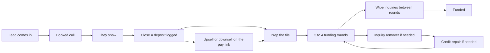

# Fundhub conveyor — what “winning” means

**COMPLIANCE REVIEW REQUIRED.** This page times dispute and repair work. It also maps a future text handshake so a bureau can ask for a phone code. No customer wording changed in this pass.

**What this is:** the lock for how the belt should move, and the one number each seat is judged on.

**What this is not:** the hire / fire agent. Do not build that agent from this file. That build stays queued on **5B.7**.

**This pass:** starting bars written 2026-08-24. No new screens. No new prices. Not the hire / fire agent.

Owner locked these facts on 2026-08-23 / 2026-08-24. Alec’s old shop is **reference**, not our law. Our prices live in the offer list (`src/config/offers.mjs`).

Pointer back: [`build-spec-2026-08-22.md`](build-spec-2026-08-22.md) §5B.7 · [`ops-kpi-agent-2026-08-22.md`](ops-kpi-agent-2026-08-22.md) · Alec scrape [`alec-legacy-strong-kpis-reference-2026-08-23.md`](alec-legacy-strong-kpis-reference-2026-08-23.md)

Unit jobs: [`fundhub-conveyor-kpis-2026-08-23-evidence/unit-jobs.json`](fundhub-conveyor-kpis-2026-08-23-evidence/unit-jobs.json) · code `src/ops/role-unit-times.mjs`

---

## 1. Success is the belt moving

Success is not a pile of role scorecards.

Success is a person moving:

**lead → book → show → close (a logged deposit) → upsell or downsell if it happens → fund → inquiry / repair when the file needs it.**

Close means a logged **deposit**. The closer marks deposit on the call log. There is no “upsell” outcome on that log. Upsell and downsell are an extra-sale mark on the pay link, not a separate close type.

Speed is the theme. Files should not sit.

---

## 2. The belt (plain picture)



If the calendar is too full, hire a **closer**. Never hire a setter. The setter is AI. We only count the bookings.

---

## 3. One North Star per seat

A North Star is the **one number** that says that seat is winning.

| Seat | North Star | Locked? |
|------|------------|---------|
| AI setter | Bookings made. Count them. Do not hire this seat. | Yes — count only |
| Sales manager | Team deposits vs how full the calendar is. A packed calendar means hire a closer. | Hire rule yes. A monthly number is **not** locked this pass. |
| Closer | **27 deposits / month per pod.** Time-max if they only close: **213** calls (160h). | They sit in a pod with one funding advisor. |
| Funding advisor | **27 funded files / month per pod.** Time-max if they only fund: **54** files (160h). | Same bar as the closer. FA desk is the bottleneck. 500 is above the 160h math. |
| Inquiry remover | Files keep moving on the clock (healthy ~15 days, hard stop 30). | Clock yes. A monthly count is **not** locked. Do not invent one. |
| Credit repair | Same clock. Letters go out **expedited**, not overnight. | Clock yes. A monthly count is **not** locked. |
| Owner / CEO | Company health: the eight company numbers already on the dashboard. | Yes — company, not a per-person star |

**Company 8** (already on the company dashboard — company health, not a seat target):

1. New clients
2. Booked calls
3. Show rate
4. Close rate
5. Cash
6. Funded count
7. Funded dollars
8. Cost per funded

Those eight stay. They are how the **company** looks. They are not “eight KPIs for every role.”

### After Chris locks this page

**Done 2026-08-24.** Starting bars written from desk time (AI-set). **One pod = closer + funding advisor.** Same bar. Not a spoken 20. Not the time-max.

- closer, monthly, deposits = 27 per pod (time-max ~213 calls)
- funding advisor, monthly, funded **count** (`files`) = 27 per pod (time-max ~54 files / half desk = 27)
- Company bar = 27 × complete pods. Uneven seats → hire the missing half. Packed calendar → hire a full pod.

Not the hire / fire agent.

---

## 4. Seats (how people sit today)

| Seat | Who | CRM today |
|------|-----|-----------|
| CEO | Owner login | Company 8 |
| AI COO | The future ops agent. No login. | Not built. Still queued. |
| Sales manager | Person | Sales floor |
| Closer | Person. Client may hear “funding specialist.” Same seat. | Calendar, closer dashboard, Present, my numbers |
| Funding advisor | Person. After the close. Not the closer. | Client file, pipeline, lenders |
| Inquiry remover | Person | Specialist desk, **Inquiries** side |
| Credit repair | Person — **a second seat** | Same Specialist login today, **Repair** toggle. Two people later. Not two logins yet. |
| Setter | **AI** | Count bookings. Never hire. |

---

## 5. Alec → Fundhub (reference, not law)

Alec’s shop numbers are in [`alec-legacy-strong-kpis-reference-2026-08-23.md`](alec-legacy-strong-kpis-reference-2026-08-23.md). Use them to think. Do not copy them into our targets or our prices.

| Alec said | Fundhub uses |
|-----------|--------------|
| Upfront $8,000–$10,000 | Funding done-for-you **$3,000 deposit** + **10% success fee** |
| 10% success fee | Same idea. Our 10% is on our offer, not his fee math. |
| Five funding rounds | Owner: **prep 30 days or less**, then **3–4 rounds**. Wipe inquiries between rounds. His five-round list is a picture, not our plan. |
| Time to fund ~30 days, problem after 60 | Prep is usually a **couple of days** of hands-on work. Healthy file clock **~15 days** (one personal-info dispute wait). Hard cap **30 days**. |
| Overnight the letters | **Wrong.** We send **expedited** US mail. Not overnight. Not UPS. Not FedEx. Bureaus use P.O. Boxes. |
| Human setters | Setter is **AI**. Count bookings. Hire closers when the calendar fills. |
| One “credit commando” | **Two seats:** inquiry remover and credit repair. CRM today is still one Specialist login with an Inquiries / Repair switch. |

Do not invent monthly inquiry or repair counts. Do not copy his $8–$10K.

---

## Offers on the belt

Our prices live in `src/config/offers.mjs`. This table says who owns each offer and what a win is. These are our offers, not Alec’s.

| Offer | Role on the belt | What “win” is |
|-------|------------------|---------------|
| Funding DFY ($3,000 deposit + 10% success fee) | Closer deposit → funding advisor | `call_outcomes.outcome = deposit`, then the file is funded |
| Repair DFY / Repair trial | Closer downsell/upsell → Specialist (repair) | A sale, then repair stages |
| Soft pull $32 | Diagnostic on the call | Pay link paid |
| UWIQ pack / Funding Mastery | Upsell / education | `sales.sale_motion` = upsell |

North Stars stay **27 deposits and 27 funded files per pod**. Not 20.

Pointer: [`build-spec-2026-08-22.md`](build-spec-2026-08-22.md) §5B.7

---

## 6. Mail is expedited — not overnight

Say **expedited**. Never say overnight.

Allowed mail classes in code: `first_class`, `priority`, `priority_express`. Those map to USPS. The fast lane we want is **expedited** (`priority_express` / PostGrid `express`).

Forbidden: UPS or FedEx overnight classes. They cannot hit a P.O. Box.

**Gap (do not fix in this pass):** the code default is still `first_class`, not expedited. Operating intent is expedited. That default is a later fixer row.

Letter **writing** is fast (the system writes the letter). Still put it on the clock. A person still has to press send.

---

## 7. Bureau phone calls (AI)

The inquiry sweeper calls **bureaus**, not customers. That code already exists.

Some bureaus want a phone code (2-factor). Mapped action. **Not built this pass.**

### 2FA handshake — mapped, not built

**COMPLIANCE REVIEW REQUIRED** — texts about a bureau call, and putting a client’s code into that call.

Per bureau, a switch. When that bureau needs a code:

1. Company texts the client: we are about to call the bureau.
2. Client texts the code back.
3. Company puts the code into the AI call.

Do not build it now. Do not write client copy now.

---

## 8. Unit jobs (this is the time model)

One job. One unit. How long that seat spends on **one** of them.

Code home: `src/ops/role-unit-times.mjs`

These are **not** the 15-day / 30-day file clocks. Those clocks say how long a file may sit. This table says how long a person spends doing the job once.

Minutes are the **model** (Grok-set 2026-08-24). Live call logs still have no durations. That does not leave this table blank.

| Unit | Who | What they do | Desk time | Source |
|------|-----|--------------|-----------|--------|
| **1 credit card application** | Funding advisor | Open lenders. Press Apply. Fill the bank form. Later move the card to Round submitted. | **10 minutes** (includes the bank form) | MODEL |
| **1 funding round** | Funding advisor | Move to Apply now. Do 5 card apps. Move to Round submitted. | **50 minutes** (5 apps × 10) | MODEL |
| **1 funded file** | Funding advisor | 3.5 rounds (owner wanted 3–4). | **175 minutes** (~2.9 hours) | MODEL |
| **1 repair client (one round, letters already made)** | Repair (Specialist → Repair) | Open desk. Press Repair. Open the file. Press Send. | **5 minutes** | MODEL |
| **1 FTC / police report upload** | Inquiry remover | Open Inquiries. Open the case. Pick the file already on the computer. Press Upload. | **2 minutes** | MODEL |
| **1 logged close call** | Closer | The phone call + Present + log deposit / downsell / etc. | **45 minutes** | MODEL |

**Same jobs, with times** (nothing left blank):

- Filling the lender credit-card form = **10 minutes** (this is the card-app unit)
- Getting an FTC or police report = **15 minutes** once they sit down to pull and save the PDF. We do not file the FTC report. Upload after that is 2 minutes.
- The closer phone call = **45 minutes** (same as the logged close call)
- Waiting on a bureau = **15 days** healthy / **30 days** hard stop (file clock, not desk)
- Waiting on a bank after submit = **2 weeks** per round

**Work month**

- 8 hours a day
- 20 work days a month
- **160 desk hours** a month per person
- Theoretical max = they only do that one job all month
- Half-time max = 80 hours on that job (meetings, wait, slack)

```
hours = (how many units) × (minutes per unit) ÷ 60
monthly max = floor(160 × 60 ÷ minutes per unit)
```

That function returns a **number** for every job in the table.

**How many fit in a month**

| Seat | Unit | Min each | All-month max (160h) | Half-time max (80h) |
|------|------|----------|----------------------|---------------------|
| Closer | logged call | 45 | **213** | **106** |
| Closer | deposits (only if every call deposits) | 45 | **213** | **106** |
| Funding advisor | CC app | 10 | **960** | **480** |
| Funding advisor | funding round | 50 | **192** | **96** |
| Funding advisor | funded file (3.5 rounds) | 175 | **54** | **27** |
| Repair | 1 client round | 5 | **1920** | **960** |
| Inquiry | FTC upload | 2 | **4800** | **2400** |
| Inquiry | get FTC PDF (included — not the upload) | 15 | **640** | **320** |

**27 deposits and 27 funded files per pod is the starting bar.** They work in tandem. It is not the time ceiling. A closer who only closes can do about **200** calls. A funding advisor who only funds can do about **54** files. **500 funded files in a month is more than 160 hours allow**, unless rounds get shorter or they skip apps.

---

## 9. File clocks (wait time — not desk time)

Owner-set. Not a person typing.

| Clock | Meaning |
|-------|---------|
| Healthy file | About **15 days** (one personal-info dispute wait) |
| Hard stop | **30 days** |
| Mail | **Expedited**, not overnight |
| Wait after mail before an AI bureau call | **3 business days** (code). Portal: **1 business day**. |

Playwright numbers (calendar 572 ms, Present 69 ms, and the rest) are **screen paint**. They are not “how long a funding round takes.” Kept in [`fundhub-conveyor-kpis-2026-08-23-evidence/ui-times.json`](fundhub-conveyor-kpis-2026-08-23-evidence/ui-times.json) only so nobody mixes them in again.

### Cycle clocks (locked)

These clocks say how long a file may sit. They are not desk minutes. Do not invent monthly inquiry or repair counts.

| Stage | Clock | Who owns it |
|-------|-------|-------------|
| Prep before round 1 | 30 days or less (hard stop). Healthy is about 15 days. Hands-on work is a couple of days. | Funding advisor + specialist if needed |
| Funding rounds | 3–4 rounds (ours). Not Alec’s five. | Funding advisor |
| Wipe between rounds | Must finish before the next round starts. | Inquiry remover |
| Alec example round lengths | About 2 weeks / 4 weeks / 2 weeks / 2 weeks / 1 month. Picture only. Not our law. | — |
| Repair stage clocks | Already in `src/repair/sla.mjs`. | Specialist |

---

## 10. Screen paint (not job time)

Local CRM click test. `npx playwright test e2e/conveyor-ui-times.spec.mjs` — 7 passed, 2026-08-24. These are **not** unit job times.

| Path | Load | Click | Result |
|------|------|-------|--------|
| Calendar → Join Call | 572 ms | 110 ms | Clicked. Link opened. |
| Closer dashboard + client → Present | 539 ms | 69 ms | Clicked. Deck opened. |
| My numbers | 492 ms | — | Load only. No belt click on that page. |
| Sales floor | 497 ms | — | Load only. No belt click on that page. |
| Pipeline MOVE | 477 ms | 84 ms | Clicked. |
| Lenders → Bureau mismatch tab | 99 ms | 42 ms | Clicked. |
| Specialist desk → Repair | 510 ms | 44 ms | Clicked. |

These are screen seconds. They are not the 15-day bureau wait.

---

## 11. Still queued (do not build from this file)

**Wired this pass (read only — not the hire / fire agent):**

- Hubstaff + CRM minutes live on the pulse as `measured_minutes`. Code: `src/ops/measure-minutes.mjs`. Need 20 timed samples. MODEL minutes stay. A human must lock them. The brain never overwrites MODEL.
- Meta = **marketing ads**. Spend is a read from `ad_metrics_daily`. Cost per booked call only when we have 10 booked calls. Category map (`ad_platform_category_map`) must be set before any spend write. Live Marketing API write is unverified. The brain does not buy, pause, or scale ads.
- LinkedIn = **hiring ads / job post**, not Meta. Packed calendar uses the existing `postJob` path in `src/ops/hire-closer.mjs`. LinkedIn Talent may show `not_configured`. Do not treat Social Studio as the hiring login. Do not add a second job post. Do not call `closeJob`.

**Still queued:**

- Ops hire / fire / assign agent
- Hermes training
- Fire auto-enqueue
- Raise / bonus dollars
- Buying or pausing ads
- Bureau 2FA text handshake
- Changing the mail default from first class to expedited
- A second Specialist login for repair

---

## 12. What Chris locks

If this page is right:

1. The belt above is success.
2. Closer starting bar is **27** deposits / month **per pod**. Time-max is ~213 calls (160h).
3. Funding advisor starting bar is **27** funded / month **per pod**. Time-max is ~54 files (160h). They work in tandem.
4. Mail wording is **expedited**.
5. Inquiry and repair stay two seats, one login for now.

Starting bars written 2026-08-24. Next is still the hire / fire agent, not this file.

