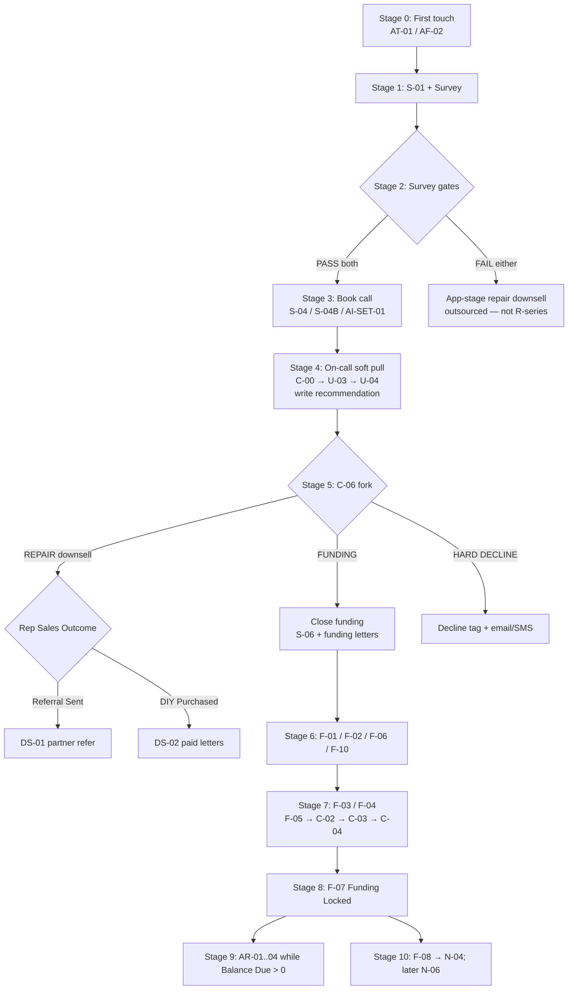
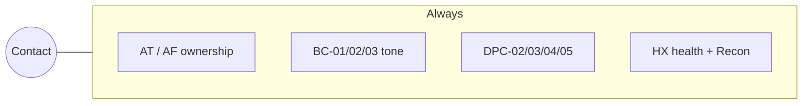

# 03 — Interactions (event spine)

How LIVE 05/30 pieces chain. **CONFIRMED** from Part A; Mermaid is STRUCTURE-INFERRED packaging of those bullets.

## Happy path — funding client

## Always-on overlays (any stage)

## Critical sequencing truths (CONFIRMED)

1. **Recommendation does not exist until Stage 4** (on-call CRS). Anything that routes on recommendation **before** the call is outdated.  
2. DS-01 / DS-02 fire from **Stage 5 Sales Outcome**, not from survey alone (survey fail has its own earlier downsell).  
3. Funding letters: C-06 FUNDING branch (and historically U-02 funding path — tension; see gaps).  
4. DIY: **no re-pull** after DS-02 — CRS already ran on the call.  
5. AR only while **Balance Due > 0**.  
6. DPC-05 catches stalls anywhere after 72 hours without progress.

## Canonical events in current code (STRUCTURE-INFERRED map)

Repo spine (`src/events/canonical.mjs`) approximates:

| Stage intent | Closest canonical event(s) |
|---|---|
| First touch / lead | `entry.captured` |
| Survey done | `survey.submitted` |
| Soft-pull paid | `diagnostic.paid` |
| CRS / analysis done | `analysis.completed` (+ `decision.rendered`) |
| Booked | `booking.created` |
| Call done / no-show | `call.completed` / `booking.noshow` |
| Funding deposit | `deposit.paid` / `sale.closed` |
| Rounds | `round.started` / `submitted` / `approved` / `funded` |
| DIY payment | `payment.received` (generic — risk) |
| Inbound SMS | `message.inbound` |
| Bank mail | `mail.response` |
| Inquiry cleared | `inquiry.removed` |

**Extra in current code (tension with Part A):** full `repair.*` and `diy.package.*` event families in `canonical.mjs`, plus `src/repair/` handlers registered from `src/workflows/index.mjs`.
