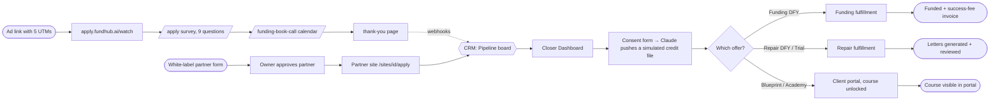
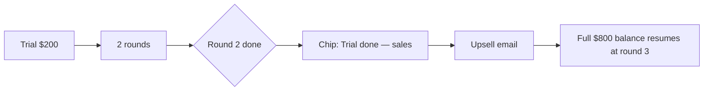
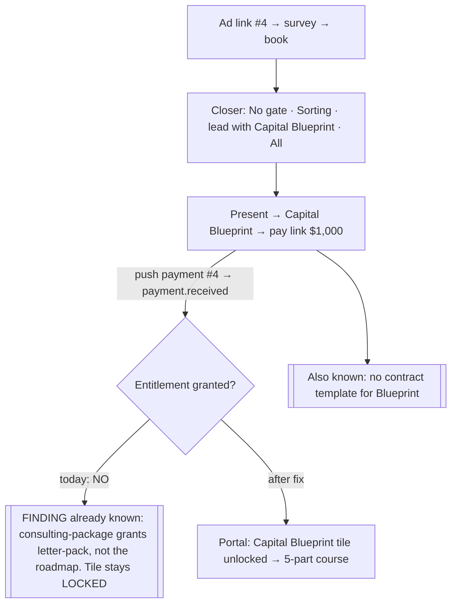
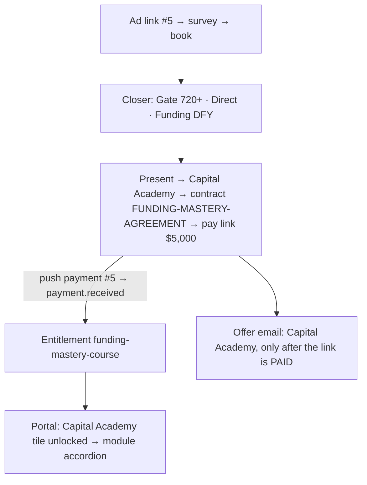
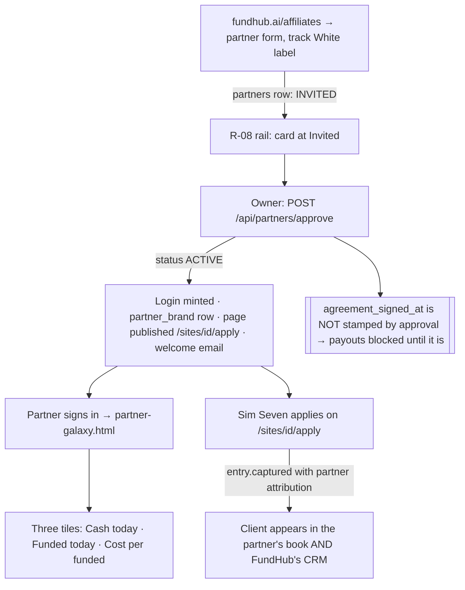

# Manual walkthrough SOP — every product path, by hand, on the live site

**Date:** 2026-09-03. **Who:** Chris types, Claude watches the data and fixes what breaks.
**Visual version (same content, tickable):** https://claude.ai/code/artifact/27bace9d-10a4-468f-b5d7-931578044d68 — source saved beside this file as `manual-walkthrough-runbook.html`.
**Where:** live fundhub.ai and apply.fundhub.ai. **Board:** `docs/workflows/manual-walkthrough-2026-09-03.md`.

How to read this page: every path is one picture, then one checklist. Each checklist line is
**You do → You should see**. If you do not see it, write one line in "Findings" at the bottom
and keep going. Do not fix anything mid-walk.

---

## 0. How the fake data gets in (owner-set 2026-09-03: sandbox, Claude pushes)

No bureau is ever called and no card is ever charged. You do the human parts; Claude pushes the two things a human cannot fake by typing.

| What | How | When you say |
|---|---|---|
| **Credit report** | `scripts/sim/push-credit.mjs` writes a simulated tri-bureau file onto the client you opted in, shaped for the path (clean 700s for funding, collections and a charge-off for repair, and so on). The real tier engine decides the outcome. The same two events a real pull fires move the card and stamp the tier. Marked `simulated` everywhere so no screen can mistake it for a bureau pull. | "push credit #1" |
| **Payment** | `scripts/sim/push-payment.mjs` posts a signed "paid" receipt to the live site for the pay link you just sent, exactly the way Commas would. Every handler after the webhook runs unchanged: money chain, entitlements, pipeline routing, offer emails. The sweeper drains it within a minute. | "push payment #1" |

Two guards built into the tools: the payment tool refuses the $32 soft-pull link (paying it would trigger a real bureau pull), and the credit tool never flags the client as demo, so they show on every dashboard like real people.

**Not switched:** live CRS stays as it is. The Pull TU/EX/EQ buttons on the Client Control Panel are still real. Do not click them during the walk.

---

## 1. Ground rules for the whole run

- **Emails:** `stanbridgejchris+sim-01@gmail.com` through `+sim-07`. All land in your inbox. The `+sim-` tag also skips quiet hours so texts arrive at any time.
- **Never use `+fhtest`.** That tag hides a client from every dashboard.
- **Phone:** your own cell on every client. Texts and calls will really come to it.
- **One email = one client.** The same contact cannot run the funnel twice.
- **Ad URL first.** Every client starts by clicking its ad link in the sheet, so the closer screen shows gate / entry / primary / secondary.
- **Private window, every client.** ClickFunnels remembers a finished survey in the browser and skips straight to "You're qualified. Pick a time below." Open each ad link in a NEW private window (Chrome: Cmd+Shift+N); close it when that client is done.
- **Do not click:** Pull TU/EX/EQ on the Client Control Panel (real bureau pull); Send with mail on the repair desk (real paper mail); anything that deletes.
- **Write findings, don't fix.** One line each, at the bottom of this page.

---

## 2. The map of everything



---

## 3. The data sheet — what you type

Your phone on all seven. Your own name, SSN, DOB and address on the **consent form only** (never in this file).

| # | First / Last | Email | Ad link (click this first) | Path |
|---|---|---|---|---|
| 1 | Sim / One-Funding | `stanbridgejchris+sim-01@gmail.com` | `https://apply.fundhub.ai/watch?utm_source=fb&utm_medium=paid&utm_campaign=funding600&utm_content=42-ringlights&utm_term=sun` | Soft pull → Funding DFY → fulfillment |
| 2 | Sim / Two-Repair | `stanbridgejchris+sim-02@gmail.com` | `https://apply.fundhub.ai/watch?utm_source=fb&utm_medium=paid&utm_campaign=sorting&utm_content=43&utm_term=nosun` | Soft pull → Repair DFY → letters |
| 3 | Sim / Three-Trial | `stanbridgejchris+sim-03@gmail.com` | `https://apply.fundhub.ai/watch?utm_source=fb&utm_medium=paid&utm_campaign=sorting&utm_content=45&utm_term=sun` | Soft pull → Repair trial → letters |
| 4 | Sim / Four-Blueprint | `stanbridgejchris+sim-04@gmail.com` | `https://apply.fundhub.ai/watch?utm_source=fb&utm_medium=paid&utm_campaign=uwiq&utm_content=26-underwriter&utm_term=sun` | Capital Blueprint → portal |
| 5 | Sim / Five-Academy | `stanbridgejchris+sim-05@gmail.com` | `https://apply.fundhub.ai/watch?utm_source=fb&utm_medium=paid&utm_campaign=premium&utm_content=82&utm_term=nosun` | Capital Academy → portal |
| 6 | Sim / Six-Partner | `stanbridgejchris+sim-06@gmail.com` | `https://fundhub.ai/affiliates/` (partner form, track white label) | White-label partner |
| 7 | Sim / Seven-Underpartner | `stanbridgejchris+sim-07@gmail.com` | the partner's own site, `/sites/<partnerId>/apply` (comes from #6) | A client under the partner |

**Addresses you'll use** (PASTE-CLIENT-ID = the long id in the address bar after you click the client's card on the Pipeline board):

| Screen | Address |
|---|---|
| Pipeline board (where the new lead shows first) | `https://fundhub.ai/app/pipeline.html` |
| Client Control Panel (click the card, or paste with the id) | `https://fundhub.ai/app/client-control-panel.html?id=PASTE-CLIENT-ID` |
| Closer Dashboard (the four ad lines) | `https://fundhub.ai/app/closer-dashboard.html?client_id=PASTE-CLIENT-ID` |
| Present deck (soft pull, contract, pay link, disposition) | `https://fundhub.ai/app/present.html?contact=PASTE-CLIENT-ID` |
| Calendar (advisor tasks) | `https://fundhub.ai/app/calendar.html` |
| Specialist desk (repair letters) | `https://fundhub.ai/app/inquiry-remover.html` |
| Finance OS (invoices, pay links) | `https://fundhub.ai/app/finance-os.html` |
| Client portal (sign in with the link from the booking-confirmation email, or ask for one on the sign-in page) | `https://fundhub.ai/app/client-portal.html` |
| Partner application form | `https://fundhub.ai/affiliates/` |
| Partner home (after approval) | `https://fundhub.ai/app/partner-galaxy.html` |

**Survey answers on /apply** (nine screens; screen 6 branches):

| Screen | Question | #1 Funding | #2 Repair | #3 Trial | #4 Blueprint | #5 Academy |
|---|---|---|---|---|---|---|
| 1 | Your info | name / email / phone from the table | same | same | same | same |
| 2 | Target amount | $100k - $200k | $50k - $100k | Less than $50k | $50k - $100k | $200k - $400k |
| 3 | Planned use | Equipment or buildout | Debt consolidation | Covering a shortfall right now | Growth (marketing, inventory, hiring) | Growth (marketing, inventory, hiring) |
| 4 | What would this change (pick one) | Grow faster | Pay off pressure | Stability | Grow faster | Grow faster |
| 5 | Current score | 700-749 | 580-649 | 580-649 | 650-699 | 750+ |
| 6 | Do you have a business? | Yes, 2-5 years | Yes, 1-2 years | **No, personal funding only** | Yes, 6-12 months | Yes, 5+ years |
| 7 | Revenue **or** income | $250k - $499k | Under $100k | $50k-$99k (income) | Under $100k | $1M+ |
| 8 | Can you verify? | Yes, bank statements | Not right now | Yes, both | Yes, tax returns | Yes, both |
| 9 | Available capital | $5k - $25k | $1k - $5k | Less than $1k | $5k - $25k | $100k+ |

Then book any slot on the calendar page. Same-day is fine; the call is you talking to yourself.

---

## 4. Path 1 — Soft pull → Funding done-for-you → fulfillment (Sim One-Funding)

```mermaid
flowchart TD
    A[Click ad link → /watch → Get Started] --> B[/apply: 9 answers/]
    B --> C[Book a slot] --> D[Thank-you page]
    D -->|webhook: entry.captured + survey.submitted + booking.created| E[Pipeline board: card in BOOKED]
    E --> F[Closer Dashboard ?client_id=]
    F -->|four ad lines under the name| G{Gate 600+ · Direct · Funding DFY}
    G --> H[Present → Send soft pull]
    H --> I[Your inbox: consent link → fill name, SSN, DOB, address. Do not pay]
    I -->|you say: push credit #1| J[[Claude pushes a simulated 700s credit file]]
    J -->|analysis.completed · decision.rendered| K[Client Control Panel: scores, tier, funding estimate]
    K --> L[Present → log disposition DEPOSIT → Send contract → Send pay link]
    L -->|push payment #1 → deposit.paid| M[Task: Funding intake. Card → funding board]
    M --> N[Move card to APPLY NOW]
    N -->|round.started| O[CCP: Generate Apps → lender list → applications]
    O --> P[Bank replies land in Bank Inbox → mark approvals]
    P --> Q[Move card APPROVED → FUNDED]
    Q -->|round.funded| R([Success-fee invoice minted + email/SMS F07])
```



**Checklist**

| Step | You do | You should see |
|---|---|---|
| 1.1 | Open a **new private window**. Paste ad link #1. Get Started. Fill all 9 screens. Book a slot. | Thank-you page with add-to-calendar. Welcome email + text on your phone within a minute. |
| 1.2 | Open `fundhub.ai/app/pipeline.html` | Sim One-Funding in the **Booked** column. Ad attribution card exists. |
| 1.3 | Click the card → Client Control Panel | Survey answers on the file. Stage Booked. |
| 1.4 | Open `fundhub.ai/app/closer-dashboard.html?client_id=<id>` (id from the URL of 1.3) | Name at top. Under it: **Gate 600+ · Entry Direct · Primary Funding, done-for-you · Secondary None**. |
| 1.5 | Present → **Send soft pull ($32 + approval form)** | Email in your inbox with the consent link. |
| 1.6 | Open the link. Fill the consent form (name, SSN, DOB, address). **Do not pay.** Say "push credit #1". | Within a minute: scores on the Client Control Panel (718 / 724 / 731), tier + funding estimate stamped, card at **Decision rendered**. |
| 1.7 | Present → log disposition **Deposit** (key 1). Send contract (FUNDING-AGREEMENT). Send pay link ($3,000). | Contract email. Pay link email + text. Offer-bucket email (Funding DFY). |
| 1.8 | Say "push payment #1". | Card moves to the funding board. Calendar shows task **Funding intake — pull CRS** for the advisor. Doc-collection hold set. |
| 1.9 | On the funding board, move the card to **Apply Now**. | Tag `client:funding`. Next action: Collect Documents. Client funding inbox provisioned. |
| 1.10 | Client Control Panel → **Generate Apps** | The lender match list appears. **No application rows are created** — see the note under this table. How many lenders: **all 313** if the client has no state on file, or roughly **17–26** once a state is known (Texas 17, Florida 19, California 23). The screen draws the first 25 rows whatever the total, and 98 of the 313 lenders have no apply link, so those rows read "No URL" instead of an Apply button. |
| 1.11 | Upload one document via the portal (any PDF) | Missing-documents hold clears. |
| 1.12 | **Open Bank Inbox.** Forward yourself one "approved for $X" email as a bank reply, or mark an approval by hand. | Approval recorded with an amount. Card can move to Approved. |
| 1.13 | Move card **Approved → Funded** | Funded amount on the round. **Success-fee invoice** exists in Finance OS = approvals × fee %. F07 email + text arrive. |
| 1.14 | Open the client portal as Sim One (link from the booking-confirmation email, or ask for one on the sign-in page) | Funding section visible. Tiles: Funding snapshot unlocked. |

**Known before you start:** the Owner "funded" tile counts a client flag, not rounds. It can read 0 while the round is funded. Note it, do not chase it.

**Two corrections to step 1.10, measured 2026-09-03.**

1. **"30–50 lenders" was never true.** The matcher checks four things only: is the
   lender switched on, does the client's state appear in the lender's state list, does
   the lender pull a bureau we are protecting, and then it spreads the pulls across
   bureaus. It does not read the credit score, the card use, the income or the funding
   estimate. Counted against the lender book in the repo
   (`credentials/lenders-audit/lenders-audited.csv`, 313 lenders, all switched on),
   the answer is 313 with no state on file and roughly 17–26 with one. Nothing in the
   code or the data produces a range of 30 to 50.

2. **Generate Apps creates no application rows.** The button re-reads the lender match
   list and redraws it. An application row is created one at a time, the first time
   someone presses **Bank yes** or **Bank no** on a single lender row
   (`src/applications/status.mjs`, `logBankDecision`). That is deliberate: a row means
   somebody actually applied, and pre-creating 25 of them would put 25 applications on
   the file that nobody sent. Expect **0 rows** after 1.10 and the first row at 1.12.

**Also known, and not a bug to chase:** the funding estimate does not read the credit
score. The underwriting rules in `vendor/underwriteiq-full/api/lite/crs/` apply exactly
three factors — the outcome tier, the card-use band, and whether the file is thin. The
score reaches the money only by deciding the tier, and the two top tiers both carry a
multiplier of 1.0. So two clients with the same accounts and scores of 724 and 762 get
the same dollar figure, on purpose.

---

## 5. Path 2 — Soft pull → Repair done-for-you → letters (Sim Two-Repair)

```mermaid
flowchart TD
    A[Ad link #2 → survey → book] --> B[Closer Dashboard: No FICO gate · Sorting · lead with Funding DFY · All roads]
    B --> C[Send soft pull → consent form → push credit #2: 500s file with collections]
    C --> D[Present: disposition (logs as DOWNSELL) → contract CREDIT-REPAIR-AGREEMENT → pay link $1,000]
    D -->|push payment #2 → payment.received| E[Card → Optimization board, INTAKE]
    E --> F[[Manual: enroll in repair program — there is no auto-enroll]]
    F -->|repair.enrolled| G[Entitlement: metro2-letter-pack]
    G --> H[Specialist desk: Repair tab → Stage → Generate letters]
    H -->|repair.letters.ready| I[Review the letter PDFs]
    I --> J{Send with mail?}
    J -->|NO — real paper| K([Stop here. Letters reviewed = done for the walk])
```

**Checklist**

| Step | You do | You should see |
|---|---|---|
| 2.1 | Ad link #2, survey, book | Card in Booked. Closer screen: **No FICO gate · Sorting, every road open · Funding, done-for-you, lead with it · All**. |
| 2.2 | Send soft pull → consent form, do not pay → "push credit #2" | Scores 588 / 602 / 595, two collections, a charge-off, a late. Tier should route to repair. |
| 2.3 | Present → pick Credit repair, done-for-you → log disposition → send contract → send pay link | Contract CREDIT-REPAIR-AGREEMENT. Pay link $1,000. **Watch:** the disposition logs as *downsell*, not deposit. That is how the code is written; decide if you like it. |
| 2.4 | "push payment #2" | Card on the **Optimization** board at Intake. |
| 2.5 | Enroll the client in the repair program (Specialist desk, Repair tab). **Finding if there is no button:** the code has the endpoint but no automatic enroll on payment. | Chip shows program Full, 6 rounds. Portal tile Metro-2 letter pack unlocked. |
| 2.6 | Specialist desk → Stage → Generate letters | **Three letters — one to Experian, one to Equifax, one to TransUnion.** Each names the derogatory accounts that bureau actually reports: Experian gets the late Capital One card, the Midland collection and the Synchrony charge-off; Equifax gets the late card, the Portfolio Recovery collection and the Synchrony charge-off; TransUnion gets the late card and both collections. Still 0 letters if there is no credit file on record — that is correct. |
| 2.7 | Open each letter PDF. Read it as the client. | Correct name, address, bureau, items. This is the deliverable. Judge it hard. |
| 2.8 | **Do not click Send with mail.** | Walk ends here. |

**What changed on 2026-09-03, and why the letters exist now.**

Before this, the repair walk produced **zero** letters. The letter engine only fired on a
Metro 2 reporting defect — a contradiction inside the bureau's own data — and a collection
that is reported cleanly has none. So a client whose whole file was collections and a
charge-off got an empty desk.

Owner decision, 2026-09-03: **any derogatory item deserves a letter, but only for a client
on the repair path.** So every collection, charge-off and late payment now produces a
claim, and a client who is not on a repair path still gets nothing no matter what their
file holds.

Two things to check when you read the letters at 2.7:

* Each item names the account and the last four digits ("ending 6642"). If it says the
  creditor with no digits, tell us.
* The letter must **not** claim a Metro 2 defect it cannot show. A letter built only from
  derogatory items says "FCRA dispute" in the subject line and never says Metro 2. A letter
  that also carries an engine finding says Metro 2, because then there really is one.

---

## 6. Path 3 — Repair trial (Sim Three-Trial)

Same as Path 2 with three differences: personal-funding branch on the survey ("push credit #3" gives a low-600s file), pay link **$200** ("push payment #3") (REPAIR-TRIAL-AGREEMENT), program **Trial, 2 rounds**. After round 2 you should see the chip **Trial done — sales** and status `upsell_pending`; the trial-complete upsell email goes out. Full program resumes from where the trial stopped, balance $800.



---

## 7. Path 4 — Capital Blueprint → portal (Sim Four-Blueprint)



**Checklist**

| Step | You do | You should see |
|---|---|---|
| 4.1 | Ad link #4, survey, book | Closer screen: **No gate · Sorting · Capital Blueprint, lead with it · All**. |
| 4.2 | Present → Capital Blueprint → send pay link ($1,000) | Pay link email. **No contract** is sent; there is no template. Finding. |
| 4.3 | "push payment #4" | No new email. Sign in with the link from the booking-confirmation email, or ask for one on the portal sign-in page. |
| 4.4 | Open the portal as Sim Four | **Expected today: Capital Blueprint tile LOCKED.** The product grants the letter pack, not the roadmap. Claude fixes this with one migration after the walk. |
| 4.5 | After the fix, reopen | Tile unlocked. 5-part "How to use this" course opens. Videos are placeholders ("Video will show here"). |

---

## 8. Path 5 — Capital Academy → portal (Sim Five-Academy)



**Checklist**

| Step | You do | You should see |
|---|---|---|
| 5.1 | Ad link #5, survey, book | Closer screen: **Gate 720+ · Direct, sell what they were promised · Funding, done-for-you · None**. (Ad 82 is a premium ad; the closer sells funding and Academy is the education road.) |
| 5.2 | Present → Capital Academy → contract → pay link ($5,000) | Contract FUNDING-MASTERY-AGREEMENT. Pay link. |
| 5.3 | "push payment #5" | Offer-bucket email for Academy arrives **only now** (it is gated on paid). Sign in via the booking-confirmation link or the sign-in page. |
| 5.4 | Open the portal | **Capital Academy tile unlocked.** Modules listed. Every video says "Video will show here when it is ready". That is the deliverable gap to judge. |

---

## 9. Path 6 — White-label partner + one client under them (Sim Six / Sim Seven)



**Checklist**

| Step | You do | You should see |
|---|---|---|
| 6.1 | `fundhub.ai/affiliates/` → apply as Sim Six-Partner, track White label | Thank-you. **No login yet** — invite-only by design. Card on the partner rail at Invited. |
| 6.2 | Approve the partner (owner). If there is no button on a screen, tell Claude; the endpoint exists. | Welcome email with login. Partner page live at `/sites/<partnerId>/apply`. |
| 6.3 | Sign in as the partner → `partner-galaxy.html` | Banner **PARTNER VIEW — your book only**. Three tiles, all zero. |
| 6.4 | Open `/sites/<partnerId>/apply` in a private window. Apply as Sim Seven-Underpartner. | Page in the partner's colours. Client lands in the partner's book **and** on FundHub's pipeline. |
| 6.5 | Check `clients.partner_id` on Sim Seven (Claude checks) | Set. Today's TODO says 0 of 29 real clients have it; this proves the door works for new ones. |
| 6.6 | Optional: Live Trial $297 via provision | `live_trials` row, clock not started. |

**Known before you start:** approval does not stamp the agreement date, so no payout can compute. Custom domain is not live. Marketing suite is off unless the owner flips it.

---

## 10. After the walks — the fix order

1. Read every Findings line. Claude groups them by screen.
2. One PR per fix, smallest diff, proven with a test, merged to main, branch deleted.
3. Re-walk only the step that failed.
4. Already-known fixes to queue regardless: Capital Blueprint entitlement (one migration), Capital Blueprint contract template, repair enroll-on-payment (or a visible Enroll button), partner approval button if none exists.

---

## Findings

`path | step | what you saw | what you expected | fix PR`

(empty — fill during the walk)
